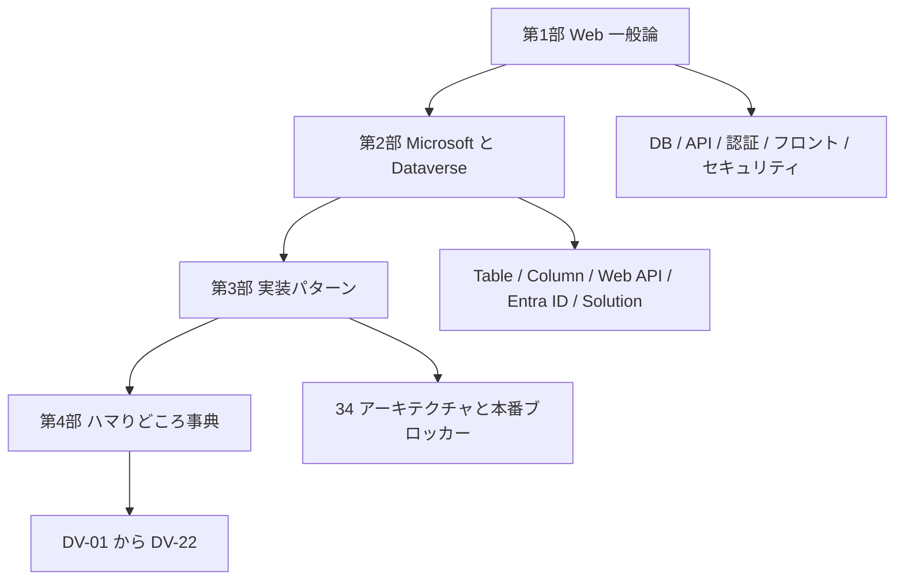
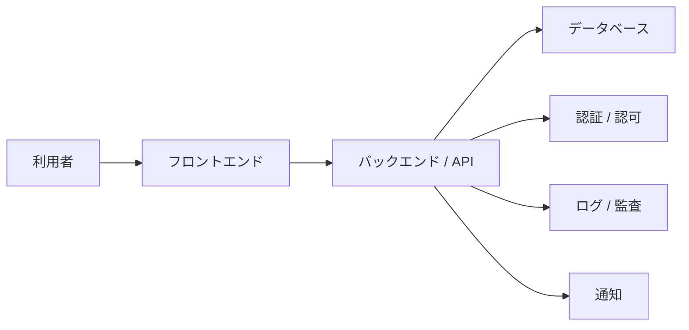
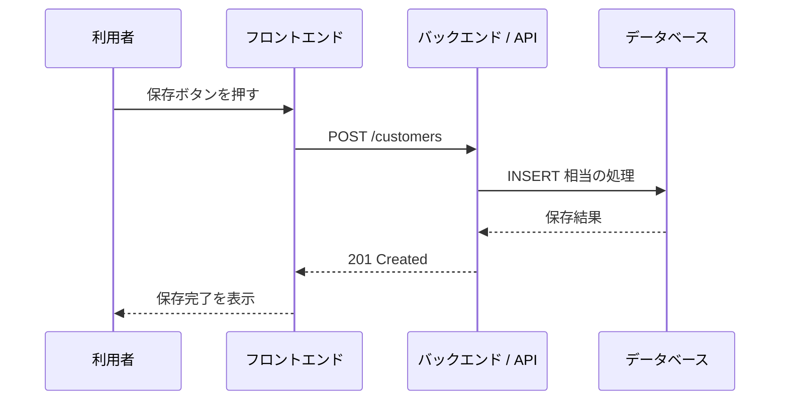
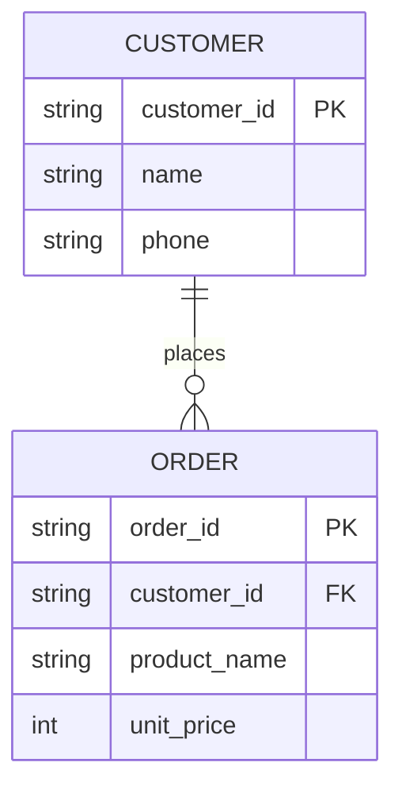
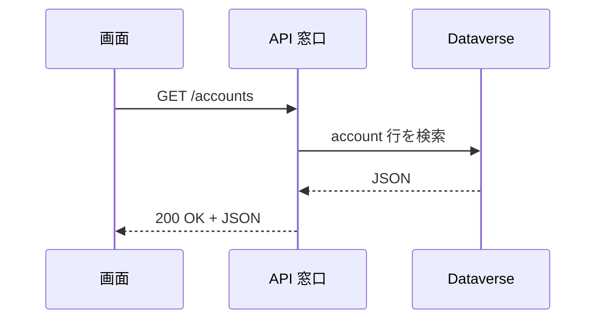
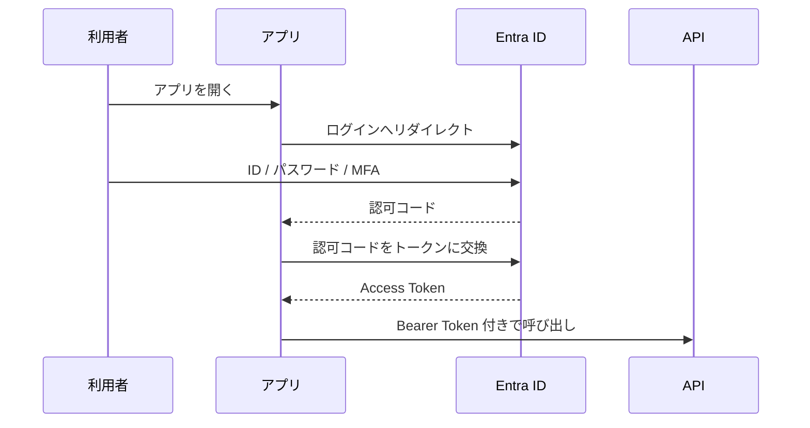
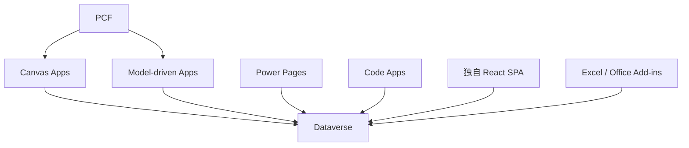
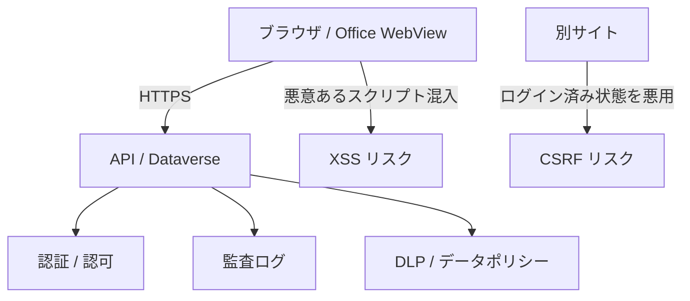

# Dataverse 学習レジュメ 2026-05-18

対象読者は、Dataverse を実務で触り始めたものの、公式用語で説明しようとすると舌が回らなくなる人。VBA や Excel 業務ツールの経験はあるが、Web システムや Power Platform の語彙を一気に整理したい人。「サルでもわかる」難易度を狙うが、難しい言葉は避けない。出すときは身近なたとえを先に置いてから定義に進む。

土台にしたのは次の 3 系統の資料。

- `notes/dataverse-stack-overview.md`(Web プロトコルから Power Platform まで通しで整理した旧 overview)
- `notes/dataverse-frontend-architectures-2026-05-18.md`(34 本のアーキテクチャ候補をロングリスト化したもの)
- 上記アーキテクチャ一覧への Codex セルフレビューと Opus 4.7 レビュー(漏れと誤りの指摘集)

用語は現行の公式表記に寄せる。ただし実務では旧名がしぶとく生き残るので、必要なところでは Table(旧 Entity)、Column(旧 Field/Attribute)、Row(旧 Record)のように併記する。ライセンス、制限値、製品提供状態は Microsoft の都合でしょっちゅう変わる。実案件で詰める直前に、必ず実施時点の Microsoft 公式情報を見直すこと。

このレジュメ自身は固定の事典ではなく、地図帳寄りの読み物だ。最初から最後まで通して読めば全体像が掴めるし、第 4 部は DV 番号で辞書として引ける。

---

# 第 1 部 Web システムの一般論

## 1. はじめに

### ふんわり入口

Dataverse を学ぶときの最初の壁は、Dataverse 本体ではない。周辺の単語が一気に押し寄せることだ。

たとえば、こんな顔ぶれが同じ会話に出てくる。

- Table, Column, Row
- Web API, OData, OAuth
- Entra ID, Application User, Security Role
- Environment, Solution, DLP
- Canvas Apps, Model-driven Apps, PCF

一つひとつは別ジャンルの単語なのに、Dataverse の世界では全部が同じ機械の歯車になっている。

Excel で例えるなら、ブック、シート、セル、マクロ、UserForm、共有フォルダ、ブック保護、参照設定、配布手順を、一つの業務ファイルに押し込んで運用しているようなものだ。VBA 経験者には見覚えがある光景だが、Web の世界では同じ機能が別々の部品に分かれている。だから 1 ファイル感覚で説明しようとすると言葉がうまく置けない。

### 正確に言うと

このレジュメで扱う Dataverse は、Microsoft Power Platform の共通データ基盤としての Microsoft Dataverse を指す。クラウド版データベース「だけ」ではない。データ保存、権限、API、監査、業務ロジック、アプリ連携、開発から本番への移送までを、ひとまとめに引き受けるプラットフォームだ。

読み方の順序はこうしてある。

1. 第 1 部で、Web システム一般の土台を作る。
2. 第 2 部で、その土台を Microsoft と Dataverse の公式用語に対応させる。
3. 第 3 部で、現実の会社環境で使える実装パターンを並べる。
4. 第 4 部で、Dataverse 特有の罠を事典として引けるよう整理する。

「サルでもわかる」を狙うとはいえ、用語を雑に丸めはしない。難しい言葉から逃げず、出すたびに身近なたとえを添えて、定義に降りていく形にする。

### VBA 的にいうと

VBA 経験者は、次の対応で読むと頭に入りやすい。

| VBA / Excel の世界 | Web / Dataverse の世界 |
|---|---|
| `.xlsm` ファイル | アプリ、Solution、環境内のリソース一式 |
| Worksheet | Table、Form、View が乗る土台 |
| `Cells(1, 1)` | Row と Column の交点 |
| UserForm | フロントエンド画面 |
| Button の `_Click` イベント | JavaScript や Power Fx のイベントハンドラ |
| ADO 接続 | Web API 呼び出し、Connector |
| Recordset | API が返す JSON 配列 |
| 標準モジュール | JavaScript module、Power Fx 式、Plug-in |
| 参照設定 | npm package、Connector、API permission |

ただし完全一致ではない。Excel の強みは、画面・データ・コードが 1 ファイルに密結合できる手軽さ。Dataverse 側はその逆で、データは Dataverse、画面は Power Apps や Web アプリ、認証は Entra ID、権限は Security Role、移送は Solution、という具合に責任を意図的に分割する。VBA で「ブックを開いて保存ボタンを押す」一連の流れが、Web では複数の建物にまたがる連携になる。

### 図



### 混同しやすい近接概念

「Dataverse を学ぶ」と「Power Apps を学ぶ」は近いが別物。Power Apps は画面を作るサービス、Dataverse はデータと権限と API の土台。

「Dataverse を学ぶ」と「SQL Server を学ぶ」も別物。Dataverse の裏にはデータベース的な仕組みがあるが、利用者が自由に DDL を書いて JOIN するための製品ではない。Table、Relationship、Security Role、Solution、Web API といった抽象化を通して操作する。

「ローコードだから簡単」と「本番運用が簡単」も同じではない。画面を作るだけなら確かに速い。だが DLP、環境、ライセンス、監査、ALM、所有者退職時の引き継ぎまで含めれば、普通の業務システムと同じ設計工数が要る。

### ここを押さえれば次に進める

Dataverse は「DB の代わり」では収まらない。DB、API、認証連携、権限、監査、イベント、ALM を束ねたパッケージ品。VBA で 1 ファイルに一体化していたものが、Web と Microsoft 365 の世界では別々の部品に切り分けられている。この部品の名前を順番にそろえることが、このレジュメ最大の目的になる。

---

## 2. システムって何だろう

### ふんわり入口

システムとは、ざっくり「毎回手作業でやると面倒な仕事を、決まった手順で回し続ける仕組み」のこと。

身近な例で考える。飲食店の注文を想像してほしい。

1. 客がメニューを見る
2. 店員に注文を伝える
3. 厨房に注文が届く
4. 料理人が作る
5. レジで会計する
6. 売上が記録される

ここまで全部、紙とペンと電卓でも回せる。ただし、忙しい時間帯になった瞬間、聞き間違い、書き間違い、二重入力、集計漏れが噴き出す。これを潰すために、注文端末、厨房モニター、レジ、売上 DB をつないだ全体が「注文システム」になる。

会社の業務システムも同じ発想で組まれている。申請、承認、顧客管理、在庫、案件、日報、問い合わせを、画面・データ・権限・通知・集計でつないだ全体を指す。

### 正確に言うと

IT システムの構成要素は、ざっくり次の役者に分けて見ると整理しやすい。

| 要素 | 役割 |
|---|---|
| 利用者 | 画面を操作する人 |
| フロントエンド | 利用者が触る画面 |
| バックエンド | 業務処理や API を担う裏側 |
| データベース | データを保存する場所 |
| 認証 | 利用者が誰かを確認する仕組み |
| 認可 | その人が何をしてよいかを決める仕組み |
| 通知 | メール、Teams、プッシュ通知 |
| ログ / 監査 | 誰が何をしたかの記録 |
| 運用 | 障害対応、変更管理、バックアップ、権限棚卸し |

Dataverse はこのうちデータベース、認可、API、監査、イベントフックまでまとめて担当する。「DB の代わり」と一言で言うと、半分しか説明できないのはこのため。

### VBA 的にいうと

VBA 業務ツールでは、1 つの `.xlsm` に多くの役割が押し込められている。

| `.xlsm` 内の部品 | システム一般論での対応 |
|---|---|
| シート | データ保存、簡易 DB |
| UserForm | フロントエンド |
| 標準モジュール | 業務ロジック |
| ボタンイベント | ユーザー操作の入口 |
| 非表示シート | 設定値、マスタ |
| 保護とパスワード | 簡易的な権限制御 |
| 共有フォルダ配布 | 簡易的なデプロイ |

Excel の強みは、この一体感。配布も最終的に 1 ファイル渡せば済む。一方で、複数人が同時に触り始めた途端、ファイル破損、版違い、権限管理、監査、配布が苦しくなる。Dataverse を含む業務システムは、ここを部品ごとに分け、責任を分散させる発想で組まれている。

### 図



### 混同しやすい近接概念

「アプリ」と「システム」は混ぜて話されがち。アプリは利用者から見える入口のこと。システムは、アプリ・データ・権限・通知・運用までを含む全体を指す。

「自動化」と「システム化」も別物。自動化は一部の作業を自動で走らせること。システム化は入力・処理・保存・権限・監査・運用までを含めて仕組みに落とし込むこと。

「画面ができた」と「業務に使える」も同じではない。業務利用には、誰が使えるか、誰が承認するか、データが消えたらどうするか、退職者の所有物をどう引き継ぐか、監査で説明できるかが要る。画面の完成はスタート地点であって、ゴールではない。

### ここを押さえれば次に進める

システムは画面だけでは成立しない。データ、処理、権限、監査、運用までを含む。Dataverse を学ぶときも、テーブル設計だけでなく「誰が、どの画面から、どの権限で、どの API を通って、どのログを残すか」を一続きで考える。

---

## 3. Web アプリの三層

### ふんわり入口

レストランで考えると、Web アプリの三層はあっさり腑に落ちる。

- 客席:お客さんが見るメニューや注文端末
- 厨房:注文を受けて調理する場所
- 倉庫:食材や在庫を保管する場所

Web アプリでも同じだ。客席がフロントエンド、厨房がバックエンド、倉庫がデータベース。利用者は画面を見る。画面は裏側に「顧客一覧をください」「案件を登録してください」と頼みに行く。裏側はデータベースを読んだり書いたりして、結果を返す。

### 正確に言うと

Web アプリの定番構成は三層アーキテクチャと呼ばれる。

| 層 | 英語 | 役割 |
|---|---|---|
| プレゼンテーション層 | Frontend / UI | 利用者に画面を見せ、入力を受け取る |
| アプリケーション層 | Backend / Application | 業務ルール、API、認証連携、外部連携を捌く |
| データ層 | Database / Storage | データを保存し、検索や更新を行う |

Dataverse を使う場合、三層の対応は構成によって変わる。

| 構成 | フロントエンド | バックエンド | データ層 |
|---|---|---|---|
| Canvas Apps | Canvas Apps | Power Platform / Dataverse Connector | Dataverse |
| Model-driven Apps | Model-driven Apps | Dataverse 標準機能 | Dataverse |
| React + Web API 直結 | React SPA | Dataverse Web API | Dataverse |
| React + BFF | React SPA | Azure Functions / App Service 等 | Dataverse |
| Excel + Power Automate | Excel / VBA / Office Scripts | Power Automate | Dataverse |

ここで効いてくるのが、第 3 部でも繰り返し出てくる「BFF(Backend For Frontend)」という考え方だ。SPA からいきなり Dataverse Web API を叩くと、トークン管理、CORS、レート制御、監査ログ、Secret 管理がフロント側に滲み出る。間に Azure Functions や App Service を 1 段挟んで、そこに集約させるとサーバー側で完結する。会社の本番審査では、この 1 段が「説明しやすさ」に直結する。

### VBA 的にいうと

VBA では三層が 1 ファイルに寄りがちだ。

```vb
' VBA では画面・処理・保存が同じブックに集まりやすい
Private Sub btnSave_Click()
    Worksheets("Data").Cells(nextRow, 1).Value = txtCustomerName.Value
    Worksheets("Data").Cells(nextRow, 2).Value = Now
End Sub
```

Web アプリでは、同じ処理を層ごとに切り出す。

```javascript
// フロントエンド側:ボタン押下で API に送る
async function saveCustomer() {
  const response = await fetch("/api/customers", {
    method: "POST",
    headers: { "Content-Type": "application/json" },
    body: JSON.stringify({ name: document.querySelector("#name").value })
  });

  if (!response.ok) {
    throw new Error("登録に失敗しました");
  }
}
```

```sql
-- データ層:実際の保存先では行が作られる
INSERT INTO Customers (CustomerName, CreatedOn)
VALUES ('株式会社サンプル', CURRENT_TIMESTAMP);
```

Dataverse では、利用者がこの SQL を書くわけではない。Table に対して Web API か Connector 経由で行を作る。SQL を書かなくても、SQL 相当の処理は確実に裏で走っている。

### 図



### 混同しやすい近接概念

「バックエンド」と「データベース」は別。バックエンドは処理をする場所、データベースは保存する場所。ただし Dataverse は Web API、権限、Plug-in、Custom API を持っており、ただの DB よりバックエンド寄りの仕事も引き受ける。

「フロントエンド」と「アプリ」も文脈で揺れる用語。Power Apps で「アプリ」と言えば Canvas App や Model-driven App を指す。Web 開発で「フロント」と言えば React や Vue の画面部分を指す。会話では「どっちのアプリ?」を意識的に確認する。

「サーバーレス」と「バックエンドなし」も別物。Azure Functions のようなサーバーレスは、サーバー管理をクラウドに任せるという意味であって、裏側の処理自体が消えるわけではない。

### ここを押さえれば次に進める

Web アプリは画面・処理・データの三層で見ると整理しやすい。Dataverse はデータ層でありながら、API、権限、イベント処理まで持っている。だから「Dataverse を DB としてだけ見る」と、API 制限・権限・監査・容量で必ず見落とす。

---

## 4. データベース入門

### ふんわり入口

データベースは、きれいに整列した台帳だ。Excel の表を思い出すと最初の足場になる。

たとえば顧客一覧。

| 顧客 ID | 顧客名 | 電話番号 |
|---|---|---|
| C001 | 株式会社サンプル | 03-0000-0000 |
| C002 | 鈴木商店 | 06-0000-0000 |

横 1 行が顧客 1 件、縦 1 列が顧客名や電話番号などの項目。DB でも基本構造はまったく同じで、表・行・列で考える。

ただし業務データが大きくなると、Excel の表だけでは破綻する。顧客、案件、見積、請求、担当者を全部 1 枚のシートに詰めると、同じ顧客名がコピーで散らばり、修正漏れが起き、どの行が何を表すか追えなくなる。そこで、テーブルを分けて、ID でつなぐ。これが正規化と呼ばれる発想。

### 正確に言うと

リレーショナルデータベースでは、データをテーブルで管理する。

| 一般 DB 用語 | Dataverse 用語 | 旧名 / 近い言葉 |
|---|---|---|
| Table | Table | Entity |
| Column | Column | Field / Attribute |
| Row | Row | Record |
| Primary Key | Primary Key | 主キー |
| Foreign Key | Lookup / Relationship | 外部キー的な関係 |
| Relationship | Relationship | リレーション |

主キーは、行を一意に識別する値。社員番号、顧客 ID、注文 ID のような「絶対にダブらない番号」。外部キーは、別テーブルの行を指す値で、Dataverse では Lookup 列と Relationship として表現される。

例として、整理されていない表をひとつ。

| 注文 ID | 顧客名 | 顧客電話 | 商品名 | 単価 |
|---|---|---|---|---|
| O001 | 株式会社サンプル | 03-0000-0000 | マウス | 2000 |
| O002 | 株式会社サンプル | 03-0000-0000 | キーボード | 5000 |

顧客電話が変わると、同じ顧客の全行を直す羽目になる。そこで顧客テーブルと注文テーブルに分ける。

```sql
CREATE TABLE Customers (
  CustomerId varchar(20) PRIMARY KEY,
  CustomerName varchar(100) NOT NULL,
  Phone varchar(30)
);

CREATE TABLE Orders (
  OrderId varchar(20) PRIMARY KEY,
  CustomerId varchar(20) NOT NULL,
  ProductName varchar(100) NOT NULL,
  UnitPrice int NOT NULL,
  FOREIGN KEY (CustomerId) REFERENCES Customers(CustomerId)
);
```

トランザクションは、複数の更新を「全部成功」か「全部失敗」のどちらかに揃える単位。銀行振込で、A さんの口座から 1 万円が引かれたのに B さんの口座に足されない、という途中失敗を防ぐ仕掛け。

```sql
BEGIN TRANSACTION;

UPDATE Accounts
SET Balance = Balance - 10000
WHERE AccountId = 'A';

UPDATE Accounts
SET Balance = Balance + 10000
WHERE AccountId = 'B';

COMMIT;
```

Dataverse では利用者が直接この SQL を書くわけではない。けれど、Web API の `$batch`、Plug-in、Custom API、Organization Service など、複数処理の整合性をどう取るかを考える場面は普通に出てくる。

### VBA 的にいうと

`Worksheet.Cells(1, 1)` は、表の 1 行目 1 列目を指す。これは Excel の「物理的な座標」で値を取りにいく感覚。DB では通常、物理的な順番に意味を持たせない。代わりに主キーで行を特定する。

```vb
' Excel 的な発想
Worksheets("Customers").Cells(2, 1).Value = "C001"
Worksheets("Customers").Cells(2, 2).Value = "株式会社サンプル"
```

```sql
-- DB 的な発想
SELECT CustomerName
FROM Customers
WHERE CustomerId = 'C001';
```

「2 行目」と言うか「`CustomerId = 'C001'` の行」と言うか、ここに発想の溝がある。

VBA の Recordset は、DB から取ってきた行のまとまり。JavaScript で API を呼んだ場合は、JSON 配列が Recordset に一番近い。

```javascript
const result = await fetch("/api/customers").then(r => r.json());
for (const row of result.value) {
  console.log(row.name);
}
```

### 図



### 混同しやすい近接概念

「表」と「テーブル」は近いが、Excel の表と DB のテーブルは別物。Excel では見た目、計算式、メモ、結合セル、書式が同じ平面に混在する。DB のテーブルは型と制約、主キー、関係を持ち、見た目の自由はない代わりに整合性が硬い。

「外部キー」と「Lookup」も近いが、Dataverse の Lookup は UI、権限、Relationship、参照先の Entity set 名、Polymorphic 型まで絡む。単なる ID 列ではない。

「削除」と「非アクティブ化」も違う。業務システムでは、行を物理削除するより、状態列で無効化するほうが監査や参照整合性に向く場面が多い。Dataverse の多くの標準 Table も、`statecode` / `statuscode` で状態を持っている。

### ここを押さえれば次に進める

DB の基本は Table、Row、Column、主キー、外部キー、Relationship。Dataverse ではこれらが Table、Column、Row、Lookup、Relationship に対応する。Excel の表にぱっと見は似ていても、型・主キー・権限・関係・監査・API が乗ってくる点が決定的に違う。

---

## 5. API と通信

### ふんわり入口

API は、システム同士の「注文窓口」だ。

レストランで言うなら、客が厨房に乗り込んで冷蔵庫を勝手に開けるのではなく、店員さんに「カレーをください」と頼む。店員さんが注文を受け取り、厨房に伝え、料理ができたら客席に運ぶ。

Web システムでも同じ流儀でやっている。画面がいきなりデータベースを直に触るのではなく、API という窓口に「顧客一覧をください」「案件を登録してください」と頼む。API は頼み方のルールを公開している。

### 正確に言うと

HTTP は Web の基本通信プロトコル。HTTPS は HTTP を TLS で暗号化したもの。現代の Web API は基本的に HTTPS で話す。

HTTP には「動詞」がある。

| メソッド | 意味 | 典型用途 |
|---|---|---|
| GET | 取得する | 一覧取得、詳細取得 |
| POST | 作成する、処理を依頼する | 新規作成、Action 呼び出し |
| PATCH | 部分更新する | 一部 Column の更新 |
| PUT | 置き換える | 全体更新 |
| DELETE | 削除する | 行の削除 |

リクエストが「依頼」、レスポンスが「返事」。

```http
GET /api/data/v9.2/accounts?$select=name,telephone1 HTTP/1.1
Host: org.crm.dynamics.com
Authorization: Bearer <access_token>
Accept: application/json
```

返事にはステータスコードが付く。これが「依頼の結果」を 3 桁数字で伝える仕組み。

| ステータス | 意味 |
|---|---|
| 200 OK | 成功 |
| 201 Created | 作成成功 |
| 204 No Content | 成功、返す本文なし |
| 400 Bad Request | 依頼の書き方が悪い |
| 401 Unauthorized | 認証ができていない |
| 403 Forbidden | 認証はできたが権限がない |
| 404 Not Found | 見つからない |
| 409 Conflict | 競合 |
| 412 Precondition Failed | ETag など前提条件に失敗 |
| 429 Too Many Requests | リクエスト過多 |
| 500 Internal Server Error | サーバー側エラー |

`401` と `403` を取り違えると、Dataverse 連携では原因究明が大きく遠回りする。`401` は「あなた誰?」が解けていない、`403` は「あなたは分かったがそれは触らせない」。前者はトークンや App Registration、後者は Security Role と Privilege Depth を疑う。

REST は HTTP の「使い方の作法」だ。プロトコルそのものではない。「リソースに URL を割り当てて、HTTP メソッドで操作する」というスタイル。

OData は、データを問い合わせるためのクエリ規格。`$select`、`$filter`、`$expand`、`$top` などを URL に書いて使う。Dataverse Web API は OData v4 系の流儀で操作する。

```javascript
const url = "https://org.crm.dynamics.com/api/data/v9.2/accounts"
  + "?$select=name,telephone1"
  + "&$filter=startswith(name,'A')";

const response = await fetch(url, {
  headers: {
    Authorization: `Bearer ${accessToken}`,
    Accept: "application/json"
  }
});

if (!response.ok) {
  throw new Error(`${response.status} ${response.statusText}`);
}

const data = await response.json();
console.log(data.value);
```

### VBA 的にいうと

VBA から HTTP を叩くことは普通にできる。ADO で SQL Server にぶら下がる感覚に近い。違いは、接続先が SQL Server ではなく Web API URL、接続文字列ではなく Bearer Token、Recordset ではなく JSON という点。

```vb
Dim http As Object
Set http = CreateObject("MSXML2.XMLHTTP")

http.Open "GET", "https://example.com/api/customers", False
http.setRequestHeader "Accept", "application/json"
http.Send

If http.Status = 200 Then
    Debug.Print http.responseText
End If
```

ただし、Dataverse Web API を VBA から直接呼ぼうとすると、OAuth・MFA・条件付きアクセス・トークン保管が一気に絡む。会社本番ではここが重い。VBA から直接 Dataverse に行くより、Power Automate や BFF を挟む構成のほうが、説明と監査が通りやすい。

### 図



### 混同しやすい近接概念

「HTTP」と「REST」は別。HTTP は通信ルール、REST は HTTP の使い方の設計流派。

「REST」と「OData」も別。REST は広い設計スタイル、OData はデータ問い合わせの具体規格。Dataverse Web API は見た目 REST っぽいが、`$filter` や `@odata.bind` など OData の書式を多用する。「REST 風 OData」と覚えるとちょうどいい。

「API」と「Connector」も別物。API はシステムが公開する窓口そのもの。Connector は Power Platform 側がその API を使いやすくラップした接続部品。Dataverse Connector の裏では Dataverse の API が動いているが、利用者は HTTP を直接書かずに済む。

### ここを押さえれば次に進める

API はシステム同士の窓口。HTTP メソッド、リクエスト / レスポンス、ステータスコードの基本を押さえると、Dataverse Web API や Connector のエラーが読めるようになる。Dataverse では OData の語彙(`$select`、`$filter`、`$expand`)が頻出するので、早めに馴染んでおく。

---

## 6. 認証と認可

### ふんわり入口

認証と認可は、会社の受付と入館証で考えるのが手っ取り早い。

受付で「あなたは誰?」を確認するのが認証。社員証、免許証、顔認証、パスワード、MFA がここに当たる。

入館したあと、「3 階の経理室に入れるか」「金庫を開けられるか」を判定するのが認可。同じ社員でも、全員が全室に入れるわけではない。

Dataverse の世界では、Entra ID が主に「あなたは誰か」を担当し、Dataverse 側の Security Role や Business Unit が「何ができるか」を担当する。2 段構えになっているのがポイント。

### 正確に言うと

認証 (Authentication) は、相手が誰であるかを確認すること。認可 (Authorization) は、認証済みの相手に対して、どの操作を許すかを決めること。略すと AuthN と AuthZ。

OAuth 2.0 は、パスワードを直接渡さずに、限定された権限を表すトークンで API を叩くための仕組み。OpenID Connect は OAuth 2.0 の上に「ログインした人の身元情報」を扱う層を被せたもの。

トークンは、ホテルのカードキーに近い。マスターキー(=パスワード)を貸し出す代わりに、有効期限付き・部屋限定のカードを渡す。落としても被害が限定できるし、期限切れで自動的に無効になる。

| 用語 | 意味 |
|---|---|
| Access Token | API を呼ぶための短命な通行証(通常 1 時間程度) |
| Refresh Token | Access Token を更新するための長寿命の通行証 |
| Scope | 何をしてよいかの範囲 |
| Client ID | アプリを識別する ID |
| Client Secret | アプリが秘密に持つ合言葉 |
| Tenant ID | Microsoft 365 テナントを識別する ID |
| Authorization Code Flow | 人間がログインしてアプリに代理権限を渡す流れ |
| Client Credentials Flow | アプリ自身がサーバー間で動く流れ |
| On-Behalf-Of (OBO) | 受け取ったユーザートークンをもとに、バックエンドがユーザーの代理で下流 API を呼ぶ流れ |

Authorization Code Flow の大筋はこう。



Client Credentials Flow は、人間がログインしないバッチやサーバー間連携向け。

```javascript
// Node.js で Client Credentials のトークンを取る例
const body = new URLSearchParams({
  grant_type: "client_credentials",
  client_id: process.env.CLIENT_ID,
  client_secret: process.env.CLIENT_SECRET,
  scope: "https://org.crm.dynamics.com/.default"
});

const tokenResponse = await fetch(
  `https://login.microsoftonline.com/${process.env.TENANT_ID}/oauth2/v2.0/token`,
  {
    method: "POST",
    headers: { "Content-Type": "application/x-www-form-urlencoded" },
    body
  }
);

const { access_token } = await tokenResponse.json();
```

On-Behalf-Of は、フロントでログインした利用者のトークンを使って、バックエンドが「その人の代理」で下流 API を叩く流れ。BFF を挟むときに「監査はユーザー単位で残したいが、トークン管理とリトライはサーバー側に閉じたい」場合に使う。

### VBA 的にいうと

VBA の業務ツールでは、Windows ログイン済みなら使える、ブックを開ければ動く、というのが暗黙の前提になっていることが多い。これは「認証と認可を Excel の運用に乗せている」状態と言える。

業務システム化するときは、ここを明示する。

| VBA 運用 | Web / Dataverse 運用 |
|---|---|
| 共有フォルダに置いた人だけ開ける | Entra ID でログインする |
| シート保護パスワード | Security Role や Column-level security |
| マクロ内に接続文字列直書き | App Registration、Secret、Key Vault |
| 担当者別ファイル配布 | Business Unit、Team、共有 |

VBA に Client Secret を埋め込む設計は避ける。ブックを配ることが Secret を配ることに等しくなる。マクロを書ける前提のリテラシーがあっても、認証情報の取り扱いは別ジャンル。

### 混同しやすい近接概念

「ログインできる」と「データを読める」は違う。Entra ID でログインできても、Dataverse 側に System User が無かったり、Security Role が足りなかったりすれば読めない。

「401」と「403」も意味が違う。`401` は認証が成立していない。`403` は認証はできたが権限が足りない。Application User を作り忘れて 401、Security Role 不足で 403、というのが王道のハマり方。

「Application User」と「Service Principal」も別物。Service Principal は Entra ID 側のアプリ実体。Application User は Dataverse 側でそのアプリを「ユーザー」として迎え入れるための登録レコード。

### ここを押さえれば次に進める

認証は「あなた誰?」、認可は「何していい?」。Dataverse 連携では Entra ID と Dataverse の 2 世界をまたぐ。App Registration を作っただけでは Dataverse の権限は取れない。Application User と Security Role までそろってはじめて、サーバー間連携は動く。

---

## 7. フロントエンドの形

### ふんわり入口

フロントエンドは、利用者が触る入口。店舗で言えば、売り場、窓口、注文端末、案内板に相当する。

同じ商品を売るにしても、店舗、電話注文、自動販売機、EC サイト、スマホアプリでは入口がまったく違う。裏側の在庫と会計は同じでも、利用者が触る部分は柔軟に変えられる。

Dataverse も同じ構造で、同じ Table を Canvas Apps、Model-driven Apps、Power Pages、Teams Tab、Excel、React アプリなどから扱える。入口の形を間違えると、業務が回らない・利用者が嫌がる・運用が破綻する、のどれかが起きる。

### 正確に言うと

フロントエンドの代表的な作り方には SPA、SSR、SSG がある。

| 方式 | 意味 | 向く場面 |
|---|---|---|
| SPA | Single Page Application。ブラウザ内で画面遷移を完結 | 業務アプリ、管理画面 |
| SSR | Server-Side Rendering。サーバーで HTML を生成して返す | 初期表示速度、SEO、認証付きサイト |
| SSG | Static Site Generation。事前に HTML を生成 | ドキュメント、ブログ、静的サイト |

React、Vue、Angular、Svelte はフロントエンドのフレームワークやライブラリ。UI 部品、状態管理、画面遷移、ビルドなどを肩代わりしてくれる道具立て。

Dataverse 周辺では、フロントの選択肢を「ローコードからプロコードへの距離」で並べると整理しやすい。

| 階層 | 例 | 特徴 |
|---|---|---|
| ローコード | Canvas Apps、Model-driven Apps | Power Platform 内、認証・権限・共有が標準寄り |
| 部分コード | PCF、Web resource、Command bar JS | 標準アプリの一部だけ拡張 |
| フルコードだが Power Platform 内 | Code Apps | React 等で書き、Power Platform 管理下で動く |
| 完全独立 | React / Vue + Dataverse Web API / BFF | 自由度は高いが、認証・ホスティング・本番審査が重い |

### VBA 的にいうと

VBA の UserForm はフロントエンドそのもの。ボタンを置いて、入力欄を置いて、`_Click` で処理を書く。

```vb
Private Sub btnSearch_Click()
    Call SearchCustomer(txtKeyword.Value)
End Sub
```

JavaScript ではイベントリスナーで似たことをする。

```javascript
document.querySelector("#searchButton").addEventListener("click", async () => {
  const keyword = document.querySelector("#keyword").value;
  const result = await fetch(`/api/customers?keyword=${encodeURIComponent(keyword)}`)
    .then(r => r.json());
  renderCustomers(result.value);
});
```

Power Fx ではボタンの `OnSelect` プロパティに式を書く。

```powerfx
ClearCollect(
    colAccounts,
    Filter(Accounts, StartsWith('Account Name', txtKeyword.Text))
)
```

書き味は違うが、「ボタンを押す → 検索 → 表示」というイベント駆動の構造は VBA からそのまま地続きで読める。

### 図



### 混同しやすい近接概念

「画面自由度」と「本番通過性」は別。React で凝った UI を作れば自由度は高いが、Entra アプリ登録、ホスティング、条件付きアクセス、DLP、監査、ライセンスの説明資料を全部用意する羽目になる。

「Canvas Apps」と「Model-driven Apps」は同じ Power Apps だが思想が違う。Canvas はゼロから自由にレイアウトする画面、Model-driven は Dataverse のデータモデル、Form、View、Sitemap を中心に自動生成寄りで作る画面。

「PCF」と「Code Apps」も違う。PCF は Canvas / Model-driven に埋め込む部品。Code Apps はアプリ全体をコードで作る方式。前者は「画面の中のパーツを自作」、後者は「アプリ自体を React で書く」。

### ここを押さえれば次に進める

フロントエンドは入口。Dataverse を真ん中に置く場合、入口は一つではない。最初に「誰が、どの端末で、どの業務導線から触るか」を決めれば、Canvas、Model-driven、Teams、SharePoint、独自 Web、Excel のどれが妥当か絞り込める。技術選定より前に、利用者像を固める。

---

## 8. セキュリティの基本

### ふんわり入口

セキュリティは、玄関の鍵だけでは足りない。会社の建物で考えれば、受付、社員証、部屋の鍵、金庫、監視カメラ、入退室ログ、持ち出し禁止ルール、廃棄ルールまで含めて初めて成立する。

Web アプリも同じで、ログイン画面を付けただけで安全になるわけではない。入力値、ブラウザの挙動、API、権限、外部サイト、通信、ログ、端末、運用、すべてが攻撃対象になりうる。

Dataverse は標準で強いセキュリティモデルを持っている。一方、フロントや連携経路を雑に組むと別の穴を作る。独自 Web、Office Add-ins、VBA、Power Automate の HTTP コネクタ、Custom Connector を絡める構成では特に意識する。

### 正確に言うと

Web セキュリティの定番用語を 5 つだけ覚えておくと、ほとんどの会話に追従できる。

| 用語 | 日常の例え | 意味 |
|---|---|---|
| CSRF | 本人の印鑑を勝手に押される | ログイン済みブラウザに意図しないリクエストを送らせる攻撃 |
| XSS | 掲示板に悪意ある貼り紙を貼る | サイト内に悪意ある JavaScript を実行させる攻撃 |
| SQL Injection | 申請欄に命令文を書き込んで処理させる | 入力値を悪用して SQL を改ざんする攻撃 |
| CORS | 入館してよい取引先ドメインの許可リスト | ブラウザが別オリジン API を呼ぶ制御 |
| CSP | 店内で実行してよいスクリプトの規則 | 読み込めるスクリプトや画像の制限 |

SQL Injection の危険な例。

```javascript
// 悪い例:入力値を SQL に直接連結する
const sql = "SELECT * FROM Users WHERE name = '" + userInput + "'";
```

安全な例。

```javascript
// 良い例:パラメータ化する
const result = await db.query(
  "SELECT * FROM Users WHERE name = ?",
  [userInput]
);
```

Dataverse Web API を使う場合、通常は自分で SQL を組み立てない。ただし、`$filter` 文字列を入力値から組み立てる場合は、エスケープと許可リストの設計が要る。

```javascript
// 悪い例:入力値を OData filter にそのまま連結する
const url = `/api/data/v9.2/accounts?$filter=name eq '${keyword}'`;

// ましな例:シングルクォートをエスケープし、関数も限定する
const escaped = keyword.replaceAll("'", "''");
const safeUrl = `/api/data/v9.2/accounts?$filter=startswith(name,'${escaped}')`;
```

CORS はブラウザ側の制御だ。サーバー間通信では同じ制約はかからない。独自 SPA から Dataverse Web API を直接叩く場合、リダイレクト URI、許可オリジン、認証フローが絡んで本番審査が膨らみがち。BFF を挟むのは、CORS を回避するため「だけ」ではないが、副次効果として CORS の重さも減る。

### VBA 的にいうと

VBA ツールでありがちな悪手は、Web に持ち上げるとそのまま重大事故になりやすい。

| VBA でありがちなこと | Web / Dataverse で何が起きるか |
|---|---|
| 接続文字列やパスワードをコードに直書き | Secret 漏洩 |
| 共有フォルダに最新版を置くだけ | 改ざん、版数不明、配布事故 |
| マクロ有効化を手作業で依頼 | 端末制御、監査、署名問題 |
| 入力値を SQL 文字列に連結 | SQL Injection |
| 全員が同じ共有アカウントで実行 | 監査不能、Multiplexing 違反 |

VBA そのものが悪いわけではない。ローカル少人数の業務には今でも強い。ただし Dataverse という中央データ基盤につなぐなら、認証・監査・トークン・ライセンス・DLP を含めて再設計するという覚悟は要る。

### 図



### 混同しやすい近接概念

「暗号化」と「安全」は別。HTTPS で通信していても、権限設計が間違っていれば見えてはいけないデータが普通に見える。暗号化は途中で覗かれないというだけの話で、宛先で漏れる事故は防げない。

「認証」と「入力検証」も別。ログイン済みのユーザーが操作していても、入力値は信用しない。業務アプリでは、悪意よりも誤入力のほうが事故率が高い。

「Dataverse の Security Role」と「画面上の非表示」も違う。画面でボタンや列を隠しても、API の権限が残っていれば別経路で叩ける。重要な制約はサーバー側、つまり Dataverse の権限と Plug-in / Custom API 側で守る。

### ここを押さえれば次に進める

セキュリティはログインだけで終わらない。入力、API、権限、通信、ブラウザ制御、監査、DLP、端末管理まで含む。Dataverse を使うときも、標準機能に任せられる部分と、自分で守らなければならない部分を切り分けて考える。

<!-- PART2-PLACEHOLDER -->
