# Dataverse 学習レジュメ 2026-05-18

対象読者は、Dataverse を実務で触り始めたものの、公式用語で説明しようとすると舌が回らなくなる人。VBA や Excel 業務ツールの経験はあるが、Web システムや Power Platform の語彙を一気に整理したい人。「サルでもわかる」難易度を狙うが、難しい言葉は避けない。出すときは身近なたとえを先に置いてから定義に進む。

土台にしたのは次の 3 系統の資料。

- `notes/dataverse-stack-overview.md`(Web プロトコルから Power Platform まで通しで整理した旧 overview)
- `notes/dataverse-frontend-architectures-2026-05-18.md`(34 本のアーキテクチャ候補をロングリスト化したもの)
- 上記アーキテクチャ一覧への Codex セルフレビューと Opus 4.7 レビュー(漏れと誤りの指摘集)

用語は現行の公式表記に寄せる。ただし実務では旧名がしぶとく生き残るので、必要なところでは Table(旧 Entity)、Column(旧 Field/Attribute)、Row(旧 Record)のように併記する。ライセンス、制限値、製品提供状態は Microsoft の都合でしょっちゅう変わる。実案件で詰める直前に、必ず実施時点の Microsoft 公式情報を見直すこと。

このレジュメ自身は固定の事典ではなく、地図帳寄りの読み物だ。最初から最後まで通して読めば全体像が掴めるし、第 4 部は DV 番号で辞書として引ける。

---

# 第 1 部 Web システムの一般論

## 1. はじめに

### ふんわり入口

Dataverse を学ぶときの最初の壁は、Dataverse 本体ではない。周辺の単語が一気に押し寄せることだ。

たとえば、こんな顔ぶれが同じ会話に出てくる。

- Table, Column, Row
- Web API, OData, OAuth
- Entra ID, Application User, Security Role
- Environment, Solution, DLP
- Canvas Apps, Model-driven Apps, PCF

一つひとつは別ジャンルの単語なのに、Dataverse の世界では全部が同じ機械の歯車になっている。

Excel で例えるなら、ブック、シート、セル、マクロ、UserForm、共有フォルダ、ブック保護、参照設定、配布手順を、一つの業務ファイルに押し込んで運用しているようなものだ。VBA 経験者には見覚えがある光景だが、Web の世界では同じ機能が別々の部品に分かれている。だから 1 ファイル感覚で説明しようとすると言葉がうまく置けない。

### 正確に言うと

このレジュメで扱う Dataverse は、Microsoft Power Platform の共通データ基盤としての Microsoft Dataverse を指す。クラウド版データベース「だけ」ではない。データ保存、権限、API、監査、業務ロジック、アプリ連携、開発から本番への移送までを、ひとまとめに引き受けるプラットフォームだ。

読み方の順序はこうしてある。

1. 第 1 部で、Web システム一般の土台を作る。
2. 第 2 部で、その土台を Microsoft と Dataverse の公式用語に対応させる。
3. 第 3 部で、現実の会社環境で使える実装パターンを並べる。
4. 第 4 部で、Dataverse 特有の罠を事典として引けるよう整理する。

「サルでもわかる」を狙うとはいえ、用語を雑に丸めはしない。難しい言葉から逃げず、出すたびに身近なたとえを添えて、定義に降りていく形にする。

### VBA 的にいうと

VBA 経験者は、次の対応で読むと頭に入りやすい。

| VBA / Excel の世界 | Web / Dataverse の世界 |
|---|---|
| `.xlsm` ファイル | アプリ、Solution、環境内のリソース一式 |
| Worksheet | Table、Form、View が乗る土台 |
| `Cells(1, 1)` | Row と Column の交点 |
| UserForm | フロントエンド画面 |
| Button の `_Click` イベント | JavaScript や Power Fx のイベントハンドラ |
| ADO 接続 | Web API 呼び出し、Connector |
| Recordset | API が返す JSON 配列 |
| 標準モジュール | JavaScript module、Power Fx 式、Plug-in |
| 参照設定 | npm package、Connector、API permission |

ただし完全一致ではない。Excel の強みは、画面・データ・コードが 1 ファイルに密結合できる手軽さ。Dataverse 側はその逆で、データは Dataverse、画面は Power Apps や Web アプリ、認証は Entra ID、権限は Security Role、移送は Solution、という具合に責任を意図的に分割する。VBA で「ブックを開いて保存ボタンを押す」一連の流れが、Web では複数の建物にまたがる連携になる。

### 図

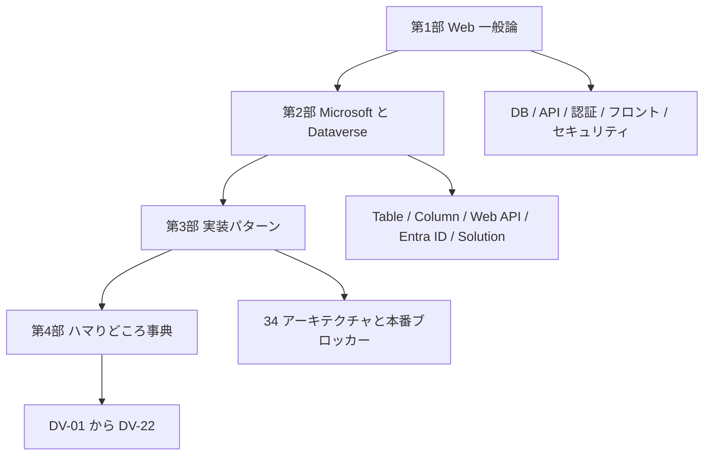

### 混同しやすい近接概念

「Dataverse を学ぶ」と「Power Apps を学ぶ」は近いが別物。Power Apps は画面を作るサービス、Dataverse はデータと権限と API の土台。

「Dataverse を学ぶ」と「SQL Server を学ぶ」も別物。Dataverse の裏にはデータベース的な仕組みがあるが、利用者が自由に DDL を書いて JOIN するための製品ではない。Table、Relationship、Security Role、Solution、Web API といった抽象化を通して操作する。

「ローコードだから簡単」と「本番運用が簡単」も同じではない。画面を作るだけなら確かに速い。だが DLP、環境、ライセンス、監査、ALM、所有者退職時の引き継ぎまで含めれば、普通の業務システムと同じ設計工数が要る。

### ここを押さえれば次に進める

Dataverse は「DB の代わり」では収まらない。DB、API、認証連携、権限、監査、イベント、ALM を束ねたパッケージ品。VBA で 1 ファイルに一体化していたものが、Web と Microsoft 365 の世界では別々の部品に切り分けられている。この部品の名前を順番にそろえることが、このレジュメ最大の目的になる。

---

## 2. システムって何だろう

### ふんわり入口

システムとは、ざっくり「毎回手作業でやると面倒な仕事を、決まった手順で回し続ける仕組み」のこと。

身近な例で考える。飲食店の注文を想像してほしい。

1. 客がメニューを見る
2. 店員に注文を伝える
3. 厨房に注文が届く
4. 料理人が作る
5. レジで会計する
6. 売上が記録される

ここまで全部、紙とペンと電卓でも回せる。ただし、忙しい時間帯になった瞬間、聞き間違い、書き間違い、二重入力、集計漏れが噴き出す。これを潰すために、注文端末、厨房モニター、レジ、売上 DB をつないだ全体が「注文システム」になる。

会社の業務システムも同じ発想で組まれている。申請、承認、顧客管理、在庫、案件、日報、問い合わせを、画面・データ・権限・通知・集計でつないだ全体を指す。

### 正確に言うと

IT システムの構成要素は、ざっくり次の役者に分けて見ると整理しやすい。

| 要素 | 役割 |
|---|---|
| 利用者 | 画面を操作する人 |
| フロントエンド | 利用者が触る画面 |
| バックエンド | 業務処理や API を担う裏側 |
| データベース | データを保存する場所 |
| 認証 | 利用者が誰かを確認する仕組み |
| 認可 | その人が何をしてよいかを決める仕組み |
| 通知 | メール、Teams、プッシュ通知 |
| ログ / 監査 | 誰が何をしたかの記録 |
| 運用 | 障害対応、変更管理、バックアップ、権限棚卸し |

Dataverse はこのうちデータベース、認可、API、監査、イベントフックまでまとめて担当する。「DB の代わり」と一言で言うと、半分しか説明できないのはこのため。

### VBA 的にいうと

VBA 業務ツールでは、1 つの `.xlsm` に多くの役割が押し込められている。

| `.xlsm` 内の部品 | システム一般論での対応 |
|---|---|
| シート | データ保存、簡易 DB |
| UserForm | フロントエンド |
| 標準モジュール | 業務ロジック |
| ボタンイベント | ユーザー操作の入口 |
| 非表示シート | 設定値、マスタ |
| 保護とパスワード | 簡易的な権限制御 |
| 共有フォルダ配布 | 簡易的なデプロイ |

Excel の強みは、この一体感。配布も最終的に 1 ファイル渡せば済む。一方で、複数人が同時に触り始めた途端、ファイル破損、版違い、権限管理、監査、配布が苦しくなる。Dataverse を含む業務システムは、ここを部品ごとに分け、責任を分散させる発想で組まれている。

### 図

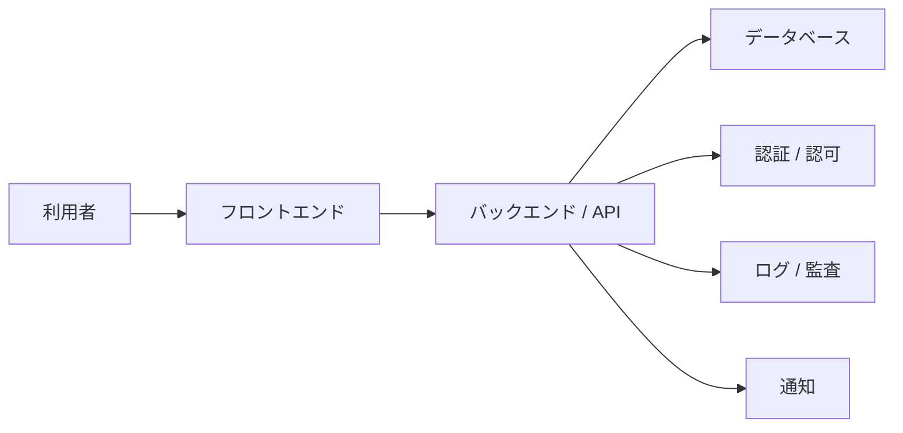

### 混同しやすい近接概念

「アプリ」と「システム」は混ぜて話されがち。アプリは利用者から見える入口のこと。システムは、アプリ・データ・権限・通知・運用までを含む全体を指す。

「自動化」と「システム化」も別物。自動化は一部の作業を自動で走らせること。システム化は入力・処理・保存・権限・監査・運用までを含めて仕組みに落とし込むこと。

「画面ができた」と「業務に使える」も同じではない。業務利用には、誰が使えるか、誰が承認するか、データが消えたらどうするか、退職者の所有物をどう引き継ぐか、監査で説明できるかが要る。画面の完成はスタート地点であって、ゴールではない。

### ここを押さえれば次に進める

システムは画面だけでは成立しない。データ、処理、権限、監査、運用までを含む。Dataverse を学ぶときも、テーブル設計だけでなく「誰が、どの画面から、どの権限で、どの API を通って、どのログを残すか」を一続きで考える。

---

## 3. Web アプリの三層

### ふんわり入口

レストランで考えると、Web アプリの三層はあっさり腑に落ちる。

- 客席:お客さんが見るメニューや注文端末
- 厨房:注文を受けて調理する場所
- 倉庫:食材や在庫を保管する場所

Web アプリでも同じだ。客席がフロントエンド、厨房がバックエンド、倉庫がデータベース。利用者は画面を見る。画面は裏側に「顧客一覧をください」「案件を登録してください」と頼みに行く。裏側はデータベースを読んだり書いたりして、結果を返す。

### 正確に言うと

Web アプリの定番構成は三層アーキテクチャと呼ばれる。

| 層 | 英語 | 役割 |
|---|---|---|
| プレゼンテーション層 | Frontend / UI | 利用者に画面を見せ、入力を受け取る |
| アプリケーション層 | Backend / Application | 業務ルール、API、認証連携、外部連携を捌く |
| データ層 | Database / Storage | データを保存し、検索や更新を行う |

Dataverse を使う場合、三層の対応は構成によって変わる。

| 構成 | フロントエンド | バックエンド | データ層 |
|---|---|---|---|
| Canvas Apps | Canvas Apps | Power Platform / Dataverse Connector | Dataverse |
| Model-driven Apps | Model-driven Apps | Dataverse 標準機能 | Dataverse |
| React + Web API 直結 | React SPA | Dataverse Web API | Dataverse |
| React + BFF | React SPA | Azure Functions / App Service 等 | Dataverse |
| Excel + Power Automate | Excel / VBA / Office Scripts | Power Automate | Dataverse |

ここで効いてくるのが、第 3 部でも繰り返し出てくる「BFF(Backend For Frontend)」という考え方だ。SPA からいきなり Dataverse Web API を叩くと、トークン管理、CORS、レート制御、監査ログ、Secret 管理がフロント側に滲み出る。間に Azure Functions や App Service を 1 段挟んで、そこに集約させるとサーバー側で完結する。会社の本番審査では、この 1 段が「説明しやすさ」に直結する。

### VBA 的にいうと

VBA では三層が 1 ファイルに寄りがちだ。

```vb
' VBA では画面・処理・保存が同じブックに集まりやすい
Private Sub btnSave_Click()
    Worksheets("Data").Cells(nextRow, 1).Value = txtCustomerName.Value
    Worksheets("Data").Cells(nextRow, 2).Value = Now
End Sub
```

Web アプリでは、同じ処理を層ごとに切り出す。

```javascript
// フロントエンド側:ボタン押下で API に送る
async function saveCustomer() {
  const response = await fetch("/api/customers", {
    method: "POST",
    headers: { "Content-Type": "application/json" },
    body: JSON.stringify({ name: document.querySelector("#name").value })
  });

  if (!response.ok) {
    throw new Error("登録に失敗しました");
  }
}
```

```sql
-- データ層:実際の保存先では行が作られる
INSERT INTO Customers (CustomerName, CreatedOn)
VALUES ('株式会社サンプル', CURRENT_TIMESTAMP);
```

Dataverse では、利用者がこの SQL を書くわけではない。Table に対して Web API か Connector 経由で行を作る。SQL を書かなくても、SQL 相当の処理は確実に裏で走っている。

### 図

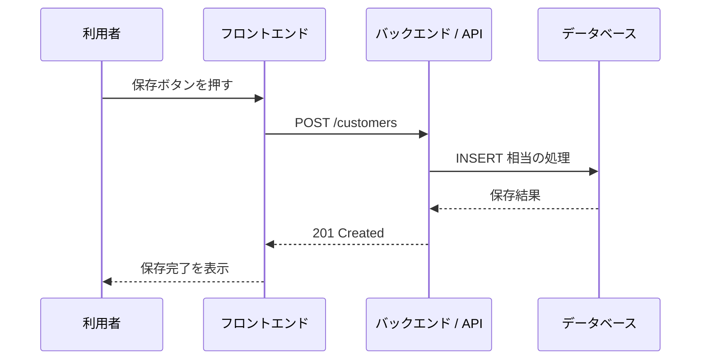

### 混同しやすい近接概念

「バックエンド」と「データベース」は別。バックエンドは処理をする場所、データベースは保存する場所。ただし Dataverse は Web API、権限、Plug-in、Custom API を持っており、ただの DB よりバックエンド寄りの仕事も引き受ける。

「フロントエンド」と「アプリ」も文脈で揺れる用語。Power Apps で「アプリ」と言えば Canvas App や Model-driven App を指す。Web 開発で「フロント」と言えば React や Vue の画面部分を指す。会話では「どっちのアプリ?」を意識的に確認する。

「サーバーレス」と「バックエンドなし」も別物。Azure Functions のようなサーバーレスは、サーバー管理をクラウドに任せるという意味であって、裏側の処理自体が消えるわけではない。

### ここを押さえれば次に進める

Web アプリは画面・処理・データの三層で見ると整理しやすい。Dataverse はデータ層でありながら、API、権限、イベント処理まで持っている。だから「Dataverse を DB としてだけ見る」と、API 制限・権限・監査・容量で必ず見落とす。

---

## 4. データベース入門

### ふんわり入口

データベースは、きれいに整列した台帳だ。Excel の表を思い出すと最初の足場になる。

たとえば顧客一覧。

| 顧客 ID | 顧客名 | 電話番号 |
|---|---|---|
| C001 | 株式会社サンプル | 03-0000-0000 |
| C002 | 鈴木商店 | 06-0000-0000 |

横 1 行が顧客 1 件、縦 1 列が顧客名や電話番号などの項目。DB でも基本構造はまったく同じで、表・行・列で考える。

ただし業務データが大きくなると、Excel の表だけでは破綻する。顧客、案件、見積、請求、担当者を全部 1 枚のシートに詰めると、同じ顧客名がコピーで散らばり、修正漏れが起き、どの行が何を表すか追えなくなる。そこで、テーブルを分けて、ID でつなぐ。これが正規化と呼ばれる発想。

### 正確に言うと

リレーショナルデータベースでは、データをテーブルで管理する。

| 一般 DB 用語 | Dataverse 用語 | 旧名 / 近い言葉 |
|---|---|---|
| Table | Table | Entity |
| Column | Column | Field / Attribute |
| Row | Row | Record |
| Primary Key | Primary Key | 主キー |
| Foreign Key | Lookup / Relationship | 外部キー的な関係 |
| Relationship | Relationship | リレーション |

主キーは、行を一意に識別する値。社員番号、顧客 ID、注文 ID のような「絶対にダブらない番号」。外部キーは、別テーブルの行を指す値で、Dataverse では Lookup 列と Relationship として表現される。

例として、整理されていない表をひとつ。

| 注文 ID | 顧客名 | 顧客電話 | 商品名 | 単価 |
|---|---|---|---|---|
| O001 | 株式会社サンプル | 03-0000-0000 | マウス | 2000 |
| O002 | 株式会社サンプル | 03-0000-0000 | キーボード | 5000 |

顧客電話が変わると、同じ顧客の全行を直す羽目になる。そこで顧客テーブルと注文テーブルに分ける。

```sql
CREATE TABLE Customers (
  CustomerId varchar(20) PRIMARY KEY,
  CustomerName varchar(100) NOT NULL,
  Phone varchar(30)
);

CREATE TABLE Orders (
  OrderId varchar(20) PRIMARY KEY,
  CustomerId varchar(20) NOT NULL,
  ProductName varchar(100) NOT NULL,
  UnitPrice int NOT NULL,
  FOREIGN KEY (CustomerId) REFERENCES Customers(CustomerId)
);
```

トランザクションは、複数の更新を「全部成功」か「全部失敗」のどちらかに揃える単位。銀行振込で、A さんの口座から 1 万円が引かれたのに B さんの口座に足されない、という途中失敗を防ぐ仕掛け。

```sql
BEGIN TRANSACTION;

UPDATE Accounts
SET Balance = Balance - 10000
WHERE AccountId = 'A';

UPDATE Accounts
SET Balance = Balance + 10000
WHERE AccountId = 'B';

COMMIT;
```

Dataverse では利用者が直接この SQL を書くわけではない。けれど、Web API の `$batch`、Plug-in、Custom API、Organization Service など、複数処理の整合性をどう取るかを考える場面は普通に出てくる。

### VBA 的にいうと

`Worksheet.Cells(1, 1)` は、表の 1 行目 1 列目を指す。これは Excel の「物理的な座標」で値を取りにいく感覚。DB では通常、物理的な順番に意味を持たせない。代わりに主キーで行を特定する。

```vb
' Excel 的な発想
Worksheets("Customers").Cells(2, 1).Value = "C001"
Worksheets("Customers").Cells(2, 2).Value = "株式会社サンプル"
```

```sql
-- DB 的な発想
SELECT CustomerName
FROM Customers
WHERE CustomerId = 'C001';
```

「2 行目」と言うか「`CustomerId = 'C001'` の行」と言うか、ここに発想の溝がある。

VBA の Recordset は、DB から取ってきた行のまとまり。JavaScript で API を呼んだ場合は、JSON 配列が Recordset に一番近い。

```javascript
const result = await fetch("/api/customers").then(r => r.json());
for (const row of result.value) {
  console.log(row.name);
}
```

### 図

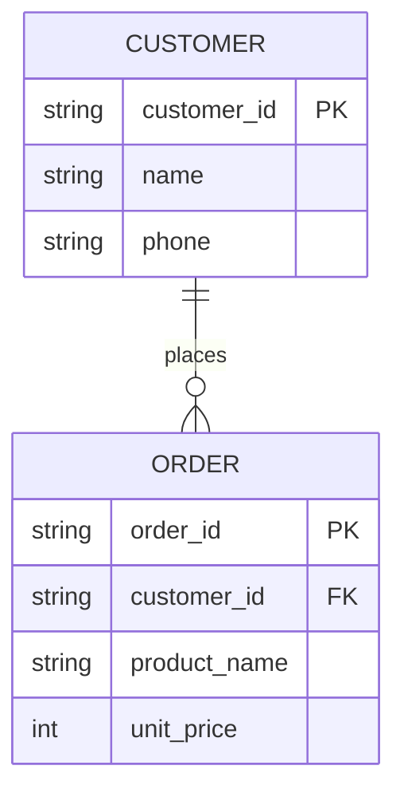

### 混同しやすい近接概念

「表」と「テーブル」は近いが、Excel の表と DB のテーブルは別物。Excel では見た目、計算式、メモ、結合セル、書式が同じ平面に混在する。DB のテーブルは型と制約、主キー、関係を持ち、見た目の自由はない代わりに整合性が硬い。

「外部キー」と「Lookup」も近いが、Dataverse の Lookup は UI、権限、Relationship、参照先の Entity set 名、Polymorphic 型まで絡む。単なる ID 列ではない。

「削除」と「非アクティブ化」も違う。業務システムでは、行を物理削除するより、状態列で無効化するほうが監査や参照整合性に向く場面が多い。Dataverse の多くの標準 Table も、`statecode` / `statuscode` で状態を持っている。

### ここを押さえれば次に進める

DB の基本は Table、Row、Column、主キー、外部キー、Relationship。Dataverse ではこれらが Table、Column、Row、Lookup、Relationship に対応する。Excel の表にぱっと見は似ていても、型・主キー・権限・関係・監査・API が乗ってくる点が決定的に違う。

---

## 5. API と通信

### ふんわり入口

API は、システム同士の「注文窓口」だ。

レストランで言うなら、客が厨房に乗り込んで冷蔵庫を勝手に開けるのではなく、店員さんに「カレーをください」と頼む。店員さんが注文を受け取り、厨房に伝え、料理ができたら客席に運ぶ。

Web システムでも同じ流儀でやっている。画面がいきなりデータベースを直に触るのではなく、API という窓口に「顧客一覧をください」「案件を登録してください」と頼む。API は頼み方のルールを公開している。

### 正確に言うと

HTTP は Web の基本通信プロトコル。HTTPS は HTTP を TLS で暗号化したもの。現代の Web API は基本的に HTTPS で話す。

HTTP には「動詞」がある。

| メソッド | 意味 | 典型用途 |
|---|---|---|
| GET | 取得する | 一覧取得、詳細取得 |
| POST | 作成する、処理を依頼する | 新規作成、Action 呼び出し |
| PATCH | 部分更新する | 一部 Column の更新 |
| PUT | 置き換える | 全体更新 |
| DELETE | 削除する | 行の削除 |

リクエストが「依頼」、レスポンスが「返事」。

```http
GET /api/data/v9.2/accounts?$select=name,telephone1 HTTP/1.1
Host: org.crm.dynamics.com
Authorization: Bearer <access_token>
Accept: application/json
```

返事にはステータスコードが付く。これが「依頼の結果」を 3 桁数字で伝える仕組み。

| ステータス | 意味 |
|---|---|
| 200 OK | 成功 |
| 201 Created | 作成成功 |
| 204 No Content | 成功、返す本文なし |
| 400 Bad Request | 依頼の書き方が悪い |
| 401 Unauthorized | 認証ができていない |
| 403 Forbidden | 認証はできたが権限がない |
| 404 Not Found | 見つからない |
| 409 Conflict | 競合 |
| 412 Precondition Failed | ETag など前提条件に失敗 |
| 429 Too Many Requests | リクエスト過多 |
| 500 Internal Server Error | サーバー側エラー |

`401` と `403` を取り違えると、Dataverse 連携では原因究明が大きく遠回りする。`401` は「あなた誰?」が解けていない、`403` は「あなたは分かったがそれは触らせない」。前者はトークンや App Registration、後者は Security Role と Privilege Depth を疑う。

REST は HTTP の「使い方の作法」だ。プロトコルそのものではない。「リソースに URL を割り当てて、HTTP メソッドで操作する」というスタイル。

OData は、データを問い合わせるためのクエリ規格。`$select`、`$filter`、`$expand`、`$top` などを URL に書いて使う。Dataverse Web API は OData v4 系の流儀で操作する。

```javascript
const url = "https://org.crm.dynamics.com/api/data/v9.2/accounts"
  + "?$select=name,telephone1"
  + "&$filter=startswith(name,'A')";

const response = await fetch(url, {
  headers: {
    Authorization: `Bearer ${accessToken}`,
    Accept: "application/json"
  }
});

if (!response.ok) {
  throw new Error(`${response.status} ${response.statusText}`);
}

const data = await response.json();
console.log(data.value);
```

### VBA 的にいうと

VBA から HTTP を叩くことは普通にできる。ADO で SQL Server にぶら下がる感覚に近い。違いは、接続先が SQL Server ではなく Web API URL、接続文字列ではなく Bearer Token、Recordset ではなく JSON という点。

```vb
Dim http As Object
Set http = CreateObject("MSXML2.XMLHTTP")

http.Open "GET", "https://example.com/api/customers", False
http.setRequestHeader "Accept", "application/json"
http.Send

If http.Status = 200 Then
    Debug.Print http.responseText
End If
```

ただし、Dataverse Web API を VBA から直接呼ぼうとすると、OAuth・MFA・条件付きアクセス・トークン保管が一気に絡む。会社本番ではここが重い。VBA から直接 Dataverse に行くより、Power Automate や BFF を挟む構成のほうが、説明と監査が通りやすい。

### 図

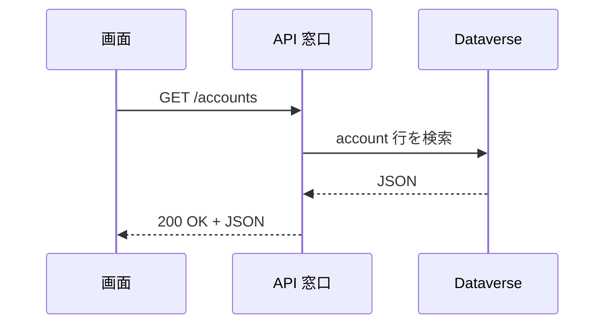

### 混同しやすい近接概念

「HTTP」と「REST」は別。HTTP は通信ルール、REST は HTTP の使い方の設計流派。

「REST」と「OData」も別。REST は広い設計スタイル、OData はデータ問い合わせの具体規格。Dataverse Web API は見た目 REST っぽいが、`$filter` や `@odata.bind` など OData の書式を多用する。「REST 風 OData」と覚えるとちょうどいい。

「API」と「Connector」も別物。API はシステムが公開する窓口そのもの。Connector は Power Platform 側がその API を使いやすくラップした接続部品。Dataverse Connector の裏では Dataverse の API が動いているが、利用者は HTTP を直接書かずに済む。

### ここを押さえれば次に進める

API はシステム同士の窓口。HTTP メソッド、リクエスト / レスポンス、ステータスコードの基本を押さえると、Dataverse Web API や Connector のエラーが読めるようになる。Dataverse では OData の語彙(`$select`、`$filter`、`$expand`)が頻出するので、早めに馴染んでおく。

---

## 6. 認証と認可

### ふんわり入口

認証と認可は、会社の受付と入館証で考えるのが手っ取り早い。

受付で「あなたは誰?」を確認するのが認証。社員証、免許証、顔認証、パスワード、MFA がここに当たる。

入館したあと、「3 階の経理室に入れるか」「金庫を開けられるか」を判定するのが認可。同じ社員でも、全員が全室に入れるわけではない。

Dataverse の世界では、Entra ID が主に「あなたは誰か」を担当し、Dataverse 側の Security Role や Business Unit が「何ができるか」を担当する。2 段構えになっているのがポイント。

### 正確に言うと

認証 (Authentication) は、相手が誰であるかを確認すること。認可 (Authorization) は、認証済みの相手に対して、どの操作を許すかを決めること。略すと AuthN と AuthZ。

OAuth 2.0 は、パスワードを直接渡さずに、限定された権限を表すトークンで API を叩くための仕組み。OpenID Connect は OAuth 2.0 の上に「ログインした人の身元情報」を扱う層を被せたもの。

トークンは、ホテルのカードキーに近い。マスターキー(=パスワード)を貸し出す代わりに、有効期限付き・部屋限定のカードを渡す。落としても被害が限定できるし、期限切れで自動的に無効になる。

| 用語 | 意味 |
|---|---|
| Access Token | API を呼ぶための短命な通行証(通常 1 時間程度) |
| Refresh Token | Access Token を更新するための長寿命の通行証 |
| Scope | 何をしてよいかの範囲 |
| Client ID | アプリを識別する ID |
| Client Secret | アプリが秘密に持つ合言葉 |
| Tenant ID | Microsoft 365 テナントを識別する ID |
| Authorization Code Flow | 人間がログインしてアプリに代理権限を渡す流れ |
| Client Credentials Flow | アプリ自身がサーバー間で動く流れ |
| On-Behalf-Of (OBO) | 受け取ったユーザートークンをもとに、バックエンドがユーザーの代理で下流 API を呼ぶ流れ |

Authorization Code Flow の大筋はこう。

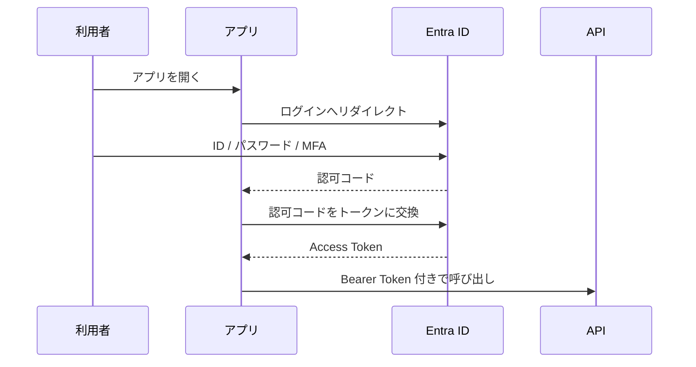

Client Credentials Flow は、人間がログインしないバッチやサーバー間連携向け。

```javascript
// Node.js で Client Credentials のトークンを取る例
const body = new URLSearchParams({
  grant_type: "client_credentials",
  client_id: process.env.CLIENT_ID,
  client_secret: process.env.CLIENT_SECRET,
  scope: "https://org.crm.dynamics.com/.default"
});

const tokenResponse = await fetch(
  `https://login.microsoftonline.com/${process.env.TENANT_ID}/oauth2/v2.0/token`,
  {
    method: "POST",
    headers: { "Content-Type": "application/x-www-form-urlencoded" },
    body
  }
);

const { access_token } = await tokenResponse.json();
```

On-Behalf-Of は、フロントでログインした利用者のトークンを使って、バックエンドが「その人の代理」で下流 API を叩く流れ。BFF を挟むときに「監査はユーザー単位で残したいが、トークン管理とリトライはサーバー側に閉じたい」場合に使う。

### VBA 的にいうと

VBA の業務ツールでは、Windows ログイン済みなら使える、ブックを開ければ動く、というのが暗黙の前提になっていることが多い。これは「認証と認可を Excel の運用に乗せている」状態と言える。

業務システム化するときは、ここを明示する。

| VBA 運用 | Web / Dataverse 運用 |
|---|---|
| 共有フォルダに置いた人だけ開ける | Entra ID でログインする |
| シート保護パスワード | Security Role や Column-level security |
| マクロ内に接続文字列直書き | App Registration、Secret、Key Vault |
| 担当者別ファイル配布 | Business Unit、Team、共有 |

VBA に Client Secret を埋め込む設計は避ける。ブックを配ることが Secret を配ることに等しくなる。マクロを書ける前提のリテラシーがあっても、認証情報の取り扱いは別ジャンル。

### 混同しやすい近接概念

「ログインできる」と「データを読める」は違う。Entra ID でログインできても、Dataverse 側に System User が無かったり、Security Role が足りなかったりすれば読めない。

「401」と「403」も意味が違う。`401` は認証が成立していない。`403` は認証はできたが権限が足りない。Application User を作り忘れて 401、Security Role 不足で 403、というのが王道のハマり方。

「Application User」と「Service Principal」も別物。Service Principal は Entra ID 側のアプリ実体。Application User は Dataverse 側でそのアプリを「ユーザー」として迎え入れるための登録レコード。

### ここを押さえれば次に進める

認証は「あなた誰?」、認可は「何していい?」。Dataverse 連携では Entra ID と Dataverse の 2 世界をまたぐ。App Registration を作っただけでは Dataverse の権限は取れない。Application User と Security Role までそろってはじめて、サーバー間連携は動く。

---

## 7. フロントエンドの形

### ふんわり入口

フロントエンドは、利用者が触る入口。店舗で言えば、売り場、窓口、注文端末、案内板に相当する。

同じ商品を売るにしても、店舗、電話注文、自動販売機、EC サイト、スマホアプリでは入口がまったく違う。裏側の在庫と会計は同じでも、利用者が触る部分は柔軟に変えられる。

Dataverse も同じ構造で、同じ Table を Canvas Apps、Model-driven Apps、Power Pages、Teams Tab、Excel、React アプリなどから扱える。入口の形を間違えると、業務が回らない・利用者が嫌がる・運用が破綻する、のどれかが起きる。

### 正確に言うと

フロントエンドの代表的な作り方には SPA、SSR、SSG がある。

| 方式 | 意味 | 向く場面 |
|---|---|---|
| SPA | Single Page Application。ブラウザ内で画面遷移を完結 | 業務アプリ、管理画面 |
| SSR | Server-Side Rendering。サーバーで HTML を生成して返す | 初期表示速度、SEO、認証付きサイト |
| SSG | Static Site Generation。事前に HTML を生成 | ドキュメント、ブログ、静的サイト |

React、Vue、Angular、Svelte はフロントエンドのフレームワークやライブラリ。UI 部品、状態管理、画面遷移、ビルドなどを肩代わりしてくれる道具立て。

Dataverse 周辺では、フロントの選択肢を「ローコードからプロコードへの距離」で並べると整理しやすい。

| 階層 | 例 | 特徴 |
|---|---|---|
| ローコード | Canvas Apps、Model-driven Apps | Power Platform 内、認証・権限・共有が標準寄り |
| 部分コード | PCF、Web resource、Command bar JS | 標準アプリの一部だけ拡張 |
| フルコードだが Power Platform 内 | Code Apps | React 等で書き、Power Platform 管理下で動く |
| 完全独立 | React / Vue + Dataverse Web API / BFF | 自由度は高いが、認証・ホスティング・本番審査が重い |

### VBA 的にいうと

VBA の UserForm はフロントエンドそのもの。ボタンを置いて、入力欄を置いて、`_Click` で処理を書く。

```vb
Private Sub btnSearch_Click()
    Call SearchCustomer(txtKeyword.Value)
End Sub
```

JavaScript ではイベントリスナーで似たことをする。

```javascript
document.querySelector("#searchButton").addEventListener("click", async () => {
  const keyword = document.querySelector("#keyword").value;
  const result = await fetch(`/api/customers?keyword=${encodeURIComponent(keyword)}`)
    .then(r => r.json());
  renderCustomers(result.value);
});
```

Power Fx ではボタンの `OnSelect` プロパティに式を書く。

```powerfx
ClearCollect(
    colAccounts,
    Filter(Accounts, StartsWith('Account Name', txtKeyword.Text))
)
```

書き味は違うが、「ボタンを押す → 検索 → 表示」というイベント駆動の構造は VBA からそのまま地続きで読める。

### 図

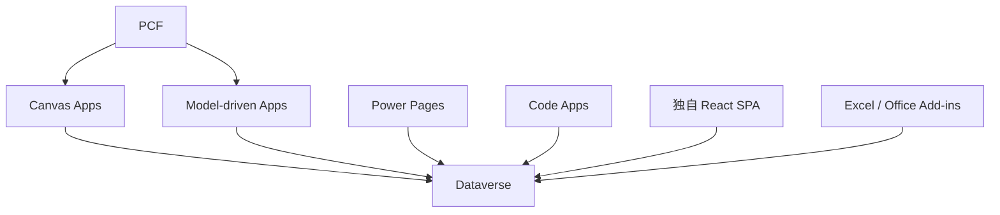

### 混同しやすい近接概念

「画面自由度」と「本番通過性」は別。React で凝った UI を作れば自由度は高いが、Entra アプリ登録、ホスティング、条件付きアクセス、DLP、監査、ライセンスの説明資料を全部用意する羽目になる。

「Canvas Apps」と「Model-driven Apps」は同じ Power Apps だが思想が違う。Canvas はゼロから自由にレイアウトする画面、Model-driven は Dataverse のデータモデル、Form、View、Sitemap を中心に自動生成寄りで作る画面。

「PCF」と「Code Apps」も違う。PCF は Canvas / Model-driven に埋め込む部品。Code Apps はアプリ全体をコードで作る方式。前者は「画面の中のパーツを自作」、後者は「アプリ自体を React で書く」。

### ここを押さえれば次に進める

フロントエンドは入口。Dataverse を真ん中に置く場合、入口は一つではない。最初に「誰が、どの端末で、どの業務導線から触るか」を決めれば、Canvas、Model-driven、Teams、SharePoint、独自 Web、Excel のどれが妥当か絞り込める。技術選定より前に、利用者像を固める。

---

## 8. セキュリティの基本

### ふんわり入口

セキュリティは、玄関の鍵だけでは足りない。会社の建物で考えれば、受付、社員証、部屋の鍵、金庫、監視カメラ、入退室ログ、持ち出し禁止ルール、廃棄ルールまで含めて初めて成立する。

Web アプリも同じで、ログイン画面を付けただけで安全になるわけではない。入力値、ブラウザの挙動、API、権限、外部サイト、通信、ログ、端末、運用、すべてが攻撃対象になりうる。

Dataverse は標準で強いセキュリティモデルを持っている。一方、フロントや連携経路を雑に組むと別の穴を作る。独自 Web、Office Add-ins、VBA、Power Automate の HTTP コネクタ、Custom Connector を絡める構成では特に意識する。

### 正確に言うと

Web セキュリティの定番用語を 5 つだけ覚えておくと、ほとんどの会話に追従できる。

| 用語 | 日常の例え | 意味 |
|---|---|---|
| CSRF | 本人の印鑑を勝手に押される | ログイン済みブラウザに意図しないリクエストを送らせる攻撃 |
| XSS | 掲示板に悪意ある貼り紙を貼る | サイト内に悪意ある JavaScript を実行させる攻撃 |
| SQL Injection | 申請欄に命令文を書き込んで処理させる | 入力値を悪用して SQL を改ざんする攻撃 |
| CORS | 入館してよい取引先ドメインの許可リスト | ブラウザが別オリジン API を呼ぶ制御 |
| CSP | 店内で実行してよいスクリプトの規則 | 読み込めるスクリプトや画像の制限 |

SQL Injection の危険な例。

```javascript
// 悪い例:入力値を SQL に直接連結する
const sql = "SELECT * FROM Users WHERE name = '" + userInput + "'";
```

安全な例。

```javascript
// 良い例:パラメータ化する
const result = await db.query(
  "SELECT * FROM Users WHERE name = ?",
  [userInput]
);
```

Dataverse Web API を使う場合、通常は自分で SQL を組み立てない。ただし、`$filter` 文字列を入力値から組み立てる場合は、エスケープと許可リストの設計が要る。

```javascript
// 悪い例:入力値を OData filter にそのまま連結する
const url = `/api/data/v9.2/accounts?$filter=name eq '${keyword}'`;

// ましな例:シングルクォートをエスケープし、関数も限定する
const escaped = keyword.replaceAll("'", "''");
const safeUrl = `/api/data/v9.2/accounts?$filter=startswith(name,'${escaped}')`;
```

CORS はブラウザ側の制御だ。サーバー間通信では同じ制約はかからない。独自 SPA から Dataverse Web API を直接叩く場合、リダイレクト URI、許可オリジン、認証フローが絡んで本番審査が膨らみがち。BFF を挟むのは、CORS を回避するため「だけ」ではないが、副次効果として CORS の重さも減る。

### VBA 的にいうと

VBA ツールでありがちな悪手は、Web に持ち上げるとそのまま重大事故になりやすい。

| VBA でありがちなこと | Web / Dataverse で何が起きるか |
|---|---|
| 接続文字列やパスワードをコードに直書き | Secret 漏洩 |
| 共有フォルダに最新版を置くだけ | 改ざん、版数不明、配布事故 |
| マクロ有効化を手作業で依頼 | 端末制御、監査、署名問題 |
| 入力値を SQL 文字列に連結 | SQL Injection |
| 全員が同じ共有アカウントで実行 | 監査不能、Multiplexing 違反 |

VBA そのものが悪いわけではない。ローカル少人数の業務には今でも強い。ただし Dataverse という中央データ基盤につなぐなら、認証・監査・トークン・ライセンス・DLP を含めて再設計するという覚悟は要る。

### 図

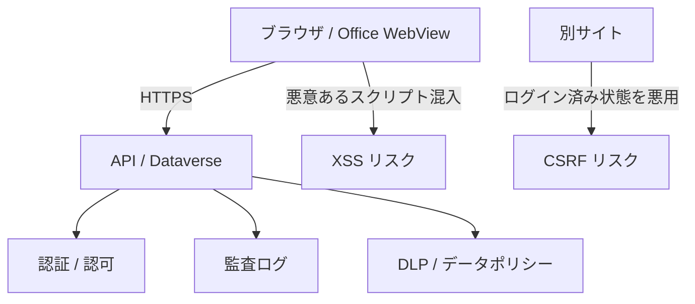

### 混同しやすい近接概念

「暗号化」と「安全」は別。HTTPS で通信していても、権限設計が間違っていれば見えてはいけないデータが普通に見える。暗号化は途中で覗かれないというだけの話で、宛先で漏れる事故は防げない。

「認証」と「入力検証」も別。ログイン済みのユーザーが操作していても、入力値は信用しない。業務アプリでは、悪意よりも誤入力のほうが事故率が高い。

「Dataverse の Security Role」と「画面上の非表示」も違う。画面でボタンや列を隠しても、API の権限が残っていれば別経路で叩ける。重要な制約はサーバー側、つまり Dataverse の権限と Plug-in / Custom API 側で守る。

### ここを押さえれば次に進める

セキュリティはログインだけで終わらない。入力、API、権限、通信、ブラウザ制御、監査、DLP、端末管理まで含む。Dataverse を使うときも、標準機能に任せられる部分と、自分で守らなければならない部分を切り分けて考える。

---

# 第 2 部 Microsoft の世界(Dataverse 中心)

## 9. Power Platform 全体地図

### ふんわり入口

Power Platform は、業務改善デパートだと思うのが手っ取り早い。フロアごとに役割が違う。

- 画面を作るフロア
- 自動処理を作るフロア
- グラフや分析を作るフロア
- 外部向け Web サイトを作るフロア
- チャットボットを作るフロア
- どのフロアも共通で使う倉庫

この共通倉庫が Dataverse。もちろん全部の Power Platform アプリが Dataverse を使うとは限らない。SharePoint Lists、Excel、SQL Server、外部 SaaS をデータ源にすることもある。それでも、権限・監査・関係・本格的な業務運用まで考えると、結局 Dataverse が中心候補に戻ってくる。

### 正確に言うと

Power Platform は、業務アプリ、自動化、分析、Web サイト、チャットボット、AI 部品、データ基盤をまとめた Microsoft のローコード / プロコード統合基盤。

| サービス | 役割 | Dataverse との関係 |
|---|---|---|
| Power Apps | 業務アプリの画面を作る | Canvas、Model-driven、Custom Page、Code Apps から Dataverse を使う |
| Power Automate | 自動処理、承認、通知、連携を組む | Dataverse トリガー、Dataverse Connector で読み書き |
| Power BI | データ分析、レポート、ダッシュボード | Dataverse をデータソースにできる |
| Power Pages | 外部 / 社外向け Web サイト | Dataverse Table を公開し、Table Permissions で守る |
| Copilot Studio | チャットボット、会話型 UI | Dataverse や Connector をアクションとして呼べる |
| Dataverse | 共通データ基盤 | Table、Security Role、Web API、監査、業務ロジックを持つ |
| Connectors | 外部サービス接続口 | SharePoint、Excel、Teams、HTTP、Dataverse などを接続 |
| AI Builder | AI 部品 | Dataverse や Power Apps / Automate と組み合わせる |

管理単位として Tenant と Environment が重要な軸になる。

| 用語 | 意味 | 例え |
|---|---|---|
| Tenant | Microsoft 365 契約全体の器 | 会社の建物全体 |
| Environment | Power Platform の作業空間 | 建物の中のフロア |
| Dataverse database | Environment に作成される Dataverse のデータ領域 | フロア専用の倉庫 |
| Default environment | テナントに自動作成される共有環境 | 全社員が出入りしがちな共用スペース |

Default 環境は便利だが、業務本番の置き場にすると痛い目を見る。全社ユーザーが Maker ロールを持ち、資産が個人所有になりやすく、管理方針がぼやけやすい。手動バックアップも取れない。PoC でも、実データや本番化前提のものは専用の開発環境・Sandbox・管理者が許可した環境で行う。Default 環境を「お試しスペース」にすると、誰かの私物アプリが本番化してそのまま放置され、退職時に孤児化する事故が定番。

### VBA 的にいうと

Power Platform 全体を Excel 世界に置き換えると、Excel・Outlook・Teams・SharePoint・Access・Power Query・VBA・タスクスケジューラ・共有フォルダを、会社全体で統合管理しているような姿になる。

VBA では「このブックを配れば動く」という配布の手軽さが強い。一方 Power Platform では「どの Environment にあり、誰が所有し、どの Connector を使い、どの Solution で移送し、どの DLP に従うか」が常に問われる。ブックを配る感覚で本番化しようとすると、必ずどこかで止まる。

### 図

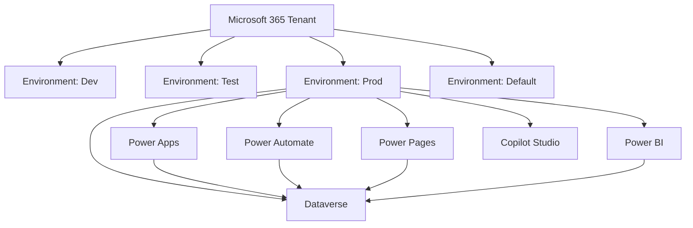

### 混同しやすい近接概念

「Power Apps」と「Power Platform」は別物。Power Apps は Power Platform の一部であって全部ではない。

「Environment」と「Dataverse」も別。Environment は作業空間で、Dataverse はその中に作れるデータ基盤。Environment は作ったけれど Dataverse database を有効にしていない、という状態もあり得る。

「Dataverse」と「Dataverse for Teams」は混同が頻発する罠。Dataverse for Teams は Teams 内利用に振り切った軽量版で、本格 Dataverse とは容量・機能・ライフサイクル・移行方針が違う。PoC で Dataverse for Teams を使い、本番で「In-Place アップグレードできない」と分かって作り直し、という展開はよくある。後述するが、Microsoft Lists / SharePoint Lists と Dataverse for Teams も別物。混ぜて呼ばないようにする。

### ここを押さえれば次に進める

Power Platform は、Apps・Automate・BI・Pages・Copilot・Dataverse・Connectors の集合体。Dataverse はその中心に据えやすい共通データ基盤だが、Environment・DLP・ライセンス・ALM とセットで考える。Default 環境を本番の代用にしない、というのは早めに刷り込んでおいた方がいい。

---

## 10. Dataverse は「何の代わり」か

### ふんわり入口

Dataverse を「Excel の代わり」とだけ説明すると、半分しか伝わらない。「Access の代わり」もまだ足りない。

近いのは、次の部品が最初から合体した業務基盤だ。

- データを置く倉庫
- 倉庫の棚割り(誰がどの棚を触れるか)
- 入館証と部屋の鍵
- 注文窓口 (API)
- 変更履歴の記録機
- 業務ルールを差し込むためのコンセント
- 他システムへの通知装置
- 開発環境から本番環境へ運ぶ箱

自前で Web アプリを組むなら、DB、ORM、認証、認可、API、監査ログ、イベントキュー、管理画面、デプロイ手順を別々の道具で揃える。Dataverse はこの大半を Microsoft のクラウド基盤として最初から提供している。便利だが、便利なぶん設計の責任範囲も広い。

### 正確に言うと

Dataverse は、Power Platform と Dynamics 365 で使われるクラウドベースのデータプラットフォーム。業務データを Table で管理し、セキュリティ、ビジネスロジック、API、監査、検索、統合、ALM までを統合して提供する。

「何の代わりか」を要素ごとに分解すると、こうなる。

| 自前システムの部品 | Dataverse 側の対応 |
|---|---|
| RDBMS のテーブル | Table (旧 Entity) |
| カラム定義 | Column (旧 Field / Attribute) |
| レコード | Row (旧 Record) |
| 外部キー | Lookup、Relationship |
| ORM | Dataverse SDK、Web API、Connector が抽象化 |
| 認可 | Security Role、Business Unit、Team、Owner、Sharing |
| 行 / 列の権限 | Privilege Depth、Column-level security |
| API | Dataverse Web API (OData v4)、Organization Service |
| サーバー側イベント | Plug-in、Custom API、Business Rule、Power Automate |
| 監査 | Audit、Power Platform Activity、Unified Audit |
| デプロイ単位 | Solution |
| 環境分離 | Environment |

Dataverse は SQL Server そのものではない。利用者が直接 DDL を書いて自由に JOIN する DB ではなく、Power Platform のメタデータ・セキュリティ・API を通して扱う、もう一段抽象化された世界。

### VBA 的にいうと

Access + ADO + フォーム + 権限 + 監査 + 配布管理をクラウド化したもの、と言うと近い。ただし Access のように `.accdb` を開いてフォームを叩くのではなく、クラウド上の Dataverse に Connector や Web API でアクセスする。

Excel で「入力シート」「マスタシート」「非表示設定シート」「VBA 処理」「保護パスワード」を一体で組んでいたものを、Dataverse では Table、Relationship、Security Role、Business Rule、Solution に分解する。役割を分けるぶん、最初のセットアップは Excel より重い。代わりに、複数人運用と監査と移送が真っ当に回る。

### コード例

Dataverse Web API で Account を作る HTTP 例。

```http
POST https://org.crm.dynamics.com/api/data/v9.2/accounts HTTP/1.1
Authorization: Bearer <access_token>
Content-Type: application/json
Accept: application/json

{
  "name": "株式会社サンプル",
  "telephone1": "03-0000-0000"
}
```

JavaScript なら、同じことをこう書く。

```javascript
async function createAccount(accessToken) {
  const response = await fetch(
    "https://org.crm.dynamics.com/api/data/v9.2/accounts",
    {
      method: "POST",
      headers: {
        Authorization: `Bearer ${accessToken}`,
        "Content-Type": "application/json",
        Accept: "application/json"
      },
      body: JSON.stringify({
        name: "株式会社サンプル",
        telephone1: "03-0000-0000"
      })
    }
  );

  if (!response.ok) {
    throw new Error(`${response.status} ${await response.text()}`);
  }
}
```

Power Fx なら 1 行で済む。

```powerfx
Patch(Accounts, Defaults(Accounts), { 'Account Name': "株式会社サンプル", 'Main Phone': "03-0000-0000" })
```

### 混同しやすい近接概念

「Dataverse は DB である」と「Dataverse は DB だけである」は別。Dataverse はデータ保存もするが、Security Role・Business Unit・Web API・Plug-in・Solution などとセットで使う前提で設計されている。

「SharePoint Lists で十分」と「Dataverse が必要」は要件で決まる。単純なリスト、軽い申請、M365 範囲の共有なら SharePoint Lists で足りる場面もある。複雑な Relationship、Column-level security、本格 ALM、複数 UI、監査要件が出てきたら Dataverse が候補に上がる。Lists で始めて要件が育って Dataverse に移す、というのは「移行コストが大きい」前提で計画する。

「中間 API を挟めば Dataverse 制限を回避できる」も誤解。BFF や API 中間層を挟んでも、Dataverse 側の Security Role、API 制限、容量、ライセンス、監査の問題は消えない。隠れて見えにくくなるだけで、本番審査では結局そこを聞かれる。

### ここを押さえれば次に進める

Dataverse は DB、ORM、認可、API、イベント、監査、ALM までを束ねた業務データ基盤。便利な反面、単なる保存先より設計範囲が広い。Table を作る前に、誰が使い、どの権限で、どの画面 / API から、どう本番運用するかをひと通り考えてから手を動かす。

---

## 11. Entra ID

### ふんわり入口

Entra ID は、Microsoft 365 の「社員証発行所」だ。

会社の建物に入るとき、受付や入館ゲートで「この人は社員か」「MFA を通ったか」「会社管理端末から来ているか」を確認する。これが Entra ID の世界。

ただし、建物に入れたからといって、経理の金庫まで自由に開けられるわけではない。Dataverse の世界では、入館後に Security Role や Business Unit で「何を触っていいか」を別途決める。この 2 段階を切り分けて捉えるのが Dataverse 連携の肝。

### 正確に言うと

Microsoft Entra ID(旧 Azure Active Directory)は、Microsoft クラウドの ID およびアクセス管理基盤。ユーザー、グループ、アプリケーション、サービスプリンシパル、条件付きアクセス、MFA、トークン発行を扱う。

Dataverse 連携で頻出する用語をまとめる。

| 用語 | 世界 | 意味 |
|---|---|---|
| Tenant | Entra / M365 | 会社全体の ID 管理単位 |
| User | Entra | 人間のアカウント |
| Group | Entra | ユーザーのまとまり |
| App Registration | Entra | アプリの定義。Client ID、Redirect URI を持つ |
| Service Principal | Entra | Tenant 内でのアプリの実体 |
| Application User | Dataverse | Dataverse 側でアプリをユーザーとして扱う登録 |
| Security Role | Dataverse | Table 操作権限の束 |
| Delegated permission | Entra / API | 人間の代わりにアプリが呼ぶ権限 |
| Application permission | Entra / API | アプリ自身が呼ぶ権限 |
| S2S | Dataverse 連携 | Server-to-Server。Client Credentials など |
| OBO | Entra | On-Behalf-Of。バックエンドがユーザー代理で下流 API を呼ぶ |

Delegated は「社員本人が受付を通り、隣にいる代理人にも書類提出を頼む」イメージ。代理人ができることは、最終的に本人の権限の範囲に縛られる。

Application / S2S は「業務委託会社の専用入館証」のイメージ。人間ではなくアプリ自体に権限が紐づく。Dataverse 側では Application User を登録し、Security Role を割り当てて初めて使える。Service Principal を作っただけでは Dataverse は気付かない。

OBO は、フロントでログインしたユーザーの文脈をバックエンドに渡し、バックエンドがその人の代理で Dataverse を呼ぶ構成。BFF を挟みつつ、「監査はユーザー単位で残したいが、トークン管理とリトライはサーバー側に閉じたい」場合の本命解。

### VBA 的にいうと

社内共有フォルダの `.xlsm` を開くとき、Windows ログインや NTFS 権限に乗っかって認証している。これは「OS が認証を肩代わりしている」状態。Entra ID は、そのクラウド版の入口。

VBA マクロに直接 Client Secret を書いて Dataverse を叩く、という構成は、社員証のコピーを全員に配るに等しい。アプリの資格情報は、サーバー側・Key Vault・Managed Identity・証明書のいずれかで管理する。これは「VBA だから許される」例外にはならない。

### 図

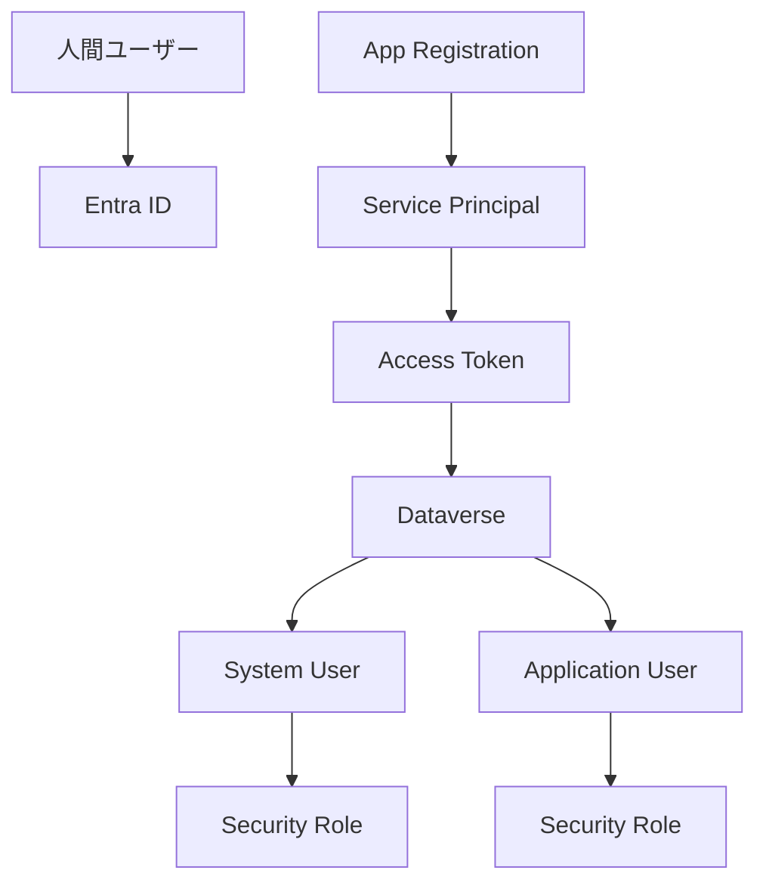

### コード例

Delegated で Dataverse を呼ぶ場合、フロントでは MSAL などを使ってユーザーのトークンを取る。

```javascript
const token = await msalInstance.acquireTokenSilent({
  scopes: ["https://org.crm.dynamics.com/user_impersonation"],
  account: msalInstance.getActiveAccount()
});

const whoami = await fetch(
  "https://org.crm.dynamics.com/api/data/v9.2/WhoAmI",
  { headers: { Authorization: `Bearer ${token.accessToken}` } }
).then(r => r.json());

console.log(whoami.UserId);
```

S2S では、Client Credentials で取得したトークンを使う。前提として Dataverse 側に Application User と Security Role が必要。

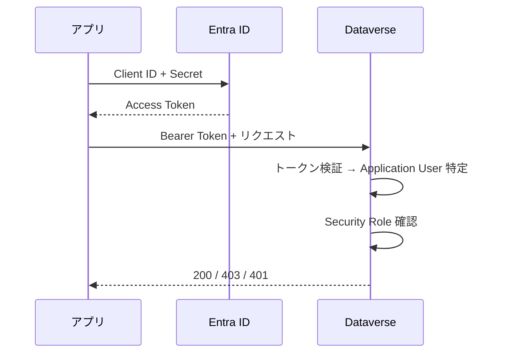

### 条件付きアクセスとの関係

Entra ID のトークン発行には、条件付きアクセス (Conditional Access) が容赦なく絡んでくる。これが本番障害の常連。

- **準拠デバイス必須**: BYOD や個人 PC、検証機からのアクセスを全弾き
- **MFA 要求**: VBA / デスクトップアプリのデバイスコードフローで対話補完が要り、自動化に向かなくなる
- **サインイン頻度**: トークンの有効期限が短くなり、自動化ジョブが定期的に切れる
- **継続的アクセス評価 (CAE)**: ユーザー状態の変化が即時反映、長時間バッチの途中で切られる
- **国 / 地域ベース**: 海外出張中アクセス不可
- **デバイスコードフロー禁止**: コピペ式の認証フローがブロックされる

調査時は、Entra ID 管理センター → 条件付きアクセス → 「What If」で、対象ユーザー + リソース(`https://*.crm.dynamics.com`)を選んで評価をかける。これをやらないと本番直前で止まる。

### 混同しやすい近接概念

「App Registration を作った」と「Dataverse に入れる」は別。App Registration は Entra ID 側の登録に過ぎず、Dataverse 側ではあらためて Application User として登録して Security Role を付けないと、`401` か `403` で跳ね返される。

「Delegated permission」と「Application permission」も別物。Delegated は人間の代理、Application はアプリ自身。監査、権限、ライセンス、条件付きアクセスの効き方が変わる。

「Service Principal」と「Application User」も別。Service Principal は Entra ID 内のアプリ実体。Application User は Dataverse 内のユーザー行。同じアプリでも、両方の世界に登録が要る。

### ここを押さえれば次に進める

Entra ID は認証の世界、Dataverse は権限とデータの世界。アプリ連携では、Entra ID でトークンをもらい、Dataverse でその主体に何を許すかを判定する。2 世界の対応表を作っておくと、`401` / `403` の切り分けが一瞬で終わる。

---

## 12. データモデルの言葉

### ふんわり入口

データモデルは、業務の地図だ。

顧客、担当者、案件、見積、商品、請求、承認、これらを「どの箱に入れるか」「箱同士をどう繋ぐか」として整理する。地図が曖昧だと、画面もフローもレポートも全部迷子になる。

Dataverse のデータモデルは、Table・Column・Row・Choice・Lookup・Relationship が基本語彙。古い資料や Dynamics 365 由来の画面では、Entity・Field・Attribute・Record という旧名も今だに混じる。両方読めるようにしておく。

### 正確に言うと

Dataverse の主要なデータモデル用語。

| 現行寄りの表記 | 旧名 / 近い言葉 | 意味 |
|---|---|---|
| Table | Entity | 行を格納する箱 |
| Column | Field / Attribute | Table の項目 |
| Row | Record | Table 内の 1 件 |
| Primary column | Primary name field | 参照表示に使われる代表列 |
| Choice | Option Set / Picklist | 選択肢 |
| Global Choice | Global Option Set | 複数 Table で共有する選択肢 |
| Lookup | Lookup field | 他 Table の Row を参照する列 |
| Relationship | Relationship | Table 間の関係 |
| One-to-many | 1:N | 1 つの親に複数の子 |
| Many-to-one | N:1 | 多くの子が 1 つの親を参照 |
| Many-to-many | N:N | 中間関係を通じた多対多 |
| Alternate Key | 代替キー | GUID 以外で一意性を持たせるキー |
| Business Rule | ビジネスルール | 入力制御や値設定のルール |
| Calculated column | 計算列 | 他列から計算される列 |
| Rollup column | ロールアップ列 | 関連行の集計値を持つ列 |

Dataverse の行には通常 GUID の主キーが付く。Account なら `accountid`。画面では取引先企業名が見えるが、内部での識別はあくまで GUID。Web API で行を指定するときも、`/accounts(<guid>)` の形で GUID を渡す。

Lookup 列を Web API で設定するときは、`@odata.bind` を使う。

```http
PATCH https://org.crm.dynamics.com/api/data/v9.2/contacts(<contact-id>) HTTP/1.1
Authorization: Bearer <access_token>
Content-Type: application/json

{
  "parentcustomerid_account@odata.bind": "/accounts(<account-id>)"
}
```

Customer、Owner、Regarding のような Polymorphic Lookup は、参照先の型(Account なのか Contact なのか)を列名に含めて明示する必要がある。これを忘れると 400 で跳ねる。詳細は第 4 部 DV-11 で扱う。

### VBA 的にいうと

Excel では、顧客シートの A 列に顧客 ID、案件シートの B 列に顧客 ID を置いて、VLOOKUP や XLOOKUP で結ぶことが多い。

```excel
=XLOOKUP(B2, Customers!A:A, Customers!B:B)
```

Dataverse では、これを Lookup と Relationship として設計する。表示は顧客名でも、内部では参照先 Row の GUID を保持している。

Power Fx では、Lookup 列を「文字列」ではなく「レコード」として扱う。

```powerfx
Patch(
    Contacts,
    Defaults(Contacts),
    {
        'Full Name': "山田 太郎",
        'Company Name': LookUp(Accounts, 'Account Name' = "株式会社サンプル")
    }
)
```

`Company Name` に文字列ではなくレコード自体を渡すのが、Excel の参照と一番違うところ。VLOOKUP に慣れた目には最初気持ち悪いが、慣れると「データ間の参照を ID と表示名で別々に管理しなくていい」という良さが見えてくる。

### 図

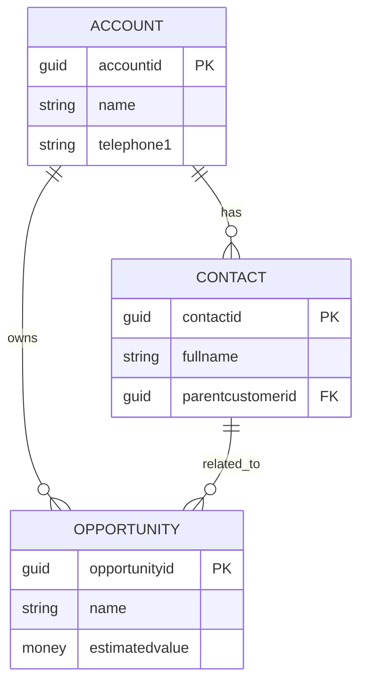

### 混同しやすい近接概念

「Choice」と「Lookup」は別物。Choice は固定的な選択肢、Lookup は別 Table の Row を参照する仕組み。部署や商品カテゴリが少数固定なら Choice、マスタとして増減や権限管理が要るなら Lookup を検討する。

「ローカル Choice」と「Global Choice」も違う。ローカル Choice はその Column 専用、Global Choice は複数 Table で共有できる。場当たりにローカルを増やすと統合で泣くので、共通概念は最初から Global Choice に寄せる。

「Calculated column」と「Rollup column」は親戚だが別物。Calculated は同じ行や関連値からその場で計算、Rollup は関連行を集計するが評価タイミングが即時とは限らない。即時判定が要る業務ロジックを Rollup に依存させると、画面更新直後に古い値が見える、という事故が起きる(DV-12 参照)。

### ここを押さえれば次に進める

Dataverse のデータモデルは Table・Column・Row・Choice・Lookup・Relationship で読む。旧名の Entity・Field・Attribute・Record も現場では生きているので、両方の語彙を持つ。Lookup は VLOOKUP に似た感覚で入れるが、型・Relationship・権限・Web API の書式が絡む点で、Excel の参照より一段深い。

---

## 13. 通信・API の言葉

### ふんわり入口

Dataverse には、外から入る道、外へ出る道、Power Platform 内の近道、の 3 種類の経路がある。

会社の倉庫で例えれば、正面受付、専用搬入口、社内便、外部配送業者、倉庫内の作業員、通知ベルがあるようなもの。全部「データを動かす手段」だが、用途も責任も違う。どの経路を選ぶかで、認証・制限・監査・コストの効き方が変わる。

### 正確に言うと

Dataverse の通信手段を、向きで分けて並べる。

| 分類 | 手段 | 役割 |
|---|---|---|
| インバウンド | Web API | REST / OData v4、HTTPS + JSON、OAuth 2.0。本命 |
| インバウンド | Organization Service | 古い SOAP / .NET SDK 系。既存 Dynamics 文脈で残る |
| インバウンド | Dataverse Connector | Power Apps / Automate から使う標準接続 |
| インバウンド | Custom Connector | 外部 API を Power Platform に登録した接続口 |
| インバウンド | Dataflows | Power Query 系の取り込み、定期バッチ |
| インバウンド | Virtual Tables | 外部データを Dataverse Table のように見せる |
| アウトバウンド | Webhooks | 変更時に HTTP POST で外部へ通知 |
| アウトバウンド | Azure Service Bus | メッセージキュー連携 |
| アウトバウンド | Event Hubs | 大量イベントストリーミング |
| 内部拡張 | Plug-in | Dataverse 内で C# 処理を同期 / 非同期実行 |
| 内部拡張 | Custom API | Dataverse 内に独自 API を定義 |
| ノーコード | Power Automate | トリガーと Connector で自動処理 |
| 差分取得 | Change Tracking API | 変更差分を後から取りに行く |

Dataverse Web API は、ブラウザでもサーバーでも HTTP で呼べる。URL の基本形はこう。

```text
https://{org}.crm{region}.dynamics.com/api/data/v9.2/
```

最小の動作確認は WhoAmI。

```http
GET https://org.crm.dynamics.com/api/data/v9.2/WhoAmI
Authorization: Bearer <access_token>
Accept: application/json
```

これが通れば、認証・ネットワーク・基本的な権限がそろっている、と判断できる。新しい接続経路を検証するとき、まず WhoAmI を投げるのが定石。

Power Automate や Canvas Apps の Dataverse Connector は、利用者が HTTP を直接書かなくても Dataverse 操作を行える接続部品。裏では Dataverse の API と認証が動いているが、開発者からは Connector として見える。

Custom API は、Dataverse 内に業務 API を作る仕組み。複数 Table をまたぐ重要更新、権限チェック、入力検証を 1 つの呼び出しにまとめたいときに使う。クライアント側の処理を薄く保ち、業務ロジックをサーバー側に寄せられる。

### VBA 的にいうと

ADO で DB に直接接続する感覚に一番近いのは Web API。違いは、接続文字列ではなく HTTPS URL、Bearer Token、JSON を使う点。

Excel マクロから直接 Web API へ行くことは技術的に可能でも、OAuth・MFA・条件付きアクセス・Secret 保管で詰まりやすい。職場で配るなら、VBA → Power Automate → Dataverse、または VBA → 社内 BFF → Dataverse の構成のほうが、認証管理と監査が回しやすい。技術的に「できる」ことと、業務に乗せて「許される」ことは別の話。

### 図

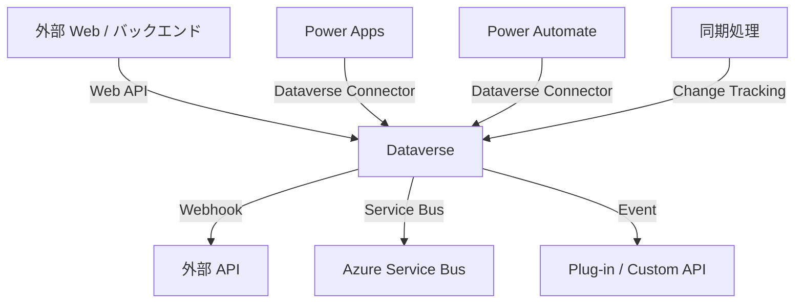

### 混同しやすい近接概念

「Service Endpoint」と「Web API」は別。Web API は Dataverse を呼ぶ HTTP API。Service Endpoint は Plug-in Registration Tool 系で Dataverse イベントを Azure Service Bus などに送る構成用。

「Custom Connector」と「Custom API」は名前が似ているだけで別物。Custom Connector は Power Platform から外部 API を呼ぶための接続定義。Custom API は Dataverse 内に独自 API を作る機能。

「Action」と「Function」は OData の文脈で別。ざっくり言うと、Function は副作用のない問い合わせ、Action は副作用を持つ処理。Dataverse では標準 Action や Custom API の設計でこの語彙が出てくる。

「Webhook」と「リアルタイム双方向通信」も別。Dataverse 自体に WebSocket のような張りっぱなし双方向通信はない。リアルタイム画面更新が要るなら、Dataverse → Webhook → 自前 SignalR / Azure Web PubSub → ブラウザの中継が定石。

### ここを押さえれば次に進める

Dataverse の通信経路は Web API だけではない。Connector、Power Automate、Plug-in、Custom API、Webhook、Service Bus、Change Tracking まである。どの経路を選んでも、Dataverse の権限・制限・容量・監査は基本的に回避できない。経路を増やしたいなら、回避ではなく集約の発想で考える。

---

## 14. UI 層の選択肢

### ふんわり入口

Dataverse を倉庫とすると、UI は窓口に当たる。窓口にはいろんな形がある。

業務担当者が毎日入力する窓口、管理者が一覧を眺める窓口、外部のお客様が申請する窓口、Teams 内でさっと操作する窓口、Excel からまとめて確認する窓口。どれも同じ Dataverse を使えるが、向き不向きがハッキリ分かれる。

### 正確に言うと

Dataverse を使う UI 層の代表選手。

| UI | 役割 | 向く場面 |
|---|---|---|
| Canvas Apps | 自由配置の業務画面 | 小から中規模の入力画面、現場向けツール |
| Model-driven Apps | Dataverse モデルから作る業務アプリ | CRUD、Form、View、権限、監査重視 |
| Custom Page | Model-driven 内に埋め込める Canvas 寄りページ | 標準 Form では足りない操作画面 |
| PCF | Power Apps Component Framework | 標準コントロールでは難しい UI 部品 |
| Power Pages | 外部 / 社外向け Web サイト | ポータル、申請、顧客向けサイト |
| Code Apps | コードファーストの Power Apps | React 等で本格 UI、Power Platform 管理下 |
| Form | Dataverse 行の詳細入力画面 | Model-driven の基本 |
| View | 一覧、フィルタ、列構成 | Model-driven や参照画面 |
| Dashboard | グラフや一覧の集合 | 管理者向け概観 |
| 独自 Web アプリ | React / Vue 等 | 独自 UX、既存 Web 基盤統合 |
| Teams Tab | Teams 内の業務入口 | Teams が業務導線の中心 |
| SPFx Web パーツ | SharePoint ポータル内 UI | 社内ポータルが入口 |
| Office Add-ins | Excel / Word / Outlook 内 UI | Office 作業に密着した補助画面 |

本命候補から見るなら、Dataverse 中心の CRUD は Model-driven Apps、画面自由度が要るなら Canvas Apps、独自 UI が本当に必要なら BFF / API 中間層ありの Web アプリ、というのが現実的な並びになる。詳細は第 3 部で扱う。

### Power Pages の位置づけ

外部 / 認証済みポータルとして使うことも多いので、本章でも触れておく。

- 認証プロバイダは Entra ID、Azure AD B2C、Local Auth、Google、Microsoft Personal などから選べる。B2C を使う場合は別途 Azure サブスクリプションと B2C テナントが要る
- Dataverse 側の Security Role とは別に、Web Role と Table Permissions という独自のアクセスモデルを持つ。Dataverse の感覚で組むと「Table Permissions の設定漏れで情報漏えい」が起きる
- Authenticated User と Anonymous User で別ライセンス、別課金。アクセス急増で予算超過しやすい
- Liquid テンプレートと Bootstrap / JS の Pro Code が混在する

### VBA 的にいうと

UserForm で自由に画面を作る感覚に近いのは Canvas Apps。Access のフォームとテーブルが結びついた感覚に近いのは Model-driven Apps。

PCF は、VBA で標準コントロールでは足りず ActiveX や独自コントロールを使い始める瞬間に近い。ただし PCF は TypeScript、React、Solution、環境設定、管理者許可が一気に絡む。Excel に COM コンポーネントを差し込むより手順は重い。

### コード例

Canvas Apps で Dataverse に行を作る Power Fx。

```powerfx
Patch(
    Accounts,
    Defaults(Accounts),
    {
        'Account Name': txtAccountName.Text,
        'Main Phone': txtPhone.Text
    }
)
```

Model-driven フォームの JavaScript で、現在行の ID を取得して Web API を呼ぶ例。

```javascript
async function onLoad(executionContext) {
  const formContext = executionContext.getFormContext();
  const id = formContext.data.entity.getId().replace(/[{}]/g, "");

  const result = await Xrm.WebApi.retrieveRecord(
    "account",
    id,
    "?$select=name,telephone1"
  );

  console.log(result.name, result.telephone1);
}
```

`Xrm.WebApi` は Model-driven フォーム内で使える Dataverse 操作 API。素の fetch を書くより認証周りが薄くなり、`Xrm.Page` のような旧 API を使わずに済む。

### 図

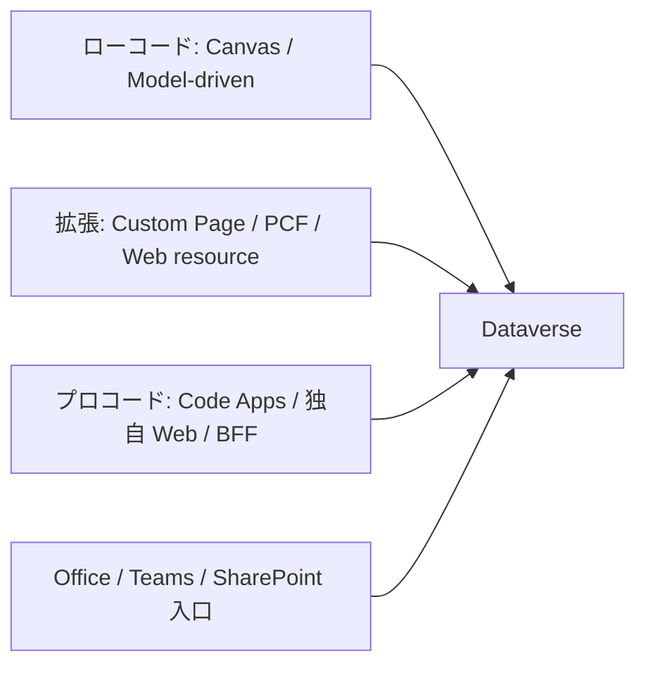

### 混同しやすい近接概念

「Canvas Apps」と「Custom Page」は近いけれど別物。Custom Page は Model-driven Apps 内で使える Canvas 系ページ、と捉えるとよい。Canvas Apps 単体と Custom Page では公開単位や共有方法が違う。

「PCF」と「Web resource JavaScript」も別。PCF はコントロール部品として Power Apps に統合される。Web resource JavaScript は Model-driven フォームやコマンドバーの拡張で使うスクリプト。役割が違う。

「Power Pages」と「独自 Web サイト」も別物。Power Pages は Dataverse 連携と認証、Table Permissions を持つ Power Platform 内の外部向けサイト機能。独自 Web サイトは、ホスティング・認証・API・監査を自前で設計する必要がある。

### ここを押さえれば次に進める

UI 選定は、見た目の自由度だけで決めない。利用者導線、認証、権限、DLP、ライセンス、ALM、本番審査、端末制御まで含めて選ぶ。Dataverse 中心なら Model-driven と Canvas を最初に検討し、独自 UI は「なぜ Power Platform 標準では足りないか」を説明できる場合だけ進む。

---

## 15. ライフサイクルとソリューション

### ふんわり入口

業務ツールは、作って終わりではない。直す、試す、本番に出す、戻す、引き継ぐ、退職者から所有権を移す、監査で説明する。これだけのライフサイクルを通過する。

Excel マクロをメールで配っていた時代は、「最新版どれ?」「誰が持ってる?」「古いファイルで入力された」「修正版に戻したい」が日常的に起きる。Power Platform でも、同じ問題は形を変えて起きる。だから Solution、Environment、ALM という枠組みが用意されている。

### 正確に言うと

ALM (Application Lifecycle Management) は、アプリや構成の作成・テスト・配布・運用・変更・廃止を管理する考え方。

Power Platform / Dataverse で重要な用語。

| 用語 | 意味 |
|---|---|
| Solution | Power Platform 資産をまとめる箱 |
| Unmanaged solution | 開発用。直接編集できる |
| Managed solution | 本番配布用。管理された形でインポートする |
| Environment | Dev / Test / Prod などの分離単位 |
| Connection Reference | Connector 接続を環境ごとに差し替える参照 |
| Environment Variable | URL や設定値を環境ごとに変える仕組み |
| DLP | Data Loss Prevention。Connector の組み合わせや利用を制御 |
| Pipeline | 環境間の移送を支援する仕組み |
| Deployment | 本番への展開 |
| Rollback | 問題発生時に戻す手順 |

基本方針は、開発環境では Unmanaged で作り、本番環境には Managed solution として入れる、という流れ。

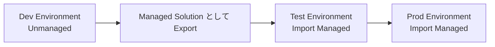

Solution に含めるもの。

| 資産 | Solution 管理 |
|---|---|
| Dataverse Table / Column / Relationship | 含める |
| Model-driven App | 含める |
| Canvas App | 含める |
| Power Automate Flow | 含める |
| Security Role | 含めることが多い |
| PCF | 含める |
| Custom API / Plug-in | 含める |
| Connection の実体 | 参照は含めるが接続実体は環境依存 |
| 利用者データ | 通常 Solution では運ばない |

接続実体を Solution で運べないのが、本番化での落とし穴になりやすい。本番環境では、本番用のサービスアカウントで Connection Reference を再マッピングする必要があり、そのサービスアカウントに Premium ライセンスが乗っていないと Premium Connector が動かない、という連鎖事故が起きる。

### VBA 的にいうと

Unmanaged solution は、開発中の `.xlsm` 原本に近い。Managed solution は、配布用に固めたバージョン。

ただし Excel ならファイルを丸ごとコピーするだけで済むことが多いのに対し、Power Platform では環境ごとの接続、Environment Variable、Security Role、DLP、所有者、ライセンスが絡む。「Solution の zip を本番に Import すれば動く」は嘘で、実際には Connection Reference のマッピング、Environment Variable の差し替え、Security Role の付け直し、利用者ライセンスの整備が要る。

### コード例

Power Platform CLI のイメージ。

```powershell
pac auth create --environment https://org.crm.dynamics.com
pac solution export --name ContosoApp --path .\ContosoApp_managed.zip --managed true
pac solution import --path .\ContosoApp_managed.zip
```

実案件では、CLI 利用可否、会社 PC の node / npm / dotnet / pac 許可、サービス接続、管理者承認を先に確認する。「pac が入らない」という理由で詰まる組織も普通にある。

### 混同しやすい近接概念

「Managed solution」と「Managed Environment」は別物。Managed solution は配布形式、Managed Environment は Power Platform 環境のガバナンス機能。会話では必ず区別する。混ぜると話が噛み合わなくなる。

「Solution に入っている」と「本番で動く」も違う。Connection Reference、Environment Variable、Security Role、DLP、利用者ライセンス、共有設定がそろわないと、Solution が Import 成功しても画面が開かない。

「Export / Import」と「ALM」も別。Export / Import は単なる作業。ALM は環境分離・レビュー・バージョン・戻し・監査・所有者管理まで含む運用全体を指す。

### ここを押さえれば次に進める

Power Platform の本番運用では Solution が中心になる。開発は Unmanaged、本番は Managed が基本。Connection Reference、Environment Variable、DLP、Security Role、所有者、ライセンスまで含めて ALM を設計する。Solution は配布の終点ではなく、運用の始点。

---

## 16. 運用・監査・ガバナンス

### ふんわり入口

業務システムは、動いている間ずっと面倒を見る必要がある。

倉庫で言えば、在庫が増えすぎていないか、誰が入ったか、危険物を混ぜていないか、棚卸ししたか、鍵を返していない退職者がいないか。Dataverse でも同じで、容量、監査、API 制限、権限、DLP、環境、所有者を見続けることになる。

ここを後回しにすると、PoC は動いたのに本番で止まる、本番に上げたら半年で容量警告、運用担当が退職して誰も触れない、という展開になる。

### 正確に言うと

Dataverse 運用で押さえる領域。

| 領域 | 用語 | 見るもの |
|---|---|---|
| 監査 | Audit | 誰がいつ何を変更したか |
| 容量 | DB / File / Log Capacity | データ、ファイル、ログの消費 |
| API 制限 | Service Protection / Throttling | 429、Retry-After、同時実行、処理時間 |
| 権限 | Security Role | Create / Read / Write / Delete / Append / Append To / Assign / Share |
| 組織境界 | Business Unit | 部署や所有範囲の境界 |
| チーム | Owner Team / Access Team | 複数人で所有やアクセスを管理 |
| 列保護 | Column-level security / Field Security Profile | 特定 Column の Read / Create / Update |
| DLP | Data policies | Connector 分類、HTTP / Custom Connector 制御 |
| 環境管理 | Environment role / security group | 誰が環境に入れるか |
| ログ | Power Platform Activity / Unified Audit / App Insights | 操作、実行、エラー、アプリログ |

### Security Role と Privilege Depth

Security Role の権限には、操作種別と「深さ」がある。

| Depth | 意味のイメージ |
|---|---|
| User | 自分が所有する行のみ |
| Business Unit | 自分の BU 内 |
| Parent: Child Business Units | 親子 BU 範囲 |
| Organization | 組織全体 |

ここがクセモノで、Read は Organization でも Write が User、Append はあるが Append To はない、Assign がない、Share がない、というように操作ごとにバラつく。System Administrator では再現しない問題が一般ユーザーで噴き出すのは、ほぼここが原因。

検証時は、System Administrator ではなく **一般ユーザー** で必ず動かす。これは「儀式」ではなく、本番ユーザーが遭遇する画面と API の応答を再現するために絶対に必要なステップ。

### Service Protection API limits

Dataverse の安定性を守るため、過剰なリクエストには制限がかかる。具体値は変動するので公式で確認するのが原則だが、目安として、5 分スライディングウィンドウ・累計実行時間・同時実行数の 3 軸で管理される。Application User もこの制限を受ける。「サーバーサイドだから無制限」は明確な誤解。

`429 Too Many Requests` が返ったら、`Retry-After` ヘッダーを見て待つ。指数バックオフを入れる。

```javascript
async function dataverseFetch(url, options, retry = 3) {
  const response = await fetch(url, options);

  if (response.status === 429 && retry > 0) {
    const retryAfter = Number(response.headers.get("Retry-After") ?? "5");
    await new Promise(resolve => setTimeout(resolve, retryAfter * 1000));
    return dataverseFetch(url, options, retry - 1);
  }

  if (!response.ok) {
    throw new Error(`${response.status} ${await response.text()}`);
  }

  return response;
}
```

`$batch` を使う場合、内部ステップ数もカウント対象になる。プラグイン経由のクエリには Database execution time の追加制限が乗ることもある。

### 容量と裏方テーブル

Dataverse の容量は DB・File・Log の 3 軸で独立管理される。基本容量はテナントとライセンスで決まり、ライセンス追加に応じて Add-on で買い増す。

容量を食い潰す犯人になりやすい裏方テーブルは、覚えておく価値がある。

- **PrincipalObjectAccess (POA)** … レコード共有 (Share) を多用すると爆増する
- **AsyncOperationBase** … 非同期処理 / Power Automate / classic workflow の履歴
- **PluginTraceLog** … Plug-in Trace を ON のまま運用すると増える
- **AuditBase** … 監査を全 Table / 全 Column で有効にすると肥大化

「DB は余裕なのに File だけ枯れた」「Log が増えてアラート」というのは普通に起きる。Power Platform 管理センター → リソース → 容量で、3 軸別に増加要因を定期的に確認する。

### VBA 的にいうと

Excel 業務では「誰がいつどのセルを変えたか」を後追いするのが難しい。変更履歴や共有ブックで一部追えるが、本格的な監査には弱い。

Dataverse なら Audit を有効にすれば変更履歴を残せる。ただし、全 Table 全 Column を雑に監査すれば良いというものではない。AuditBase や Log 容量が膨らむ。監査要件と容量見積もりはセットで決める。

VBA で全員が同じ共有アカウントを使うと、誰の操作か分からなくなる(Multiplexing 問題)。Dataverse でも、Application User やサービスアカウントを使う構成では、監査上「誰の操作として残るか」を最初に設計する。

### 図

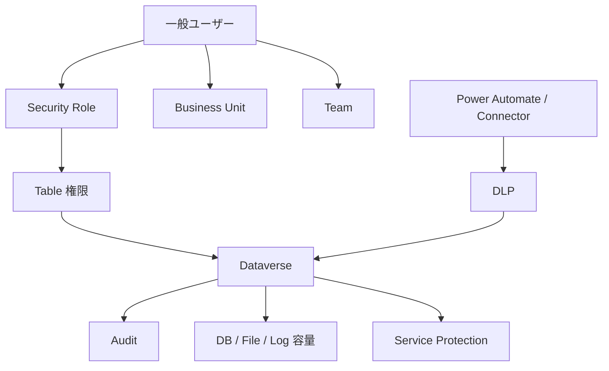

### 混同しやすい近接概念

「Security Role」と「Environment Maker」は別物。Environment Maker は環境内でアプリやフローを作れる権限。Security Role は Dataverse のデータに対する権限。両方そろってはじめて、Maker が業務データを触れる。

「DLP で Dataverse をブロックできるか」と「Dataverse 利用が安全か」も別物。Dataverse は中核 Connector で、従来型 DLP では原則ブロックできない扱いになっている。実際に問題になるのは、Dataverse 単体ではなく、HTTP・Custom Connector・外部 SaaS・Excel・SharePoint との混在パターン。詳細は第 3 部で扱う。

「容量がある」と「運用上安全」も違う。DB / File / Log は別枠で消費される。添付・File / Image column・Audit・PluginTraceLog・AsyncOperationBase・POA が独自に積み上がっていく。

### ここを押さえれば次に進める

Dataverse 運用は、Audit・Capacity・Throttling・Security Role・Business Unit・Team・Column-level security・DLP を継続的に見る仕事。System Administrator で動いた、はゴールではない。一般ユーザー・最小権限・実データに近い量・監査ログまで揃えて検証する。

---

# 第 3 部 実装パターン

## 17. アーキテクチャ候補の網羅

### ふんわり入口

Dataverse を使った画面を作る方法は、ひとつではない。入口だけ並べても、Power Apps、Model-driven Apps、Power Pages、Teams、SharePoint、Excel、React、モバイル、Power BI、RPA、iPaaS まである。

ここで効くのは「作れるか」より「本番で通るか」だ。自分の PC で動く、Developer 環境で動く、管理者権限で動く、これらはまだ入口の入口でしかない。本番では DLP、Entra ID 権限、環境ロール、端末制御、ネットワーク、監査、ライセンス、所有者、変更管理が待ち構えている。

アーキテクチャ選定は、メニュー選びではなく「会社の稟議を通す配送経路選び」に近い。速そうに見える道でも、会社の門で止められるなら本番に乗せられない。

### 正確に言うと

参照資料のアーキテクチャ一覧では、Dataverse をバックエンドにした構成を A1〜F1 まで 34 本に分類している。大分類は次のとおり。

| 分類 | 名前 | 方向性 |
|---|---|---|
| A | Power Platform 純正系 | Power Apps、Power Pages、PCF、Code Apps など |
| B | Office / M365 製品をフロント化する系 | Excel、Office Add-ins、SPFx、Outlook など |
| C | ファイル / マクロ / レガシークライアント系 | VBA、Access など |
| D | 独自 Web アプリ / デスクトップ / モバイル系 | SPA、BFF、Teams Tab、Azure App Service など |
| E | 仲介 / ノーコード / データ連携系 | SharePoint 連携、Power Automate Desktop、Virtual Tables など |
| F | Dataverse バックエンド補助系 | Custom API、Plug-in、Webhook など |

### ショートリスト 5 本

厳しめの会社 PC 本番環境では、最初から 34 本を同列に比較しない。本命候補として次の 5 本を先に検討するのが現実的。

| 優先 | 候補 | 向く条件 | 選定根拠 | 注意点 |
|---|---|---|---|---|
| 1 | A2 Model-driven Apps | Dataverse 中心の CRUD、権限・監査・Form 重視 | Dataverse の Security Role、View、Form、Solution に素直に乗る | UI 自由度は低い。複雑 UX は Custom Page / PCF 併用 |
| 2 | A1 Canvas Apps | 画面を早く作りたい、小から中規模入力 | Power Apps 管理下で DLP・共有・ライセンスを説明しやすい | 委任、性能、複雑式、接続参照、利用者ライセンス |
| 3 | D5 / D8 BFF / API 中間層 + Dataverse | 独自 UI 必須、認証 / 監査 / レート制御を中央集約したい | SPA 直結より情シス説明がしやすい | Azure / ホスティング承認、アプリ登録、運用責任、追加コスト |
| 4 | D6 Teams Tab App + Dataverse | Teams が標準入口 | 既存 M365 導線に乗せやすい、SSO と組み合わせやすい | Teams カスタムアプリ許可、Manifest、SSO、ホスティング |
| 5 | B4 SPFx Web パーツ + Dataverse / BFF | SharePoint ポータルが業務入口 | 社内ポータルに自然に置ける | App Catalog、API permission、CSP、変更管理 |

Model-driven Apps と Canvas Apps は、Power Platform 内で完結しやすく、Dataverse の権限と ALM に素直に乗せられる。独自 UI が必要なら、ブラウザから Dataverse Web API へ直結する D1 より前に、BFF / API 中間層で認証・監査・制限・ログを集約する D5 / D8 を先に比較するのが筋。

### BFF / API 中間層という発想

会社本番環境では、SPA から Dataverse Web API に直接行く構成より、間に Azure Functions、App Service、API Management、Logic Apps、Container Apps を挟む構成のほうが説明が通りやすい。

中間層に何を集約するか。

- アプリ登録、Redirect URI、管理者同意の管理(フロントは公開クライアントのままで済む)
- Application User、サービスプリンシパル、証明書 / シークレットの保管(Key Vault)
- 429 / Retry-After のリトライ制御、レート制限、再試行ポリシー
- 監査ログ(Application Insights / 統合ログ)
- 業務ロジックの集中、Dataverse Custom API への一段ラップ

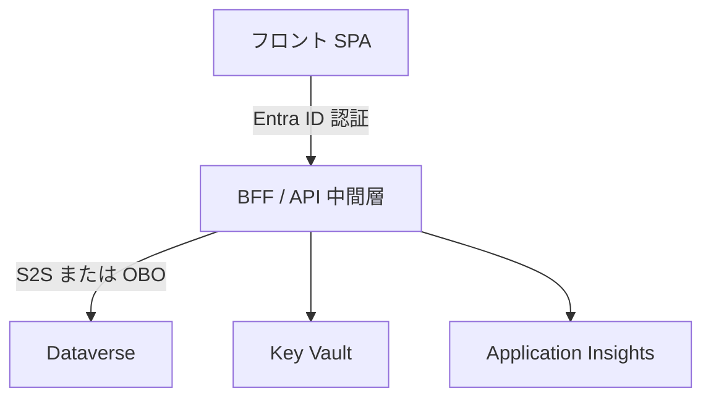

直結のメリットは「中間層を作らなくていい」のひと言だが、本番審査の重さを考えると、間に 1 段挟む構成のほうが結局速く本番化する、というのが現実。

### ロングリスト全 34 本

| ID | アーキテクチャ | 認証 / 実行文脈 | 本番で詰まりやすいポイント | 通過感 |
|---|---|---|---|---|
| A1 | Canvas Apps + Dataverse | 委任認証、各ユーザーの Dataverse 権限 | DLP 混在、委任制限、性能、Table 権限不足、接続参照 | 高 |
| A2 | Model-driven Apps | 委任認証、Security Role でアプリ / データ制御 | Form / View / Sitemap 権限、BU 境界、列セキュリティ、BPF | 高 |
| A3 | Power Pages | Power Pages 認証、Entra ID / B2C / 外部 ID | 外部公開審査、Table Permissions 漏れ、容量課金、匿名アクセス | 中 |
| A4 | Custom Pages + PCF | Power Apps 文脈、PCF はホスト文脈 | PCF 審査、npm / pac 不可、Solution checker、CSP / CORS | 中 |
| A5 | Power Apps Code Apps | Entra ID、Power Platform 管理下 | 機能成熟度、開発ツール制限、環境設定無効化、Premium | 中 |
| A6 | Model-driven 内 Web resources / JS / Command bar / iframe | Model-driven 文脈、Xrm.WebApi | unsupported DOM 操作、保守性、iframe 先 CSP、権限検証 | 中〜高 |
| A7 | Power Apps Teams / SharePoint 埋め込み、mobile / wrap | 埋め込み先 + Power Apps 認証 | Teams / SharePoint 埋め込み許可、Intune、wrap、オフライン | 中 |
| B1 | Excel + Power Query (Dataverse コネクタ) | Excel の M365 サインイン、読み取り中心 | 書き戻し困難、外部接続ブロック、ラベル / IRM、再配布 | 中 |
| B2 | Office Scripts + Power Automate + Dataverse | Scripts + Flow 接続文脈 | 外部 fetch 制約、OAuth 保管不可、Scripts 無効化、DLP | 中 |
| B3 | Office Add-ins + Dataverse / BFF | Office.js + MSAL / SSO または BFF | サイドロード禁止、集中配信、ホスティング、SSO 同意 | 低〜中 |
| B4 | SPFx Web パーツ + Dataverse / BFF | SharePoint ログイン + MSAL / BFF | App Catalog、API access 承認、CSP、ポータル変更管理 | 中 |
| B5 | Outlook Add-in / Dynamics 365 App for Outlook | Office.js SSO / MSAL または標準 D365 | Exchange 集中配信、メールデータ、監査、アドイン承認 | 低〜中 |
| C1 | Excel VBA + REST | 実装次第、OAuth が難しい | マクロブロック、Defender、Trust Center、トークン保管、監査困難 | 低 |
| C2 | Excel VBA + Dataverse Web API | デバイスコード / 認可コード | CA / MFA、トークン保管、アプリ登録不可、監査、保守 | 低 |
| C3 | Excel + Office Scripts + Power Automate | Flow 接続所有者 / 実行者文脈 | Premium、Run script 制限、保存場所、DLP、タイムアウト | 中 |
| C4 | Microsoft Access + Dataverse リンクテーブル | Office / Access 認証、ODBC / OLE DB | 端末配布、ドライバ、ローカルキャッシュ、移行性 | 低 |
| D1 | 独自 SPA + Dataverse Web API 直結 | SPA 登録 + MSAL + delegated | アプリ登録、同意、CA、ホスティング、トークン、API 制限 | 低〜中 |
| D2 | デスクトップアプリ + MSAL + Web API | Public client、interactive | EXE / MSI 禁止、署名、SmartScreen、MFA / CAE、配布 | 低 |
| D3 | Power BI (フロント代用) + Dataverse | Power BI Connector の委任認証 | 基本参照中心、書き戻しは Power Apps visual 経由、DirectQuery 性能 | 中〜高 |
| D4 | Dynamics 365 標準フォーム流用 | D365 / Dataverse 標準認証 | D365 導入有無、Use Rights、標準改修影響、業務承認 | 中 |
| D5 | Azure Static Web Apps + Functions / APIM BFF + Dataverse | Entra 認証、OBO または Application User | Azure 申請、APIM / Functions、Key Vault、監査、Private Endpoint | 中 |
| D6 | Teams Tab App + Dataverse / BFF | Teams SSO + delegated / OBO / BFF | Teams アプリポリシー、Manifest、SSO 同意、ホスティング | 中 |
| D7 | Mobile Native + Dataverse / BFF | MSAL mobile、BFF、Intune | 社内アプリ配布、企業署名、BYOD、Intune、端末紛失 | 低 |
| D8 | Azure App Service / Container Apps server-side .NET + Dataverse SDK | Confidential client、S2S または OBO | ホスティング承認、VNet、Secret rotation、SDK 差異、監査 | 中 |
| E1 | SharePoint List 連携 → Dataverse 同期 | SharePoint / Flow 接続所有者文脈 | 二重管理、同期遅延、権限モデル二重化、リストビューしきい値 | 中 |
| E2 | Microsoft Lists / SharePoint Lists + Power Apps | SharePoint / Power Apps 委任認証 | Dataverse ではない。複雑関係、監査、委任、後の移行 | 中 |
| E3 | Dataverse for Teams + Teams 内アプリ | Teams メンバー / 所有者モデル | 容量 / 機能制限、本格 Dataverse との差、本番移行 | 中 |
| E4 | Power Automate Desktop + UI フロー | 実行端末 / 実行ユーザー文脈 | RPA 監査、端末ロック、無人 / 有人、資格情報、VDI | 低〜中 |
| E5 | Copilot Studio | Copilot / チャネル認証、Connector 権限 | チャット UI 限定、生成 AI 制限、会話ログ、データ越境 | 中 |
| E6 | Custom Connector / Logic Apps + Dataverse | Custom Connector / OAuth、Managed Identity | Custom Connector 禁止、HTTP DLP、Azure 統制、接続所有者 | 中 |
| E7 | Virtual Tables | Dataverse 認証 + 外部接続認証 | 性能、外部依存、書き込み制限、検索 / 集計制約 | 中 |
| E8 | Synapse Link / Fabric / Dataflows / Power BI 分析基盤 | サービス間連携、分析中心 | 参照専用、遅延、データ複製、所在地、Purview、コスト | 中 |
| E9 | Microsoft Loop + Power Automate / Dataverse 連携 | Loop / M365 + Flow 接続文脈 | Loop ガバナンス、共有範囲、監査、DLP、配布モデル | 低〜中 |
| E10 | OutSystems / Mendix 等 iPaaS / ローコード基盤 + Dataverse | 製品ごとの SSO / Connector | 二重ライセンス、外部 SaaS DLP、ベンダーロックイン | 低〜中 |
| F1 | Custom API / Plug-in / Webhook によるバックエンド分離 | Dataverse 内実行、呼び出し元文脈 | Sandbox 2 分、外部通信制限、デプロイ審査、Trace 肥大化 | 中 |

### ホスティング先の独立評価

D 系の独自 Web アプリでは、フロント技術より「どこにホストするか」のほうが組織内承認難易度が高いことが多い。アーキテクチャ表とは別に、ホスティング先を独立軸として並べる。

| ホスティング先 | 通しやすさ | 監査適合性 | 詰まりやすい点 |
|---|---|---|---|
| Azure Static Web Apps | 中 | 中〜高 | Azure subscription、カスタムドメイン、Built-in Auth、Private network 要件 |
| Azure App Service | 中 | 高 | App Service Plan、VNet / Private Endpoint、Key Vault、運用責任 |
| Azure Functions + APIM | 中 | 高 | APIM 費用、API 設計、証明書 / secret、レート制御、監視 |
| 社内オンプレ IIS | 中 | 中〜高 | 証明書、パッチ、サーバー運用、Dataverse outbound 許可 |
| SharePoint / SPFx | 中〜高 | 中 | App Catalog、API permission、CSP、ページ運用 |
| GitHub Pages / Netlify / Vercel | 低 | 低〜中 | 外部 SaaS、DLP、データ所在地、契約 / 監査、社内プロキシ |
| ローカル PC 配布 | 低 | 低 | 端末制御、署名、更新、監査、退職 / 端末更改 |

「フロント技術が決まったらホスティングは後で決める」では順序が逆になる。会社環境では先に「どこなら置けるか」を確認し、その上でフロント技術を選ぶ。

### Microsoft Lists / SharePoint Lists と Dataverse for Teams は別物

ここはよく混同される。

- **Microsoft Lists / SharePoint Lists**: SharePoint のリスト機能。M365 標準で使える。Power Apps から接続できる。Dataverse ではない。リスト件数が大規模になるとリストビューしきい値や委任で詰まる
- **Dataverse for Teams**: 一部の Microsoft 365 / Office 365 サブスクリプションに含まれる、Teams 向けの軽量 Dataverse 環境。Teams Premium 前提ではない。容量・機能・ライフサイクルが本格 Dataverse とは別物
- **Dataverse (本格)**: Power Apps Premium / Dynamics 365 / per app 等のライセンスが必要

「Dataverse for Teams で PoC して本番で Dataverse に上げる」は In-Place アップグレード不可。再構築前提でコストを見積もる必要がある。

### DLP の正しい捉え方

DLP は「Dataverse コネクタを使うとブロックされる」という単純な話ではない。実際の論点はこう。

- Dataverse コネクタは Power Platform の中核コネクタで、従来型 DLP では原則ブロックできない扱い
- 詰まるのは、**同一アプリ / フロー内で Dataverse と別分類コネクタ(HTTP、Custom Connector、外部 SaaS)を混在させた**場合
- 複数 DLP ポリシーが合成された結果、想定外のブロックが起きる場合
- Advanced connector policies で HTTP / Custom Connector の endpoint を制限している場合

対策は、アプリ / フロー内のコネクタ分類を事前に棚卸しして、Business / Non-Business が混ざらないようにすること。「Dataverse 使うから DLP 心配ない」は半分しか合っていない。

### Office Scripts の現実的な扱い

Office Scripts は TypeScript で書ける Excel 自動化機能だが、Dataverse 連携の文脈では制約が厳しい。

- **外部 fetch** は Excel for Web 上では一部可能だが、OAuth 2.0 の対話的サインインや安全な資格情報保管の仕組みがない
- **Power Automate 経由で実行**すると、外部 API 呼び出しが追加で制限される
- Dataverse Web API へ OAuth 付きで安定接続するのは技術的に厳しい

現実解は「Office Scripts → Power Automate → Dataverse」の 3 段構成。Office Scripts に Dataverse 直接通信をさせない。

### VBA 的にいうと

VBA 経験者は、C1 や C2 を見て「Excel から直接 Dataverse を叩けばよいのでは」と考えがち。技術的には可能でも、本番ではマクロ制御・MFA・条件付きアクセス・トークン保管・アプリ登録・監査・ライセンスのどこかで止まる。

VBA 資産を活かしたいなら、Excel を画面として残しつつ、Dataverse 直結ではなく Power Automate や BFF を経由する構成を比較する。それでも Multiplexing や接続所有者の問題は残るので、暫定 / 個人運用 / 移行期の橋渡し、と割り切るのが現実的。

### 最小プローブ

どの候補でも、最初の PoC は「画面映え」ではなく「本番ブロッカーを潰す」ために作る。

```http
GET https://org.crm.dynamics.com/api/data/v9.2/WhoAmI HTTP/1.1
Authorization: Bearer <access_token>
Accept: application/json
```

これが通るかどうかが、認証・ネットワーク・基本権限の最初のチェックポイント。最低限、次を見る。

| 確認 | 内容 |
|---|---|
| 認証 | 誰の ID で実行されるか |
| 権限 | 一般ユーザーで CRUD、Append、Append To が通るか |
| 列保護 | Field Security 列がどう返るか(プロパティ自体が落ちるか) |
| BU | 部署違いの行が見えるか |
| DLP | 使う Connector の組み合わせが許可されるか |
| 429 | Retry-After をログに出せるか |
| ALM | Dev から Test へ Managed で運べるか |
| 監査 | 誰の操作として残るか |

### 混同しやすい近接概念

「通過確率が高い」と「最適」は別。Model-driven Apps は本番説明しやすいが、独自 UX が強い要件には合わない場面もある。

「低コード」と「低リスク」も同じではない。Power Automate で簡単に組めても、接続所有者・DLP・ライセンス・孤児化・実行履歴・タイムアウトでリスクが膨らむ。

「独自 Web が自由」と「運用も自由」も違う。ホスティング・認証・Secret・監査・脆弱性対応・CI/CD・障害対応を自分たちで持つ覚悟が要る。「作れるか」と「運用し続けられるか」は別問題。

### ここを押さえれば次に進める

アーキテクチャ候補は 34 本あるが、最初の本命は Model-driven、Canvas、BFF / API 中間層、Teams Tab、SPFx の 5 本でいい。比較軸は機能ではなく、ID 方式、権限境界、ホスティング、DLP、ALM、監査、性能、ライセンス、運用責任。「作れる」より「誰が動かし続けるか」を先に決める。

---

## 18. 本番運用ブロッカー

### ふんわり入口

PoC は通ったのに本番で止まる。Power Platform や Dataverse ではあるあるの展開だ。

理由は単純で、PoC で見ているのは「技術的に動くか」、本番審査で見られるのは「会社として許してよいか」だから。個人の Developer 環境で動くことと、全社の業務データを扱ってよいことは、同じ建物ですらない。

### 正確に言うと

本番運用でよく止まる横断ブロッカーの一覧。

| ブロッカー | 何が起きるか | 先に見ること |
|---|---|---|
| DLP | Connector 混在で保存や実行がブロックされる | Dataverse、SharePoint、Excel、HTTP、Custom Connector、外部 SaaS の分類 |
| Entra 権限 | App Registration や管理者同意が取れない | アプリ登録権限、同意ワークフロー、API permission |
| 環境ロール | Maker 権限や Dataverse 権限がない | Environment Maker、System Customizer、Security Role |
| ネットワーク | Dynamics / Power Platform / Azure / Office CDN へ到達できない | Proxy、TLS inspection、許可ドメイン |
| デバイス制御 | VS Code、node、npm、pac、dotnet、VBA、EXE が禁止 | 会社 PC のソフト制御、Intune、Defender ASR |
| データガバナンス | 個人情報や機密データの扱いが未承認 | データ分類、DPIA、リテンション、外部共有 |
| 監査ログ | 誰が何をしたか説明できない | Audit、Power Platform Activity、Unified Audit、App Insights |
| ライセンス | 利用者・実行者・サービスアカウントに権利がない | Power Apps、Automate、Pages、BI、D365 Use Rights |
| 容量 | DB / File / Log が足りない | 添付、File / Image、Audit、Trace、AsyncOperationBase |
| 所有者 | 個人所有のアプリ / フロー / 接続が退職で孤児化 | Co-owner、サービスアカウント、運用担当 |
| ALM | 本番移送、戻し、差分管理がない | Solution、Pipeline、Managed、Rollback |
| 変更管理 | CAB や審査会に間に合わない | 申請周期、RACI、戻し手順、障害時連絡 |

### DLP の罠を再確認

DLP の罠は、Dataverse 単体ではなく、混在パターンで顕在化する。

- 同じアプリ / フロー内で **Dataverse + HTTP + Custom Connector** を使うと、Business / Non-Business の混在でブロック
- 同じアプリ / フロー内で **Dataverse + 外部 SaaS Connector** を使うと、別ポリシーの合成でブロック
- Advanced connector policies で HTTP の endpoint が制限されている場合、想定外のサイトに POST しようとして失敗

「DLP を回避するため Custom Connector で包む」のは逆効果になりやすい。Custom Connector はだいたい厳しめの分類になる。

### Entra 権限と条件付きアクセス

独自 SPA、Teams Tab、SPFx、Office Add-ins、BFF が止まりやすいのが Entra 周り。

- App Registration を作る権限が個人ユーザーに無い組織がある(管理者経由必須)
- API permission の付与に管理者同意が要る
- SPA Redirect URI 登録のフォーマットが厳しい
- ユーザー同意自体を禁止しているテナントがある
- 条件付きアクセスで準拠デバイス必須、MFA 必須、サインイン頻度短縮、デバイスコードフロー禁止
- 国 / 地域制限で海外からアクセス不可

これらは「PoC では動いたが本番テナントで止まる」典型例。本番テナントで Entra ID 管理センターの「What If」を回しておくのが筋。

### Power Platform 環境戦略

- Default 環境を PoC / 本番に使わない(全社ユーザーが Maker、手動バックアップ不可)
- Developer Plan(無料・永続・個人専用)、Trial (30 日)、Sandbox(組織所有・要申請)、Production を使い分ける
- Managed Environments が有効な環境か確認(ガバナンス機能が強化されるが、利用者ライセンスに追加要件が乗ることがある)

### VBA 的にいうと

VBA では「マクロが動かない」のひと言で片付くが、会社端末では実は多くの制御が積み重なっている。

| VBA での止まり方 | Dataverse / Power Platform での止まり方 |
|---|---|
| マクロが無効 | Power Platform 機能がテナント設定で無効 |
| ActiveX が禁止 | PCF / Office Add-ins / 独自アプリが禁止 |
| 外部接続が止まる | DLP、Proxy、CORS、条件付きアクセス |
| ファイル配布できない | Solution import、Teams app 配布、App Catalog 承認が必要 |
| 誰の最新版か分からない | ALM、所有者、Pipeline が必要 |

形は違うが、「組織が許してくれないと動かない」という構図はそっくり。

### 最小チェックリストの順序

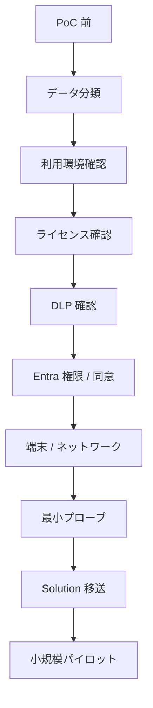

管理者へ依頼する確認は、Power Platform 管理者、Entra 管理者、M365 管理者、Teams / SharePoint 管理者、端末 / ネットワーク管理者、監査 / セキュリティ、ライセンス担当に分かれる。1 人にまとめて聞くと必ず漏れる。

### 社内事例を探すという裏技

組織政治的に最強の説得材料は「既に他部署で動いている」という事実だ。CoE Toolkit、Managed Environments、社内 Wiki、SharePoint、Teams、Power Platform 利用者コミュニティで先行事例を探す。例外申請ではなく既存パターン踏襲として説明できれば、情シスの心理的負担が一気に下がる。

### コード例

429 を記録するだけでも、本番説明では意味がある。

```javascript
async function callWithLog(url, options) {
  const response = await fetch(url, options);

  if (response.status === 429) {
    console.warn("Dataverse throttled", {
      retryAfter: response.headers.get("Retry-After"),
      requestId: response.headers.get("x-ms-service-request-id")
    });
  }

  return response;
}
```

`x-ms-service-request-id` は Microsoft サポートに問い合わせるときの相関 ID として使える。ログにこのヘッダーを残しておくと、後で「あの時の 429 はなぜ?」を追える。

### 混同しやすい近接概念

「管理者が一度 OK した」と「全要件が OK」は別。Power Platform 管理者が環境を許可しても、Entra 管理者がアプリ登録を許可しない、端末管理者が npm を許可しない、監査部門がログ不足を指摘する、という分業がある。

「PoC 許可」と「本番許可」も別。Trial 環境、個人所有接続、ダミーデータ、外部通信の一時許可は、本番には引き継げないことが多い。両方の審査要件を事前に見ておく。

「System Administrator で動いた」と「一般ユーザーで動く」も別物。必ず一般ユーザー、最小権限、BU 違い、Field Security ありで検証する。

### ここを押さえれば次に進める

本番ブロッカーは、技術より管理境界で出る。DLP、Entra、環境ロール、ネットワーク、端末制御、データガバナンス、監査、ライセンス、所有者、ALM を PoC 前に確認する。画面を作る前に、止まりそうな門を地図に書き出しておく。

---

## 19. ライセンスと費用

### ふんわり入口

ライセンスは、入場券と利用券の組み合わせだ。

遊園地で例えると、入園券だけでは全アトラクションに乗れない。乗り物ごとのチケット、年間パス、団体契約、特別エリアの追加料金が複雑に絡む。Power Platform も似た構造で、Microsoft 365 を持っているからといって Dataverse 本番アプリが全部使える、とはならない。

ライセンスは技術者だけで判断できない。購入ルート、契約、Dynamics 365 の文脈、Power Apps / Automate の権利、サービスアカウント、外部ユーザー、Azure 費用、容量費用が絡む。技術が決まってからライセンスを後回しにすると、本番直前で「買えません」と突き返される。

### 正確に言うと

Dataverse / Power Platform で要注意のライセンス・費用の罠。

| 罠 | 内容 | 何を見るか |
|---|---|---|
| Multiplexing | 中間 API や共有アカウントで隠しても、実利用者のライセンスは免除されない | 誰が実質的に Dataverse データを使うか |
| Dynamics 365 Use Rights | D365 に含まれる Power Apps 権利は該当 D365 文脈に制限される | カスタム業務アプリが D365 権利内か |
| Power Apps per app vs Premium | アプリ単位かユーザー単位かで費用が変わる | 利用者数、アプリ数、増加見込み |
| Default 環境 | 業務本番に不向き、Maker 過剰 | 本番環境、管理方針、バックアップ、所有者 |
| Managed Environment | 利用者 / フロー実行者に Premium 系が要求される場面 | 対象環境が Managed か |
| Premium Connector | Dataverse、HTTP、Custom Connector の扱い | アプリ / フロー内の Connector 棚卸し |
| Power Automate 文脈 | スケジュール / バックグラウンド / HTTP / RPA / 無人実行は別ライセンス | 実行者、所有者、トリガー |
| サービスアカウント | 接続所有者にもライセンスと管理が必要 | 退職しない所有者、PIM、資格情報 |
| Dataverse Capacity | DB / File / Log が別枠 | 添付、File / Image、Audit、Trace |
| Power Pages | Authenticated / Anonymous capacity、外部ユーザー | アクセス数、匿名、トラフィック |
| Power BI | Pro / PPU / Capacity、Power Apps visual | 閲覧者、共有先、書き戻し |
| Azure 中間層 | Functions、App Service、APIM、Key Vault、App Insights | Azure 課金と運用責任 |
| Trial / Developer / PoC | 本番へそのまま昇格できない | 再構築、Solution 移送、購入リードタイム |
| AI Builder / Copilot | Credit、メッセージ、地域、データ条件 | 契約と利用条件の変化 |
| 購入リードタイム | Volume License で数週間〜数ヶ月 | PoC 完了後の購買は遅い |

### Multiplexing の罠

Multiplexing は特に注意がいる。

BFF や API 中間層を作って、利用者全員の操作を 1 つの Application User で Dataverse に流したとしても、それだけで利用者ライセンスが不要になるわけではない。実際に Power Apps、Power Automate、Copilot Studio、Dataverse のデータや機能を利用する人が誰かで判定される。

監査で指摘されると、過去分の課金請求リスクがある。「サービスアカウントに一本化したから安くなる」という思いつきは、ライセンス上は通用しないことが多い。

### Dynamics 365 Use Rights の罠

Dynamics 365 ライセンスにはバンドルされた Power Apps の利用権が含まれることがあるが、「該当 Dynamics 365 アプリ文脈」に限定されるケースが多い。

- Sales、Customer Service、Field Service など、対象 D365 アプリのテーブル / リレーションを使う範囲内ならバンドル権利で OK
- 全く別業務のカスタムテーブル中心のアプリは、別途 Power Apps ライセンスが必要になることがある

法務 / Microsoft アカウントマネージャに書面確認を取るのが安全。

### Power Apps per app vs Premium

- **per app**: 1 ライセンス = 1 アプリ。アプリを追加するたび追加購入
- **Premium (per user)**: 1 ユーザーが無制限アプリを使える

利用アプリ数が増えそうなら、早めに Premium per user へ切り替えるほうが結果的に安くなることが多い。per app の積み上げは「気付いたら高い」になりやすい。

### Power Pages の予算

Power Pages は Authenticated User と Anonymous User で別ライセンス、別課金。

- Authenticated User はアクティブユーザー数 × 月の課金
- 外部公開ポータルで突発的アクセス増があると、予算超過のリスク
- Capacity Add-on で手当する設計を最初から組み込む

### Azure 中間層の費用

D5 / D8 で BFF を採用する場合、Azure 側のコストも比較表に入れる。

- Functions(消費プラン)、App Service Plan
- API Management
- Storage、Key Vault、Application Insights
- Private Endpoint、VNet 連携
- Bandwidth

「Power Platform のライセンス費は安いが、Azure の追加コストでトータル増」という見落としは普通にある。

### VBA 的にいうと

VBA では Excel が入っていればマクロも動く、という単純な世界。Dataverse では、Microsoft 365 Apps があること、Power Apps を作れること、Dataverse 本番アプリを実行できること、Power Automate の Premium Flow を使えること、Power Pages 外部ユーザーを扱えることは、それぞれ別の権利。「Office があれば全部 OK」は通用しない。

「共有アカウントでまとめれば安くなる」という発想は危険だ。監査上もライセンス上も説明が立たない可能性が高い。

### 費用見積もりの考え方

最初から正確な金額を出すより、費用の発生箇所を漏らさず洗い出すほうが大事。

| 費用領域 | 例 |
|---|---|
| 利用者ライセンス | Power Apps Premium / per app、Dynamics 365、Power BI Pro |
| 実行ライセンス | Power Automate Premium、RPA、サービスアカウント |
| 容量 | Dataverse DB / File / Log、Power Pages capacity |
| Azure | App Service、Functions、APIM、Storage、Key Vault、App Insights |
| 運用 | 監視、障害対応、変更管理、保守担当 |
| 開発環境 | VS Code、CLI 利用許可、証明書、開発用環境 |
| 監査 / 法務 | DPIA、データ分類、第三者契約レビュー |

### 混同しやすい近接概念

「Microsoft 365 に含まれる」と「Dataverse 本番利用に足りる」は別物。Dataverse for Teams や一部の標準 Connector は M365 文脈で使えることがあるが、本格 Dataverse アプリとは別に考える。

「D365 の権利」と「自由な Power Apps 権利」も別。Dynamics 365 の Use Rights は対象アプリ文脈に縛られる。

「Application User なら安くなる」も誤解。Application User は技術上の実行主体であって、実利用者のライセンス要否を消す魔法ではない。

### ここを押さえれば次に進める

ライセンスは後回しにしない。アーキテクチャ候補ごとに、利用者・作成者・実行者・接続所有者・外部ユーザー・サービスアカウント・容量・Azure 費用を一覧化する。Multiplexing、D365 Use Rights、Default 環境、Managed Environment、Premium Connector は最初に確認する項目。技術が決まってから値段を聞きにいくと、購入リードタイムで月単位の遅れが出る。

<!-- PART4-PLACEHOLDER -->
