# Dataverse学習レジュメ 2026-05-18

対象読者: Dataverseを実務で触っているが、公式用語で説明しようとすると詰まりやすい人。特に、VBAやExcel業務ツールの経験があり、WebシステムやPower Platformの語彙を体系的に整理したい人。

このレジュメは、次の2資料を土台にして再構成した。

- `notes/dataverse-stack-overview.md`
- `notes/dataverse-frontend-architectures-2026-05-18.md`

用語はできるだけ現在の公式表記に寄せる。ただし実務では古い名前が残っているため、必要に応じて `Table(旧Entity)`、`Column(旧Field/Attribute)`、`Row(旧Record)` のように併記する。ライセンス、制限値、製品提供状態は変わりやすいので、実案件では必ず実施時点のMicrosoft公式情報を確認する。

---

# 第1部 Webシステムの一般論

## 1. はじめに

### ふんわり入口

Dataverseを学ぶときに最初に困るのは、Dataverseそのものの難しさだけではない。むしろ、周辺の言葉が一気に押し寄せることが難しい。

たとえば、次のような言葉が同じ会話に出てくる。

- Table
- Column
- Row
- Web API
- OData
- OAuth
- Entra ID
- Security Role
- Environment
- Solution
- DLP
- Canvas Apps
- Model-driven Apps
- PCF
- Application User

一つひとつは別の分野の言葉だが、Dataverseでは全部がつながっている。Excelで言えば、ブック、シート、セル、マクロ、ユーザーフォーム、共有フォルダ、パスワード保護、VBA参照設定が一つの業務ファイルにまとまっているようなものだ。

このレジュメでは、いきなりDataverseの設定画面に飛び込まない。まずWebシステム一般の言葉をそろえる。次にMicrosoftの世界で同じ概念がどう呼ばれるかを見る。そして最後に、実装パターンとハマりどころを整理する。

### 正確に言うと

このレジュメで扱うDataverseは、Microsoft Power Platformの共通データ基盤としてのMicrosoft Dataverseである。Dataverseは単なるデータベースではなく、データ保存、権限、API、監査、業務ロジック、アプリ連携、ALMをまとめて扱うプラットフォームである。

本書の読み方は次の通り。

1. 第1部でWebシステムの土台を作る。
2. 第2部でその土台をMicrosoft Power PlatformとDataverseの公式用語に対応させる。
3. 第3部で現実の会社環境で使えるアーキテクチャ候補を比較する。
4. 第4部でDataverse特有の罠を事典として引けるようにする。

「サルでもわかる」系の入口にするが、用語を雑に丸めない。難しい言葉は避けず、先に日常の例えを置いてから、公式寄りの定義に進む。

### VBA的にいうと

VBA経験者は、次の対応で考えると入りやすい。

| VBA/Excelの感覚 | Web/Dataverse側の言葉 |
|---|---|
| `.xlsm` ファイル | アプリ、Solution、環境内の資産 |
| Worksheet | Table、画面、ビューの土台 |
| `Cells(1, 1)` | RowとColumnの交点 |
| UserForm | フロントエンド |
| Buttonの `_Click` | JavaScriptやPower Fxのイベント |
| ADO接続 | Web API呼び出し、Connector |
| Recordset | APIから返ったJSON配列 |
| 標準モジュール | JavaScript module、Power Fx式、Plug-in |
| 参照設定 | npm package、Connector、API permission |

ただし完全に同じではない。Excelは1つのファイルの中で画面、データ、コードが密結合になりやすい。Dataverseでは、データはDataverse、画面はPower AppsやWebアプリ、認証はEntra ID、権限はSecurity Role、移送はSolutionという具合に、責任が分かれる。

### 図

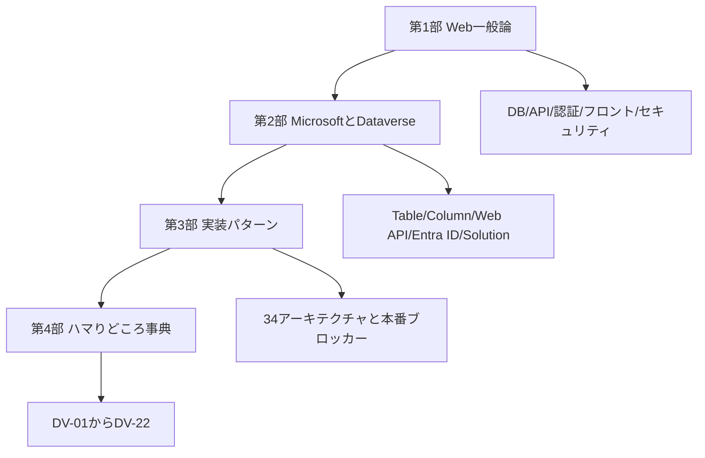

### 混同しやすい近接概念

「Dataverseを学ぶ」と「Power Appsを学ぶ」は近いが同じではない。Power Appsは画面を作るサービスで、Dataverseはデータと権限とAPIの土台である。

「Dataverseを学ぶ」と「SQL Serverを学ぶ」も近いが同じではない。Dataverseの背後にはデータベース的な仕組みがあるが、利用者が直接SQLで自由にテーブルを作ってJOINする製品ではない。DataverseではTable、Relationship、Security Role、Solution、Web APIなどの抽象化を通して扱う。

「ローコードだから簡単」と「本番運用が簡単」も同じではない。画面を作るだけなら簡単でも、DLP、環境、ライセンス、監査、ALM、所有者退職対策まで含めると、普通の業務システムと同じだけ設計が必要になる。

### ここを押さえれば次に進める

Dataverseは「データベースの代わり」だけではない。DB、API、認証連携、権限、監査、イベント、運用のまとまりとして見ると理解しやすい。VBAで一体化していたものが、WebとMicrosoft 365の世界では部品に分かれている。この部品の名前を順番にそろえるのが、このレジュメの目的である。

---

## 2. システムってなんだろう

### ふんわり入口

システムとは、ざっくり言えば「人が毎回手でやると面倒な仕事を、決まった手順で回す仕組み」である。

身近な例で考える。飲食店の注文を想像する。

1. お客さんがメニューを見る。
2. 店員さんに注文を伝える。
3. 厨房に注文が届く。
4. 料理人が作る。
5. 会計で金額が計算される。
6. 売上が記録される。

これを全部紙でやっても業務は回る。ただし、忙しくなると聞き間違い、書き間違い、二重入力、集計漏れが起きる。そこで、注文端末、厨房モニター、レジ、売上データベースをつないで「注文システム」にする。

会社の業務システムも同じである。申請、承認、顧客管理、在庫管理、案件管理、日報、問い合わせ管理などを、画面、データ、権限、通知、集計でつないだものがシステムである。

### 正確に言うと

システムは、目的を達成するために複数の要素が相互に関係して動く仕組みである。ITシステムでは、主に次の要素がある。

| 要素 | 役割 |
|---|---|
| 利用者 | 画面を操作する人 |
| フロントエンド | 利用者が触る画面 |
| バックエンド | 業務処理やAPIを担う裏側 |
| データベース | データを保存する場所 |
| 認証 | 利用者が誰かを確認する仕組み |
| 認可 | その人が何をしてよいかを決める仕組み |
| 通知 | メール、Teams、プッシュ通知など |
| ログ/監査 | 誰が何をしたかを残す仕組み |
| 運用 | 障害対応、変更管理、バックアップ、権限棚卸し |

Dataverseを中心に見ると、Dataverseはこのうちデータベース、認可、API、監査、イベントフックの多くをまとめて引き受ける。

### VBA的にいうと

VBAの業務ツールでは、1つの`.xlsm`に多くの役割が入る。

| `.xlsm`内の要素 | システム一般論 |
|---|---|
| シート | データ保存、簡易DB |
| UserForm | フロントエンド |
| 標準モジュール | 業務ロジック |
| ボタンイベント | ユーザー操作の入口 |
| 非表示シート | 設定値やマスタ |
| 保護、パスワード | 簡易的な権限制御 |
| 共有フォルダ配布 | 簡易的なデプロイ |

Excelではこの一体感が強みである。一方、本番で複数人が同時に使うと、ファイル破損、バージョン違い、権限管理、監査、同時編集、配布が苦しくなる。Dataverseを含む業務システムは、ここを分離して管理する発想である。

### 図

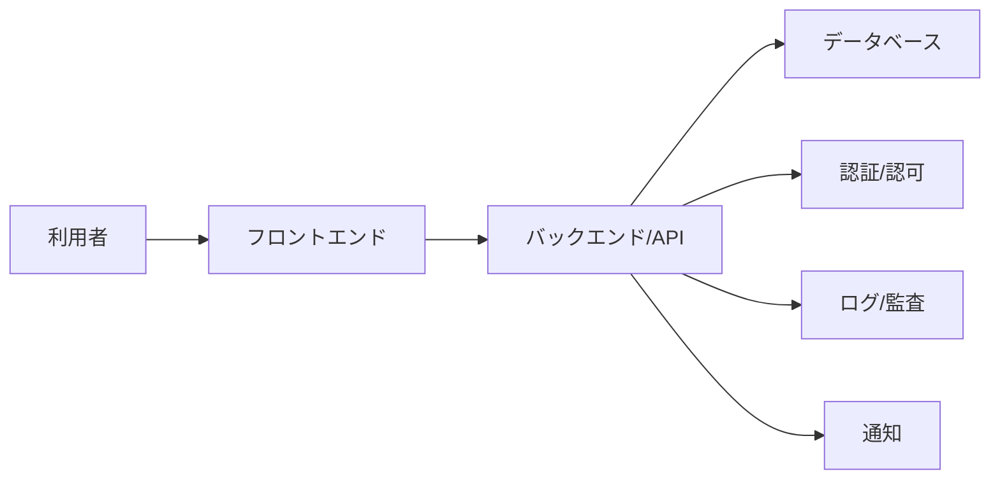

### 混同しやすい近接概念

「アプリ」と「システム」は混同しやすい。アプリは利用者から見える入口を指すことが多い。システムは、アプリ、データ、権限、通知、運用まで含む全体を指す。

「自動化」と「システム化」も同じではない。自動化は一部の作業を自動で走らせること。システム化は、入力、処理、保存、権限、監査、運用まで含めて仕組みにすること。

「画面ができた」と「業務に使える」も同じではない。業務利用には、誰が使えるか、誰が承認するか、データが消えたらどうするか、退職者の所有物をどう引き継ぐか、監査で説明できるかが必要になる。

### ここを押さえれば次に進める

システムは画面だけではない。データ、処理、権限、監査、運用を含む。Dataverseを学ぶときも、テーブル設計だけでなく「誰が、どの画面から、どの権限で、どのAPIを通って、どのログを残すか」まで一続きで考える。

---

## 3. Webアプリの三層

### ふんわり入口

レストランで考えると、Webアプリの三層はわかりやすい。

- 客席: お客さんが見るメニューや注文端末
- 厨房: 注文を受けて調理する場所
- 倉庫: 食材や在庫を保管する場所

Webアプリでは、客席がフロントエンド、厨房がバックエンド、倉庫がデータベースである。

利用者は画面を見る。画面は裏側に「この顧客一覧をください」「この案件を登録してください」と依頼する。裏側はデータベースを読んだり書いたりして、結果を返す。

### 正確に言うと

Webアプリの代表的な構成は三層アーキテクチャである。

| 層 | 英語 | 役割 |
|---|---|---|
| プレゼンテーション層 | Frontend / UI | 利用者に画面を見せ、入力を受け取る |
| アプリケーション層 | Backend / Application | 業務ルール、API、認証連携、外部連携を処理する |
| データ層 | Database / Storage | データを保存し、検索や更新を行う |

Dataverseを使う場合、この三層の対応は構成によって変わる。

| 構成 | フロントエンド | バックエンド | データ層 |
|---|---|---|---|
| Canvas Apps | Canvas Apps | Power Platform/Dataverse Connector | Dataverse |
| Model-driven Apps | Model-driven Apps | Dataverse標準機能 | Dataverse |
| React + Web API直結 | React SPA | Dataverse Web API | Dataverse |
| React + BFF | React SPA | Azure Functions/App Service等 | Dataverse |
| Excel + Power Automate | Excel/VBA/Office Scripts | Power Automate | Dataverse |

### VBA的にいうと

VBAでは三層が1ファイルに寄りがちである。

```vb
' VBAでは画面、処理、保存が同じブック内に集まりやすい
Private Sub btnSave_Click()
    Worksheets("Data").Cells(nextRow, 1).Value = txtCustomerName.Value
    Worksheets("Data").Cells(nextRow, 2).Value = Now
End Sub
```

Webアプリでは、同じ処理が分かれる。

```javascript
// フロントエンド: ボタン押下でAPIに送る
async function saveCustomer() {
  const response = await fetch("/api/customers", {
    method: "POST",
    headers: { "Content-Type": "application/json" },
    body: JSON.stringify({ name: document.querySelector("#name").value })
  });

  if (!response.ok) {
    throw new Error("登録に失敗しました");
  }
}
```

```sql
-- データ層: 実際にはDBに行として保存される
INSERT INTO Customers (CustomerName, CreatedOn)
VALUES ('株式会社サンプル', CURRENT_TIMESTAMP);
```

Dataverseでは直接このSQLを利用者が書くわけではない。代わりにTableに対してWeb APIやConnector経由で行を作る。

### 図

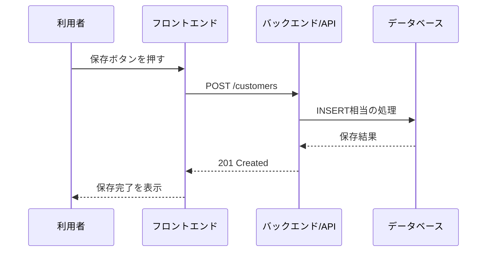

### 混同しやすい近接概念

「バックエンド」と「データベース」は別である。バックエンドは処理をする場所、データベースは保存する場所である。ただしDataverseはWeb API、権限、Plug-in、Custom APIなどを持つため、単なるデータベースよりバックエンド寄りの機能も持つ。

「フロントエンド」と「アプリ」も文脈で揺れる。Power Appsで「アプリ」と言うとCanvas AppやModel-driven Appを指すことが多い。Web開発で「フロント」と言うとReactやVueなどの画面部分を指すことが多い。

「サーバーレス」と「バックエンドなし」も違う。Azure Functionsのようなサーバーレスは、サーバー管理をクラウドに任せるという意味であり、裏側の処理が消えるわけではない。

### ここを押さえれば次に進める

Webアプリは、画面、処理、データの三層で見ると整理しやすい。Dataverseはデータ層でありながら、API、権限、イベント処理も持つ。そのため「DataverseをDBとしてだけ見る」と見落としが出る。

---

## 4. データベース入門

### ふんわり入口

データベースは、きれいに整理された台帳である。Excelの表を想像すると入りやすい。

たとえば顧客一覧がある。

| 顧客ID | 顧客名 | 電話番号 |
|---|---|---|
| C001 | 株式会社サンプル | 03-0000-0000 |
| C002 | 鈴木商店 | 06-0000-0000 |

この表で、横1行が1人の顧客、縦1列が顧客名や電話番号などの項目である。データベースでも基本は同じで、表、行、列で考える。

ただし業務データが大きくなると、Excelの表だけでは苦しくなる。顧客、案件、見積、請求、担当者を全部1枚のシートに入れると、同じ顧客名が何度も出たり、修正漏れが起きたり、どの行が何を表しているのかわからなくなる。そこで、テーブルを分け、IDでつなぐ。

### 正確に言うと

リレーショナルデータベースでは、データをテーブルとして管理する。

| 一般DB用語 | Dataverse用語 | 旧名/近い言葉 |
|---|---|---|
| Table | Table | Entity |
| Column | Column | Field / Attribute |
| Row | Row | Record |
| Primary Key | Primary Key | 主キー |
| Foreign Key | Lookup / Relationship | 外部キー的な関係 |
| Relationship | Relationship | リレーション |

主キーは、行を一意に識別する値である。社員番号、顧客ID、注文IDのようなものだ。外部キーは、別のテーブルの行を指す値である。DataverseではLookup列とRelationshipで表現される。

正規化は、データの重複や不整合を減らすためにテーブルを適切に分ける考え方である。

例として、悪い表を考える。

| 注文ID | 顧客名 | 顧客電話 | 商品名 | 単価 |
|---|---|---|---|---|
| O001 | 株式会社サンプル | 03-0000-0000 | マウス | 2000 |
| O002 | 株式会社サンプル | 03-0000-0000 | キーボード | 5000 |

顧客電話が変わると、同じ顧客の全行を直す必要がある。そこで顧客テーブルと注文テーブルに分ける。

```sql
CREATE TABLE Customers (
  CustomerId varchar(20) PRIMARY KEY,
  CustomerName varchar(100) NOT NULL,
  Phone varchar(30)
);

CREATE TABLE Orders (
  OrderId varchar(20) PRIMARY KEY,
  CustomerId varchar(20) NOT NULL,
  ProductName varchar(100) NOT NULL,
  UnitPrice int NOT NULL,
  FOREIGN KEY (CustomerId) REFERENCES Customers(CustomerId)
);
```

トランザクションは、複数の更新を「全部成功」または「全部失敗」にする単位である。銀行振込で、Aさんの口座から1万円を引いたのにBさんの口座に足されない、という途中失敗を防ぐ考え方である。

```sql
BEGIN TRANSACTION;

UPDATE Accounts
SET Balance = Balance - 10000
WHERE AccountId = 'A';

UPDATE Accounts
SET Balance = Balance + 10000
WHERE AccountId = 'B';

COMMIT;
```

Dataverseでは利用者が自由にSQLトランザクションを書くわけではないが、Web APIの`$batch`、Plug-in、Custom API、Organization Serviceなどで複数処理の整合性を考える場面がある。

### VBA的にいうと

`Worksheet.Cells(1, 1)`は、表の1行目1列目を指す。DBでは、通常「1行目」のような物理的な順番に意味を持たせない。代わりに主キーで行を特定する。

```vb
' Excel的な発想
Worksheets("Customers").Cells(2, 1).Value = "C001"
Worksheets("Customers").Cells(2, 2).Value = "株式会社サンプル"
```

```sql
-- DB的な発想
SELECT CustomerName
FROM Customers
WHERE CustomerId = 'C001';
```

VBAのRecordsetは、DBから取ってきた行のまとまりである。JavaScriptでAPIを呼んだ場合は、JSON配列がRecordsetに近い。

```javascript
const result = await fetch("/api/customers").then(r => r.json());
for (const row of result.value) {
  console.log(row.name);
}
```

### 図

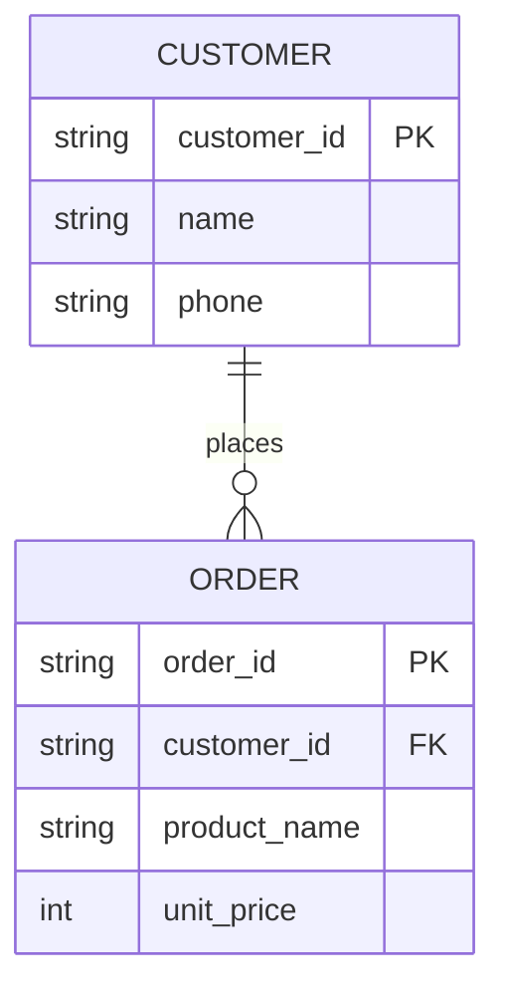

### 混同しやすい近接概念

「表」と「テーブル」は近いが、Excelの表とDBのテーブルは同じではない。Excelでは見た目、計算式、メモ、結合セルなどが混ざりやすい。DBのテーブルは型、制約、主キー、関係を持つ。

「外部キー」と「Lookup」も近いが、DataverseではLookupはUIや権限、Relationship、参照先のEntity Set名などと絡む。単なるID列ではない。

「削除」と「非アクティブ化」も違う。業務システムでは、行を物理削除せず、状態列で無効化する方が監査や参照整合性に向く場合が多い。Dataverseの多くの標準Tableにも状態を表す列がある。

### ここを押さえれば次に進める

DBの基本はTable、Row、Column、主キー、外部キー、Relationshipである。Dataverseではこれらが公式用語としてTable、Column、Row、Lookup、Relationshipに対応する。Excelの表に似ているが、主キー、権限、関係、監査、APIが乗る点が大きく違う。

---

## 5. APIと通信

### ふんわり入口

APIは、システム同士の注文窓口である。

レストランで言えば、客が厨房に直接入って冷蔵庫を開けるのではなく、店員さんに「カレーをください」と頼む。店員さんは注文を受け、厨房に伝え、料理を客席へ戻す。

Webシステムでも、画面がデータベースを直接触るのではなく、APIに「顧客一覧をください」「案件を登録してください」と頼むことが多い。APIは頼み方のルールを持った窓口である。

### 正確に言うと

HTTPはWebの基本通信プロトコルである。HTTPSはHTTPをTLSで暗号化したもの。現代のWeb APIは基本的にHTTPSで通信する。

HTTPにはメソッドがある。

| メソッド | 意味 | 典型用途 |
|---|---|---|
| GET | 取得する | 一覧取得、詳細取得 |
| POST | 作成する、処理を依頼する | 新規作成、Action呼び出し |
| PATCH | 部分更新する | 一部列の更新 |
| PUT | 置き換える | 全体更新 |
| DELETE | 削除する | 行の削除 |

リクエストは依頼、レスポンスは返事である。

```http
GET /api/data/v9.2/accounts?$select=name,telephone1 HTTP/1.1
Host: org.crm.dynamics.com
Authorization: Bearer <access_token>
Accept: application/json
```

返事にはステータスコードが付く。

| ステータス | 意味 |
|---|---|
| 200 OK | 成功 |
| 201 Created | 作成成功 |
| 204 No Content | 成功、返す本文なし |
| 400 Bad Request | 依頼の書き方が悪い |
| 401 Unauthorized | 認証できていない |
| 403 Forbidden | 権限がない |
| 404 Not Found | 見つからない |
| 409 Conflict | 競合 |
| 412 Precondition Failed | ETagなど前提条件に失敗 |
| 429 Too Many Requests | リクエスト過多 |
| 500 Internal Server Error | サーバー側エラー |

RESTはHTTPの使い方の作法である。プロトコルそのものではない。「リソースにURLを割り当て、HTTPメソッドで操作する」という考え方である。

ODataは、データを問い合わせるための規格で、`$select`、`$filter`、`$expand`、`$top`などのクエリを使う。Dataverse Web APIはOData v4系の作法で操作する。

```javascript
const url = "https://org.crm.dynamics.com/api/data/v9.2/accounts"
  + "?$select=name,telephone1"
  + "&$filter=startswith(name,'A')";

const response = await fetch(url, {
  headers: {
    Authorization: `Bearer ${accessToken}`,
    Accept: "application/json"
  }
});

if (!response.ok) {
  throw new Error(`${response.status} ${response.statusText}`);
}

const data = await response.json();
console.log(data.value);
```

### VBA的にいうと

VBAからもHTTPは呼べる。ADOでDBに接続する感覚に近いが、接続先はSQL ServerではなくWeb APIである。

```vb
Dim http As Object
Set http = CreateObject("MSXML2.XMLHTTP")

http.Open "GET", "https://example.com/api/customers", False
http.setRequestHeader "Accept", "application/json"
http.Send

If http.Status = 200 Then
    Debug.Print http.responseText
End If
```

ただし、Dataverse Web APIをVBAから直接安全に呼ぶにはOAuth、MFA、条件付きアクセス、トークン保管が絡む。会社本番ではここが非常に重い。VBAから直接Dataverseへ行くより、Power AutomateやBFFを挟む方が現実的な場合が多い。

### 図


### 混同しやすい近接概念

「HTTP」と「REST」は違う。HTTPは通信のルール、RESTはHTTPをどう使うかの設計作法である。

「REST」と「OData」も違う。RESTは広い設計スタイル、ODataはデータ問い合わせの具体的な規格である。Dataverse Web APIはREST風に見えるが、ODataの書式を多く使う。

「API」と「Connector」も違う。APIはシステムが公開する窓口。ConnectorはPower PlatformからAPIを使いやすくする接続部品である。Dataverse Connectorの裏側ではDataverseのAPIが使われるが、利用者は直接HTTPを書かずに扱える。

### ここを押さえれば次に進める

APIはシステム同士の窓口である。HTTPメソッド、リクエスト、レスポンス、ステータスコードを理解すると、Dataverse Web APIやConnectorのエラーが読めるようになる。DataverseではODataの語彙がよく出るため、`$select`、`$filter`、`$expand`は早めに慣れる。

---

## 6. 認証と認可

### ふんわり入口

認証と認可は、会社の受付と入館証で考えるとわかりやすい。

受付で「あなたは誰ですか」と確認するのが認証である。社員証、免許証、顔認証、パスワード、MFAがこれに当たる。

その後、「あなたは3階の経理部屋に入れますか」「金庫を開けられますか」と判断するのが認可である。同じ社員でも、全員が全室に入れるわけではない。

Dataverseでは、Entra IDが主に「あなたは誰か」を担当し、DataverseのSecurity RoleやBusiness Unitなどが「何ができるか」を担当する。

### 正確に言うと

認証(Authentication)は、主体が誰であるかを確認すること。認可(Authorization)は、認証済みの主体に対して、どの操作を許可するかを決めること。

OAuth 2.0は、パスワードを直接渡さず、限定された権限を表すトークンでAPIを使うための仕組みである。OpenID ConnectはOAuth 2.0の上にID情報を扱う層を加えたもので、ログインした人のIDを扱う。

トークンは、ホテルのカードキーに近い。マスターキーではなく、期限や入れる部屋が決まったカードを渡す。

| 用語 | 意味 |
|---|---|
| Access Token | APIを呼ぶための短命な通行証 |
| Refresh Token | Access Tokenを再取得するための通行証 |
| Scope | 何をしてよいかの範囲 |
| Client ID | アプリを識別するID |
| Client Secret | アプリが秘密に持つ合言葉 |
| Tenant ID | Microsoft 365テナントを識別するID |
| Authorization Code Flow | 人間がログインしてアプリに代理権限を渡す流れ |
| Client Credentials Flow | アプリ自身がサーバー間で動く流れ |
| On-Behalf-Of | 受け取ったユーザートークンをもとに、バックエンドがユーザーの代わりに下流APIを呼ぶ流れ |

Authorization Code Flowの大まかな流れは次の通り。


Client Credentials Flowは、人間が画面でログインしないバッチやサーバー間連携で使う。

```javascript
// Node.jsでClient Credentialsのトークンを取る例
const body = new URLSearchParams({
  grant_type: "client_credentials",
  client_id: process.env.CLIENT_ID,
  client_secret: process.env.CLIENT_SECRET,
  scope: "https://org.crm.dynamics.com/.default"
});

const tokenResponse = await fetch(
  `https://login.microsoftonline.com/${process.env.TENANT_ID}/oauth2/v2.0/token`,
  {
    method: "POST",
    headers: { "Content-Type": "application/x-www-form-urlencoded" },
    body
  }
);

const { access_token } = await tokenResponse.json();
```

### VBA的にいうと

VBAの小さなツールでは、Windowsログイン済みの前提で動いたり、ブックを開ける人なら使える、という形になりやすい。これは「認証と認可をExcelファイル運用に寄せている」状態である。

業務システムでは、認証と認可を明示する。

| VBA運用 | Web/Dataverse運用 |
|---|---|
| 共有フォルダに置いた人だけ開ける | Entra IDでログインする |
| シート保護パスワード | Security RoleやColumn-level security |
| マクロ内に接続文字列 | App Registration、Secret、Key Vault |
| 担当者別ファイル配布 | Business Unit、Team、共有 |

特に、VBAにClient Secretを埋め込む設計は避ける。ブックを配ることはSecretを配ることに近くなる。

### 混同しやすい近接概念

「ログインできる」と「データを読める」は違う。Entra IDでログインできても、Dataverse側にSystem Userがあり、Security Roleがあり、対象TableへのRead権限がなければ読めない。

「401」と「403」も違う。401は認証ができていない。403は認証はできたが権限がない。DataverseではApplication Userを作り忘れた場合やSecurity Role不足で、この違いが重要になる。

「Application User」と「Service Principal」も違う。Service PrincipalはEntra ID側のアプリ実体。Application UserはDataverse側でそのアプリをユーザーとして扱うための登録である。

### ここを押さえれば次に進める

認証は「あなた誰」、認可は「何してよい」。Dataverse連携ではEntra IDとDataverseの2世界をまたぐ。App RegistrationだけではDataverse権限は得られない。Application UserとSecurity Roleまでそろって初めて、サーバー間連携が動く。

---

## 7. フロントエンドの形

### ふんわり入口

フロントエンドは、利用者が触る入口である。店舗で言えば売り場、窓口、注文端末、案内板である。

同じ商品を売るにも、店舗、電話注文、自動販売機、ECサイト、スマホアプリでは入口が違う。裏側の在庫や会計は共通でも、利用者が触る形は変えられる。

Dataverseも同じで、同じTableをCanvas Apps、Model-driven Apps、Power Pages、Teams Tab、Excel、Reactアプリなど、さまざまな入口から扱える。

### 正確に言うと

フロントエンドの代表的な形には、SPA、SSR、SSGなどがある。

| 方式 | 意味 | 向く場面 |
|---|---|---|
| SPA | Single Page Application。ブラウザ内で画面遷移を処理する | 業務アプリ、管理画面 |
| SSR | Server-Side Rendering。サーバーでHTMLを生成して返す | 初期表示速度、SEO、認証付きサイト |
| SSG | Static Site Generation。事前にHTMLを生成する | ドキュメント、ブログ、静的サイト |

React、Vue、Angular、Svelteなどはフロントエンドフレームワークまたはライブラリである。UI部品、状態管理、画面遷移、ビルドなどを助ける。

Dataverse周辺では、フロントエンドの選択肢をローコード度合いで見ると整理しやすい。

| 層 | 例 | 特徴 |
|---|---|---|
| ローコード | Canvas Apps、Model-driven Apps | Power Platform内、認証/権限/共有が標準寄り |
| 部分コード | PCF、Web resource、Command bar JS | 標準アプリの一部を拡張 |
| フルコードだがPower Platform内 | Code Apps | React等で書き、Power Platform管理下で動かす |
| 完全独立 | React/Vue + Dataverse Web API/BFF | 自由度が高いが認証、ホスティング、審査が重い |

### VBA的にいうと

VBAのUserFormはフロントエンドである。

```vb
Private Sub btnSearch_Click()
    Call SearchCustomer(txtKeyword.Value)
End Sub
```

JavaScriptではイベントリスナーで似たことをする。

```javascript
document.querySelector("#searchButton").addEventListener("click", async () => {
  const keyword = document.querySelector("#keyword").value;
  const result = await fetch(`/api/customers?keyword=${encodeURIComponent(keyword)}`)
    .then(r => r.json());
  renderCustomers(result.value);
});
```

Power Fxでは、ボタンの`OnSelect`に式を書く。

```powerfx
ClearCollect(
    colAccounts,
    Filter(Accounts, StartsWith('Account Name', txtKeyword.Text))
)
```

### 図

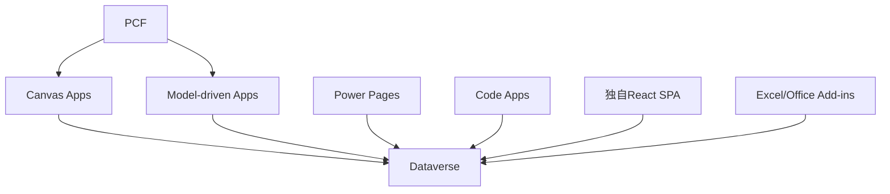

### 混同しやすい近接概念

「画面自由度」と「本番通過性」は別である。Reactで独自UIを作れば自由度は高いが、Entraアプリ登録、ホスティング、条件付きアクセス、DLP、監査、ライセンスの説明が必要になる。

「Canvas Apps」と「Model-driven Apps」は同じPower Appsでも発想が違う。Canvasは自由配置の画面を作る。Model-drivenはDataverseのデータモデル、フォーム、ビュー、サイトマップを中心に自動生成寄りで作る。

「PCF」と「Code Apps」も違う。PCFはCanvas/Model-drivenに埋め込む部品。Code Appsはアプリ全体をコードで作る方式である。

### ここを押さえれば次に進める

フロントエンドは入口である。Dataverseを中心にする場合、入口は一つではない。最初に「誰が、どの端末で、どの業務導線から使うか」を決めると、Canvas、Model-driven、Teams、SharePoint、独自Web、Excelのどれが妥当か判断しやすくなる。

---

## 8. セキュリティの基本

### ふんわり入口

セキュリティは、玄関の鍵だけではない。会社なら、受付、社員証、部屋の鍵、金庫、監視カメラ、入退室ログ、持ち出し禁止ルール、廃棄ルールまで含む。

Webアプリでも同じで、ログイン画面だけ作れば安全というわけではない。入力値、ブラウザ、API、権限、外部サイト、通信、ログ、端末、運用まで見る必要がある。

Dataverseは標準で強いセキュリティモデルを持つが、フロントエンドや連携方法を間違えると、別の穴を作る。特に独自Web、Office Add-ins、VBA、Power Automate HTTP、Custom Connectorを使う場合は注意が必要である。

### 正確に言うと

Webセキュリティでよく出る基本用語を整理する。

| 用語 | 日常の例え | 意味 |
|---|---|---|
| CSRF | 本人の印鑑を勝手に押される | ログイン済みブラウザに意図しないリクエストを送らせる攻撃 |
| XSS | 掲示板に悪意ある貼り紙を貼る | サイト内に悪意あるJavaScriptを実行させる攻撃 |
| SQL Injection | 申請欄に命令文を書き込む | 入力値を悪用してSQLを改ざんする攻撃 |
| CORS | 入館できる取引先ドメインの許可リスト | ブラウザが別オリジンAPIを呼ぶ制御 |
| CSP | 店内で実行してよいスクリプトの規則 | 読み込めるスクリプトや画像の制限 |

SQL Injectionの危険な例。

```javascript
// 悪い例: 入力値をSQLに直接連結する
const sql = "SELECT * FROM Users WHERE name = '" + userInput + "'";
```

安全な例。

```javascript
// 良い例: パラメータ化する
const result = await db.query(
  "SELECT * FROM Users WHERE name = ?",
  [userInput]
);
```

Dataverse Web APIを使う場合、通常は自分でSQLを組み立てないため、典型的なSQL Injectionとは形が違う。ただし、`$filter`文字列を入力値から組み立てる場合、エスケープや許可リスト設計が必要になる。

```javascript
// 悪い例: 入力値をOData filterにそのまま連結する
const url = `/api/data/v9.2/accounts?$filter=name eq '${keyword}'`;

// ましな例: シングルクォートをエスケープし、許可する検索条件を限定する
const escaped = keyword.replaceAll("'", "''");
const safeUrl = `/api/data/v9.2/accounts?$filter=startswith(name,'${escaped}')`;
```

CORSはブラウザの制御である。サーバー間通信では同じ制約はない。独自SPAからDataverseを直接叩く場合、ブラウザ、リダイレクトURI、許可オリジン、認証フローが絡むため、本番審査が重くなりやすい。

### VBA的にいうと

VBAツールでは、次のようなセキュリティ問題が起きやすい。

| VBAでありがちなこと | Web/Dataverseでの危険 |
|---|---|
| 接続文字列やパスワードをコードに直書き | Secret漏洩 |
| 共有フォルダに最新版を置くだけ | 改ざん、版数不明 |
| マクロ有効化を手作業で依頼 | 端末制御、監査、署名問題 |
| 入力値をSQL文字列に連結 | SQL Injection |
| 全員が同じ共有アカウントで実行 | 監査不能、Multiplexing問題 |

VBAが悪いわけではない。ローカル少人数の業務には強い。ただしDataverseのような中央データ基盤につなぐなら、認証、監査、トークン、ライセンス、DLPを含めて設計する必要がある。

### 図

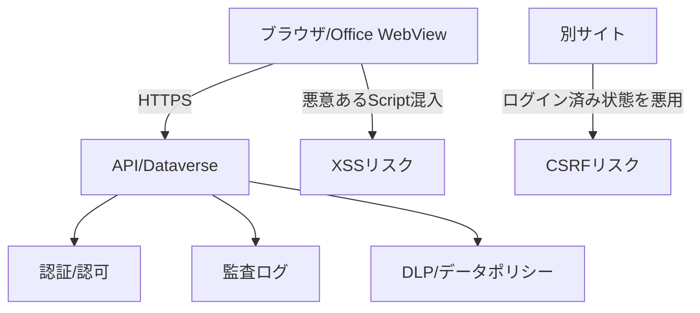

### 混同しやすい近接概念

「暗号化」と「安全」は違う。HTTPSで通信していても、権限設計が間違っていれば見えてはいけないデータが見える。

「認証」と「入力検証」も別である。ログイン済みユーザーでも、入力値は信用しない。業務アプリでは、悪意だけでなく誤入力も事故の原因になる。

「DataverseのSecurity Role」と「画面上の非表示」も違う。画面でボタンや列を隠しても、API権限が残っていれば別経路で更新できる可能性がある。重要な制約はサーバー側、つまりDataverseの権限やPlug-in/Custom API側で守る。

### ここを押さえれば次に進める

セキュリティはログインだけではない。入力、API、権限、通信、ブラウザ制御、監査、DLP、端末管理まで含む。Dataverseを使う場合も、標準機能に任せる部分と、自分で守る部分を分けて考える。

---

# 第2部 Microsoftの世界(Dataverse中心)

## 9. Power Platform全体地図

### ふんわり入口

Power Platformは、会社の業務改善デパートのようなものだ。売り場ごとに役割が違う。

- 画面を作る売り場
- 自動処理を作る売り場
- グラフや分析を作る売り場
- 外部向けWebサイトを作る売り場
- チャットボットを作る売り場
- その全部が使う共通倉庫

この共通倉庫がDataverseである。もちろん全部のPower Platformアプリが必ずDataverseを使うわけではない。SharePoint Lists、Excel、SQL Server、外部SaaSを使うこともある。しかし、権限、監査、関係、業務アプリの本格運用まで考えると、Dataverseが中心候補になる。

### 正確に言うと

Power Platformは、業務アプリ、自動化、分析、Webサイト、チャットボット、AI部品、データ基盤をまとめたMicrosoftのローコード/プロコード統合基盤である。

| サービス | 役割 | Dataverseとの関係 |
|---|---|---|
| Power Apps | 業務アプリの画面を作る | Canvas、Model-driven、Custom Page、Code AppsなどからDataverseを使う |
| Power Automate | 自動処理、承認、通知、連携を作る | Dataverseトリガー、Dataverse Connectorで読み書きする |
| Power BI | データ分析、レポート、ダッシュボード | Dataverseをデータソースにできる |
| Power Pages | 外部/社外向けWebサイト | Dataverse Tableを公開し、Table Permissionsで守る |
| Copilot Studio | チャットボット、会話型UI | DataverseやConnectorをアクションとして呼べる |
| Dataverse | 共通データ基盤 | Table、Security Role、Web API、監査、業務ロジックを持つ |
| Connectors | 外部サービス接続口 | SharePoint、Excel、Teams、HTTP、Dataverseなどを接続する |
| AI Builder | AI部品 | DataverseやPower Apps/Automateと組み合わせる |

Power Platformの管理単位として、TenantとEnvironmentが重要である。

| 用語 | 意味 | 例え |
|---|---|---|
| Tenant | Microsoft 365契約全体の器 | 会社の建物全体 |
| Environment | Power Platformの作業空間 | 建物の中のフロア |
| Dataverse database | Environmentに作成されるDataverseのデータ領域 | そのフロア専用の倉庫 |
| Default environment | テナントに自動作成される共有環境 | 全社員が入りがちな共用スペース |

Default環境は便利だが、本番業務の置き場としては危険が多い。全社ユーザーがMakerになりやすく、資産が個人所有になりやすく、管理方針が曖昧になりやすい。PoCでも、実データや本番化前提のものは専用の開発環境、Sandbox、または管理者が許可した環境で行う。

### VBA的にいうと

Power Platform全体は、Excel単体ではなく、Excel、Outlook、Teams、SharePoint、Access、Power Query、VBA、タスクスケジューラ、共有フォルダを会社全体で統合管理するような発想に近い。

VBAでは「このブックを配れば動く」が強い。一方Power Platformでは「どのEnvironmentにあり、誰が所有し、どのConnectorを使い、どのSolutionで移送し、どのDLPに従うか」が重要になる。

### 図

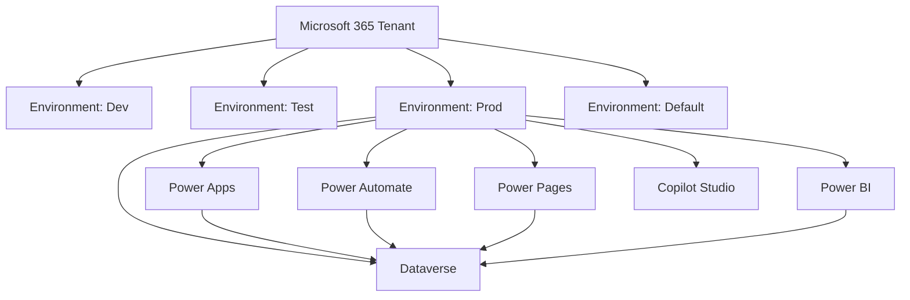

### 混同しやすい近接概念

「Power Apps」と「Power Platform」は違う。Power AppsはPower Platformの一部である。

「Environment」と「Dataverse」は違う。Environmentは作業空間で、Dataverseはその中に作れるデータ基盤である。

「Dataverse」と「Dataverse for Teams」は違う。Dataverse for TeamsはTeams内利用に寄った軽量版で、本格Dataverseとは容量、機能、ライフサイクル、移行方針が異なる。PoCでDataverse for Teamsを使った場合、本番で作り直しになることを見積もる。

### ここを押さえれば次に進める

Power Platformは、Apps、Automate、BI、Pages、Copilot、Dataverse、Connectorsの集合である。Dataverseはその中心に置ける共通データ基盤だが、環境、DLP、ライセンス、ALMと一緒に考える必要がある。

---

## 10. Dataverseは「何の代わり」か

### ふんわり入口

Dataverseを「Excelの代わり」や「Accessの代わり」とだけ言うと、半分しか当たっていない。

より近い例えは、次の部品が最初から合体した業務基盤である。

- データを置く倉庫
- 倉庫の棚割り
- 入館証と部屋の鍵
- 注文窓口(API)
- 変更履歴
- 業務ルールを差し込む場所
- 他システムへ通知する仕組み
- 開発環境から本番環境へ運ぶ箱

自前でWebアプリを作るなら、DB、ORM、認証、認可、API、監査ログ、イベントキュー、管理画面、デプロイ手順を組み合わせる。Dataverseはこの多くをMicrosoftの基盤として提供する。

### 正確に言うと

Dataverseは、Power PlatformとDynamics 365で使われるクラウドベースのデータプラットフォームである。業務データをTableとして管理し、セキュリティ、ビジネスロジック、API、監査、検索、統合、ALMを提供する。

「何の代わりか」を分解すると次のようになる。

| 自前システムの部品 | Dataverse側の対応 |
|---|---|
| RDBMSのテーブル | Table(旧Entity) |
| カラム定義 | Column(旧Field/Attribute) |
| レコード | Row(旧Record) |
| 外部キー | Lookup、Relationship |
| ORM | Dataverse SDK、Web API、Connectorが抽象化 |
| 認可 | Security Role、Business Unit、Team、Owner、Sharing |
| 行/列の権限 | Privilege Depth、Column-level security |
| API | Dataverse Web API(OData v4)、Organization Service |
| サーバー側イベント | Plug-in、Custom API、Business Rule、Power Automate |
| 監査 | Audit、Power Platform Activity、管理ログ |
| デプロイ単位 | Solution |
| 環境分離 | Environment |

DataverseはSQL Serverそのものではない。利用者が直接DDLを書いて自由にJOINするDBではなく、Power Platformのメタデータ、セキュリティ、APIを通して扱う。

### VBA的にいうと

Access + ADO + フォーム + 権限 + 監査 + 配布管理をクラウド化したもの、と言うと近い。ただしAccessのようにローカルファイルを直接開くのではなく、クラウド上のDataverseへConnectorやWeb APIを通してアクセスする。

Excelで「入力シート」「マスタシート」「非表示設定シート」「VBA処理」「保護パスワード」を一体で作っていたものを、DataverseではTable、Relationship、Security Role、Business Rule、Solutionに分ける。

### コード例

Dataverse Web APIでAccountを作るHTTP例。

```http
POST https://org.crm.dynamics.com/api/data/v9.2/accounts HTTP/1.1
Authorization: Bearer <access_token>
Content-Type: application/json
Accept: application/json

{
  "name": "株式会社サンプル",
  "telephone1": "03-0000-0000"
}
```

JavaScriptで同じことをする例。

```javascript
async function createAccount(accessToken) {
  const response = await fetch(
    "https://org.crm.dynamics.com/api/data/v9.2/accounts",
    {
      method: "POST",
      headers: {
        Authorization: `Bearer ${accessToken}`,
        "Content-Type": "application/json",
        Accept: "application/json"
      },
      body: JSON.stringify({
        name: "株式会社サンプル",
        telephone1: "03-0000-0000"
      })
    }
  );

  if (!response.ok) {
    throw new Error(`${response.status} ${await response.text()}`);
  }
}
```

### 混同しやすい近接概念

「DataverseはDBである」と「DataverseはDBだけである」は違う。Dataverseはデータ保存をするが、Security Role、Business Unit、Web API、Plug-in、Solutionなどがセットである。

「SharePoint Listsで十分」と「Dataverseが必要」は要件で決まる。単純なリスト、軽い申請、M365範囲の共有ならSharePoint Listsで足りることもある。複雑なRelationship、監査、列セキュリティ、業務アプリ、複数UI、本番ALMが必要ならDataverseが候補になる。

「中間APIを挟めばDataverse制限を回避できる」も誤解である。BFFやAPI中間層を挟んでも、DataverseのSecurity Role、API制限、容量、ライセンス、監査の問題は消えない。隠れるだけである。

### ここを押さえれば次に進める

DataverseはDB、ORM、認可、API、イベント、監査、ALMをまとめた業務データ基盤である。だから便利だが、単なる保存先より設計範囲が広い。Tableを作る前に、誰が使い、どの権限で、どの画面/APIから、どう本番運用するかを考える。

---

## 11. Entra ID

### ふんわり入口

Entra IDは、Microsoft 365の社員証発行所である。

会社の建物に入るとき、受付や入館ゲートで「この人は社員か」「MFAを通ったか」「会社管理端末から来ているか」を確認する。これがEntra IDの世界である。

一方、建物に入れたからといって、経理の金庫を開けられるとは限らない。Dataverseでは、入館後にSecurity RoleやBusiness Unitで「何ができるか」を決める。この2段階を分けて理解することが重要である。

### 正確に言うと

Microsoft Entra ID(旧Azure Active Directory)は、MicrosoftクラウドのIDおよびアクセス管理基盤である。ユーザー、グループ、アプリケーション、サービスプリンシパル、条件付きアクセス、MFA、トークン発行を扱う。

Dataverse連携でよく出る用語を整理する。

| 用語 | 世界 | 意味 |
|---|---|---|
| Tenant | Entra/M365 | 会社全体のID管理単位 |
| User | Entra | 人間のアカウント |
| Group | Entra | ユーザーのまとまり |
| App Registration | Entra | アプリの定義。Client IDやRedirect URIを持つ |
| Service Principal | Entra | Tenant内でのアプリの実体 |
| Application User | Dataverse | Dataverse側でアプリをユーザーとして扱う登録 |
| Security Role | Dataverse | Table操作権限の束 |
| Delegated permission | Entra/API | 人間の代わりにアプリが呼ぶ権限 |
| Application permission | Entra/API | アプリ自身が呼ぶ権限 |
| S2S | Dataverse連携 | Server-to-Server。Client Credentialsなど |
| OBO | Entra | On-Behalf-Of。バックエンドがユーザーの代理で下流APIを呼ぶ |

Delegatedは「社員本人が受付で入って、代理人に書類提出を頼む」ようなもの。最終的な権限は本人の権限に影響される。

Application/S2Sは「業務委託会社の専用入館証」のようなもの。人間ではなくアプリ自体に権限を与える。DataverseではApplication Userを作り、Security Roleを割り当てる必要がある。

OBOは、フロントでログインしたユーザーの文脈をバックエンドに渡し、バックエンドがその人の代理でDataverseを呼ぶ構成である。BFF/API中間層で「監査はユーザー単位にしたいが、トークンや再試行制御はサーバー側に寄せたい」場合に候補になる。

### VBA的にいうと

VBAで社内共有フォルダにあるファイルを開くとき、Windowsログインや共有フォルダ権限に乗ることが多い。Entra IDは、そのクラウド版の入口である。

ただし、VBAマクロに直接Client Secretを書いてDataverseを叩くのは、社員証のコピーを全員に配るようなものになりやすい。アプリの資格情報は、サーバー側、Key Vault、Managed Identity、証明書などで管理する。

### 図

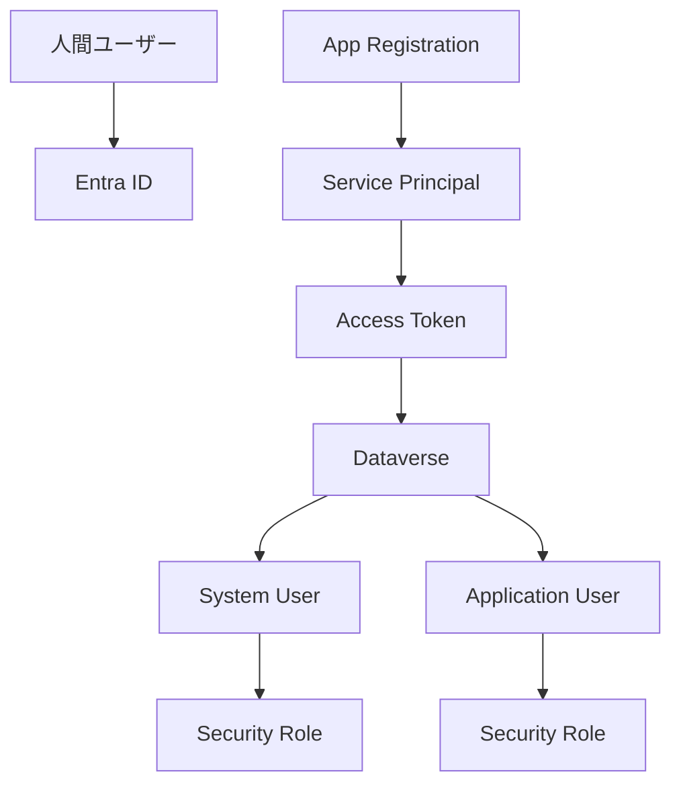

### コード例

DelegatedでDataverseを呼ぶ場合、フロントではMSALなどを使ってユーザーのトークンを取得する。

```javascript
const token = await msalInstance.acquireTokenSilent({
  scopes: ["https://org.crm.dynamics.com/user_impersonation"],
  account: msalInstance.getActiveAccount()
});

const whoami = await fetch(
  "https://org.crm.dynamics.com/api/data/v9.2/WhoAmI",
  { headers: { Authorization: `Bearer ${token.accessToken}` } }
).then(r => r.json());

console.log(whoami.UserId);
```

S2Sでは、Client Credentialsで取得したトークンを使う。その場合、Dataverse側のApplication UserとSecurity Roleが必要になる。

### 混同しやすい近接概念

「App Registrationを作った」と「Dataverseに入れる」は違う。App RegistrationはEntra ID側の登録であり、Dataverse側ではApplication Userとして登録してSecurity Roleを付ける必要がある。

「Delegated permission」と「Application permission」は違う。Delegatedは人間の代理。Applicationはアプリ自身。監査、権限、ライセンス、条件付きアクセスの見え方が変わる。

「Service Principal」と「Application User」は違う。Service PrincipalはEntra ID内のアプリ実体。Application UserはDataverse内のユーザー行である。

### ここを押さえれば次に進める

Entra IDは認証の世界、Dataverseは権限とデータの世界である。アプリ連携では、Entra IDでトークンをもらい、Dataverseでその主体に何を許すかを判断する。2世界の対応を表にして管理すると、401/403の切り分けが速くなる。

---

## 12. データモデルの言葉

### ふんわり入口

データモデルは、業務の地図である。

顧客、担当者、案件、見積、商品、請求、承認など、業務で扱うものを「どんな箱に入れるか」「箱同士をどうつなぐか」として整理する。地図が曖昧だと、画面もフローもレポートも迷子になる。

Dataverseのデータモデルでは、Table、Column、Row、Choice、Lookup、Relationshipが基本語彙になる。昔の資料やDynamics 365由来の画面では、Entity、Field、Attribute、Recordという言葉も残る。

### 正確に言うと

Dataverseの主要なデータモデル用語。

| 現在の公式寄り表記 | 旧名/近い言葉 | 意味 |
|---|---|---|
| Table | Entity | 行を格納する箱 |
| Column | Field / Attribute | Tableの項目 |
| Row | Record | Table内の1件 |
| Primary column | Primary name field | 参照表示に使われる代表列 |
| Choice | Option Set / Picklist | 選択肢 |
| Global Choice | Global Option Set | 複数Tableで共有する選択肢 |
| Lookup | Lookup field | 他TableのRowを参照する列 |
| Relationship | Relationship | Table間の関係 |
| One-to-many | 1:N | 1つの親に複数の子 |
| Many-to-one | N:1 | 多くの子が1つの親を参照 |
| Many-to-many | N:N | 中間関係を通じた多対多 |
| Alternate Key | 代替キー | GUID以外で一意性を持たせるキー |
| Business Rule | ビジネスルール | 入力制御や値設定のルール |
| Calculated column | 計算列 | 他列から計算される列 |
| Rollup column | ロールアップ列 | 関連行の集計値を持つ列 |

Dataverseの行には通常GUIDの主キーがある。たとえばAccountなら`accountid`である。画面では取引先企業名が見えるが、内部的な識別はGUIDで行われる。

Lookup列をWeb APIで設定する場合、`@odata.bind`を使う。

```http
PATCH https://org.crm.dynamics.com/api/data/v9.2/contacts(<contact-id>) HTTP/1.1
Authorization: Bearer <access_token>
Content-Type: application/json

{
  "parentcustomerid_account@odata.bind": "/accounts(<account-id>)"
}
```

Customer、Owner、RegardingのようなPolymorphic Lookupは、参照先の型を明示する必要がある。ここはDataverse特有の罠として第4部で詳しく扱う。

### VBA的にいうと

Excelでは、顧客シートのA列に顧客ID、案件シートのB列に顧客IDを置いて、VLOOKUPやXLOOKUPでつなぐことが多い。

```excel
=XLOOKUP(B2, Customers!A:A, Customers!B:B)
```

Dataverseでは、これをLookupとRelationshipとして設計する。見た目は顧客名だが、内部では参照先RowのGUIDを持つ。

Power Fxでは、Lookup列は単なる文字列ではなくレコードとして扱う。

```powerfx
Patch(
    Contacts,
    Defaults(Contacts),
    {
        'Full Name': "山田 太郎",
        'Company Name': LookUp(Accounts, 'Account Name' = "株式会社サンプル")
    }
)
```

### 図

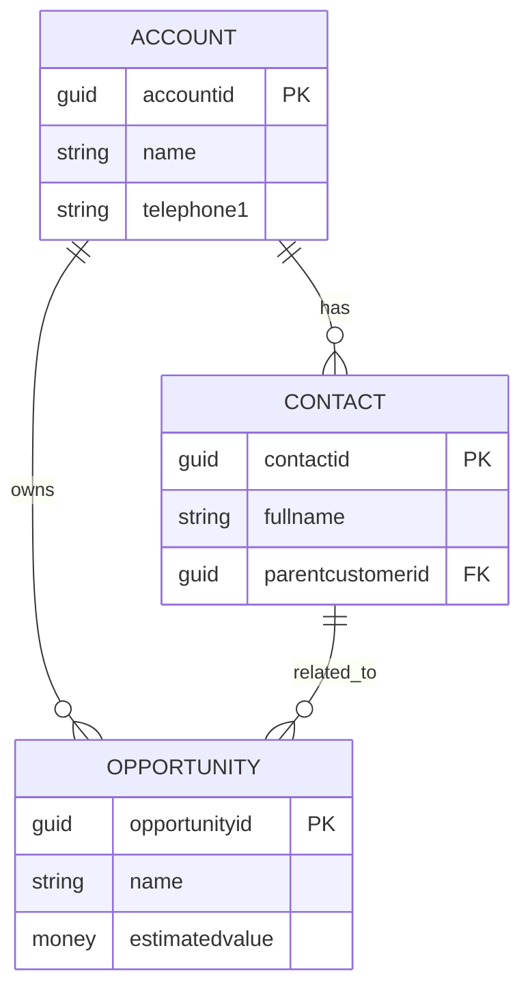

### 混同しやすい近接概念

「Choice」と「Lookup」は違う。Choiceは固定的な選択肢。Lookupは別TableのRowを参照する。部署や商品カテゴリが少数固定ならChoice、マスタとして増減や権限管理が必要ならLookupを検討する。

「ローカルChoice」と「Global Choice」も違う。ローカルChoiceはそのColumn専用。Global Choiceは複数Tableで共有できる。乱立すると統合が苦しくなる。

「Calculated column」と「Rollup column」は違う。Calculatedは同じ行や関連値から計算する。Rollupは関連行を集計するが、評価タイミングが即時とは限らない。

### ここを押さえれば次に進める

DataverseのデータモデルはTable、Column、Row、Choice、Lookup、Relationshipで読む。旧名のEntity、Field、Attribute、Recordも現場では出る。LookupはExcelのVLOOKUP感覚に近いが、型、Relationship、権限、Web APIの書式まで絡む。

---

## 13. 通信・APIの言葉

### ふんわり入口

Dataverseには、外から入る道、外へ出る道、Power Platform内の近道がある。

会社の倉庫で例えると、正面受付、専用搬入口、社内便、外部配送業者、倉庫内作業員、通知ベルがあるようなものだ。全部「データを動かす手段」だが、用途も責任も違う。

### 正確に言うと

Dataverseの通信手段は、インバウンド(外部からDataverseへ)とアウトバウンド(Dataverseから外部へ)に分けると整理しやすい。

| 分類 | 手段 | 役割 |
|---|---|---|
| インバウンド | Web API | REST/OData v4、HTTPS + JSON、OAuth 2.0 |
| インバウンド | Organization Service | 古いSOAP/.NET SDK系。既存Dynamics文脈で残る |
| インバウンド | Dataverse Connector | Power Apps/Automateから使う標準接続 |
| インバウンド | Custom Connector | 外部APIをPower Platformに接続口として登録 |
| インバウンド | Dataflows | Power Query系の取り込み |
| インバウンド | Virtual Tables | 外部データをDataverse Tableのように見せる |
| アウトバウンド | Webhooks | 変更時にHTTP POSTで外部へ通知 |
| アウトバウンド | Azure Service Bus | メッセージキュー連携 |
| アウトバウンド | Event Hubs | 大量イベントストリーミング |
| 内部拡張 | Plug-in | Dataverse内でC#処理を同期/非同期実行 |
| 内部拡張 | Custom API | Dataverse内に独自APIを定義 |
| ノーコード | Power Automate | トリガーとConnectorで自動処理 |
| 差分取得 | Change Tracking API | 変更差分を後から取りに行く |

Dataverse Web APIは、ブラウザやサーバーからHTTPで呼べる。主なURLは次の形。

```text
https://{org}.crm{region}.dynamics.com/api/data/v9.2/
```

代表的な呼び出し。

```http
GET https://org.crm.dynamics.com/api/data/v9.2/WhoAmI
Authorization: Bearer <access_token>
Accept: application/json
```

Power AutomateやCanvas AppsのDataverse Connectorは、利用者が直接HTTPを書かなくてもDataverse操作を行える。裏側にはDataverse APIと認証があるが、開発者はConnectorとして扱う。

Custom APIは、Dataverse内に業務APIを作る仕組みである。複数Tableをまたぐ重要な更新、権限チェック、入力検証を1つの呼び出しにまとめたい場合に向く。

### VBA的にいうと

ADOでDBに直接接続する感覚に近いのはWeb APIである。ただし接続文字列ではなく、HTTPS URL、Bearer Token、JSONを使う。

Excelマクロから直接Web APIへ行くことも技術的には可能だが、OAuth、MFA、条件付きアクセス、Secret保管で詰まりやすい。職場で配るなら、VBA → Power Automate → Dataverse、またはVBA → 社内BFF → Dataverseの方が説明しやすい場合がある。

### 図

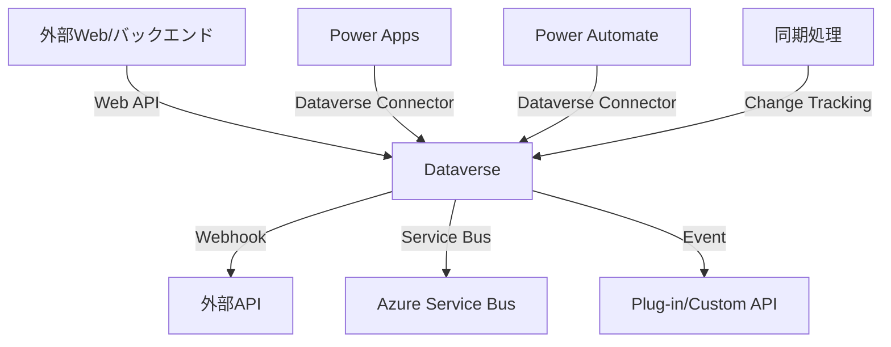

### 混同しやすい近接概念

「Service Endpoint」と「Web API」は違う。Web APIはDataverseを呼ぶHTTP API。Service EndpointはPlug-in Registration ToolなどでDataverseイベントをAzure Service Busなどへ送る構成で使われる文脈がある。

「Custom Connector」と「Custom API」は名前が似ているが違う。Custom ConnectorはPower Platformから外部APIを呼ぶための接続定義。Custom APIはDataverse内に独自APIを作る機能である。

「Action」と「Function」はOData文脈で違う。ざっくり言うと、Functionは副作用のない問い合わせ、Actionは副作用を持つ処理として扱われる。Dataverseでは標準ActionやCustom APIの設計で出てくる。

「Webhook」と「リアルタイム双方向通信」も違う。Dataverse自体にWebSocketのような張りっぱなし双方向通信はない。リアルタイム画面更新が必要なら、Dataverse → Webhook → 自前SignalR/Azure Web PubSub → ブラウザのような中継が必要になる。

### ここを押さえれば次に進める

Dataverseの通信はWeb APIだけではない。Connector、Power Automate、Plug-in、Custom API、Webhook、Service Bus、Change Trackingなどがある。どの経路でも、Dataverseの権限、制限、容量、監査は基本的に回避できない。

---

## 14. UI層の選択肢

### ふんわり入口

Dataverseを倉庫だとすると、UIは窓口である。窓口にはいろいろな形がある。

業務担当者が毎日入力する窓口、管理者が一覧を見る窓口、外部のお客様が申請する窓口、Teams内でちょっと操作する窓口、Excelからまとめて確認する窓口。どれも同じDataverseを使えるが、向き不向きがある。

### 正確に言うと

Dataverseを使うUI層の代表。

| UI | 役割 | 向く場面 |
|---|---|---|
| Canvas Apps | 自由配置の業務画面 | 小から中規模の入力画面、現場向けツール |
| Model-driven Apps | Dataverseモデルから作る業務アプリ | CRUD、フォーム、ビュー、権限、監査重視 |
| Custom Page | Model-driven内に埋め込めるCanvas寄り画面 | 標準フォームでは足りない操作画面 |
| PCF | Power Apps Component Framework | 標準コントロールでは難しいUI部品 |
| Power Pages | 外部/社外向けWebサイト | ポータル、申請、顧客向けサイト |
| Code Apps | コードファーストのPower Apps | React等で本格UI、Power Platform管理下 |
| Form | Dataverse行の詳細入力画面 | Model-drivenの基本 |
| View | 一覧、フィルタ、列構成 | Model-drivenや参照画面 |
| Dashboard | グラフや一覧の集合 | 管理者向け概観 |
| 独自Webアプリ | React/Vue等 | 独自UX、既存Web基盤統合 |
| Teams Tab | Teams内の業務入口 | Teamsが業務導線の中心 |
| SPFx Webパーツ | SharePointポータル内UI | 社内ポータルが入口 |
| Office Add-ins | Excel/Word/Outlook内UI | Office作業に密着した補助画面 |

本番候補として最初に見るなら、Dataverse中心のCRUDはModel-driven Apps、画面自由度が必要ならCanvas Apps、独自UIが本当に必要ならBFF/API中間層ありのWebアプリを検討するのが現実的である。

### VBA的にいうと

UserFormで自由に入力画面を作る感覚に近いのはCanvas Appsである。Accessのフォームとテーブルが結びついた感覚に近いのはModel-driven Appsである。

PCFは、VBA UserFormの標準コントロールでは足りないからActiveXや独自コントロールを使う感覚に近い。ただしPCFはTypeScript、React、Solution、環境設定、管理者許可が絡む。

### コード例

Canvas AppsでDataverseに行を作るPower Fx。

```powerfx
Patch(
    Accounts,
    Defaults(Accounts),
    {
        'Account Name': txtAccountName.Text,
        'Main Phone': txtPhone.Text
    }
)
```

Model-drivenフォームのJavaScriptで、現在行のIDを取得し、Web APIを呼ぶ例。

```javascript
async function onLoad(executionContext) {
  const formContext = executionContext.getFormContext();
  const id = formContext.data.entity.getId().replace(/[{}]/g, "");

  const result = await Xrm.WebApi.retrieveRecord(
    "account",
    id,
    "?$select=name,telephone1"
  );

  console.log(result.name, result.telephone1);
}
```

### 図

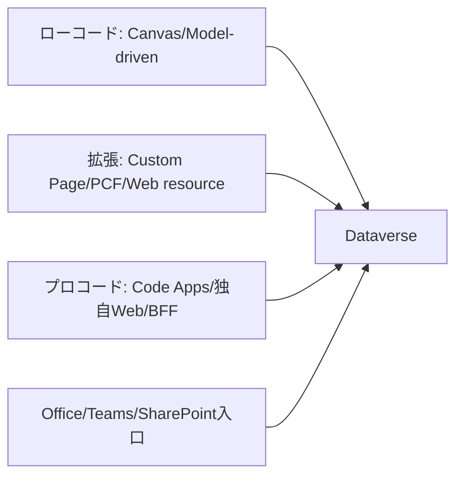

### 混同しやすい近接概念

「Canvas Apps」と「Custom Page」は近いが同じではない。Custom PageはModel-driven Apps内で使えるCanvas系ページとして考えるとよい。

「PCF」と「Web resource JavaScript」は違う。PCFはコントロール部品としてPower Appsに統合される。Web resource JavaScriptはModel-drivenフォームやコマンドバーの拡張で使うスクリプトである。

「Power Pages」と「独自Webサイト」は違う。Power PagesはDataverse連携と認証、Table Permissionsを持つPower Platform内の外部向けサイト機能。独自Webサイトはホスティング、認証、API、監査を自前設計する必要がある。

### ここを押さえれば次に進める

UI選定は、見た目の自由度だけで決めない。利用者導線、認証、権限、DLP、ライセンス、ALM、本番審査、端末制御で決める。Dataverse中心ならModel-drivenとCanvasを先に見て、独自UIは必要性を説明できる場合に進む。

---

## 15. ライフサイクルとソリューション

### ふんわり入口

業務ツールは、作って終わりではない。直す、試す、本番に出す、戻す、引き継ぐ、退職者から所有権を移す、監査で説明する、という一生がある。

Excelマクロをメールで配っていた時代は、「最新版はどれ」「誰が持っている」「古いファイルで入力された」「修正版を戻したい」がよく起きる。Power Platformでも同じことは起きる。だからSolution、Environment、ALMが必要になる。

### 正確に言うと

ALM(Application Lifecycle Management)は、アプリや構成の作成、テスト、配布、運用、変更、廃止を管理する考え方である。

Power Platform/Dataverseで重要な用語。

| 用語 | 意味 |
|---|---|
| Solution | Power Platform資産をまとめる箱 |
| Unmanaged solution | 開発用。直接編集できる |
| Managed solution | 本番配布用。管理された形でインポートする |
| Environment | Dev/Test/Prodなどの分離単位 |
| Connection Reference | Connector接続を環境ごとに差し替える参照 |
| Environment Variable | URLや設定値を環境ごとに変える仕組み |
| DLP | Data Loss Prevention。Connectorの組み合わせや利用を制御 |
| Pipeline | 環境間の移送を支援する仕組み |
| Deployment | 本番への展開 |
| Rollback | 問題発生時に戻す手順 |

基本方針は、開発環境ではUnmanagedで作り、本番環境にはManaged solutionとして入れることである。

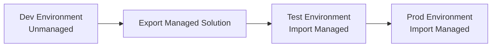

Solutionに含める代表例。

| 資産 | Solution管理 |
|---|---|
| Dataverse Table/Column/Relationship | 含める |
| Model-driven App | 含める |
| Canvas App | 含める |
| Power Automate Flow | 含める |
| Security Role | 含めることが多い |
| PCF | 含める |
| Custom API/Plug-in | 含める |
| Connectionの実体 | 参照は含めるが接続実体は環境依存 |
| 利用者データ | 通常Solutionでは運ばない |

### VBA的にいうと

Unmanaged solutionは、開発中の`.xlsm`原本に近い。Managed solutionは、配布用に固めたバージョンに近い。

ただしExcelではファイルを丸ごとコピーするだけで済むことが多いが、Power Platformでは環境ごとの接続、環境変数、Security Role、DLP、所有者、ライセンスが絡む。ファイルコピー感覚では本番化できない。

### コード例

Power Platform CLIのイメージ。

```powershell
pac auth create --environment https://org.crm.dynamics.com
pac solution export --name ContosoApp --path .\ContosoApp_managed.zip --managed true
pac solution import --path .\ContosoApp_managed.zip
```

実案件では、CLI利用可否、会社PCのnode/npm/dotnet/pac許可、サービス接続、管理者承認を確認する。

### 混同しやすい近接概念

「Managed solution」と「Managed Environment」は別物である。Managed solutionは配布形式。Managed EnvironmentはPower Platform環境の管理機能/ガバナンス機能である。名前が似ているため、会話では必ず区別する。

「Solutionに入っている」と「本番で動く」も違う。Connection Reference、Environment Variable、Security Role、DLP、利用者ライセンス、共有設定が揃わないと動かない。

「Export/Import」と「ALM」は同じではない。Export/Importは作業。ALMは環境分離、レビュー、バージョン、戻し、監査、所有者管理まで含む運用全体である。

### ここを押さえれば次に進める

Power Platformの本番運用ではSolutionが中心になる。開発はUnmanaged、本番はManagedが基本。Connection Reference、Environment Variable、DLP、Security Role、所有者、ライセンスまで含めてALMを設計する。

---

## 16. 運用・監査・ガバナンス

### ふんわり入口

業務システムは、動いている間ずっと面倒を見る必要がある。

倉庫なら、在庫が増えすぎていないか、誰が入ったか、危険物を混ぜていないか、棚卸ししたか、鍵を返していない退職者がいないかを見る。Dataverseでも同じで、容量、監査、API制限、権限、DLP、環境、所有者を見続ける。

### 正確に言うと

Dataverse運用で重要な領域。

| 領域 | 用語 | 見ること |
|---|---|---|
| 監査 | Audit | 誰がいつ何を変更したか |
| 容量 | DB/File/Log Capacity | データ、ファイル、ログの消費 |
| API制限 | Service Protection / Throttling | 429、Retry-After、同時実行、処理時間 |
| 権限 | Security Role | Create/Read/Write/Delete/Append/Append To/Assign/Share |
| 組織境界 | Business Unit | 部署や所有範囲の境界 |
| チーム | Owner Team / Access Team | 複数人で所有やアクセスを管理 |
| 列保護 | Column-level security / Field Security Profile | 特定ColumnのRead/Create/Update |
| DLP | Data policies | Connector分類、HTTP/Custom Connector制御 |
| 環境管理 | Environment role/security group | 誰が環境に入れるか |
| ログ | Power Platform Activity / Unified Audit / App Insights | 操作、実行、エラー、外部アプリログ |

Security Roleの権限は、単にRead/Writeがあるかだけでなく、Privilege Depthがある。

| Depth | 意味のイメージ |
|---|---|
| User | 自分が所有する行 |
| Business Unit | 自分のBU内 |
| Parent: Child Business Units | 親子BU範囲 |
| Organization | 組織全体 |

ReadはOrganizationだがWriteはUser、AppendはあるがAppend Toがない、Assignはない、Shareはない、というように操作ごとに差が出る。System Administratorでは再現しない問題が一般ユーザーで出る理由はここにある。

Service Protection API limitsでは、Dataverseの安定性を守るために過剰なリクエストが制限される。429が返った場合は`Retry-After`を見て待つ。

```javascript
async function dataverseFetch(url, options, retry = 3) {
  const response = await fetch(url, options);

  if (response.status === 429 && retry > 0) {
    const retryAfter = Number(response.headers.get("Retry-After") ?? "5");
    await new Promise(resolve => setTimeout(resolve, retryAfter * 1000));
    return dataverseFetch(url, options, retry - 1);
  }

  if (!response.ok) {
    throw new Error(`${response.status} ${await response.text()}`);
  }

  return response;
}
```

### VBA的にいうと

Excel業務では、「誰がいつどのセルを変えたか」を後から追えないことが多い。変更履歴や共有ブックで追える場合もあるが、本格的な監査には弱い。

Dataverseでは、Auditを有効にすれば変更履歴を残せる。ただし、全Table全Columnを何でも監査すればよいわけではない。AuditBaseやLog容量が膨らむ。監査要件と容量見積もりをセットで考える。

VBAで全員が同じ共有アカウントや同じ接続文字列を使うと、誰の操作かわからない。DataverseでもApplication Userやサービスアカウントを使う場合、監査上「誰の操作として残るか」を設計する必要がある。

### 図

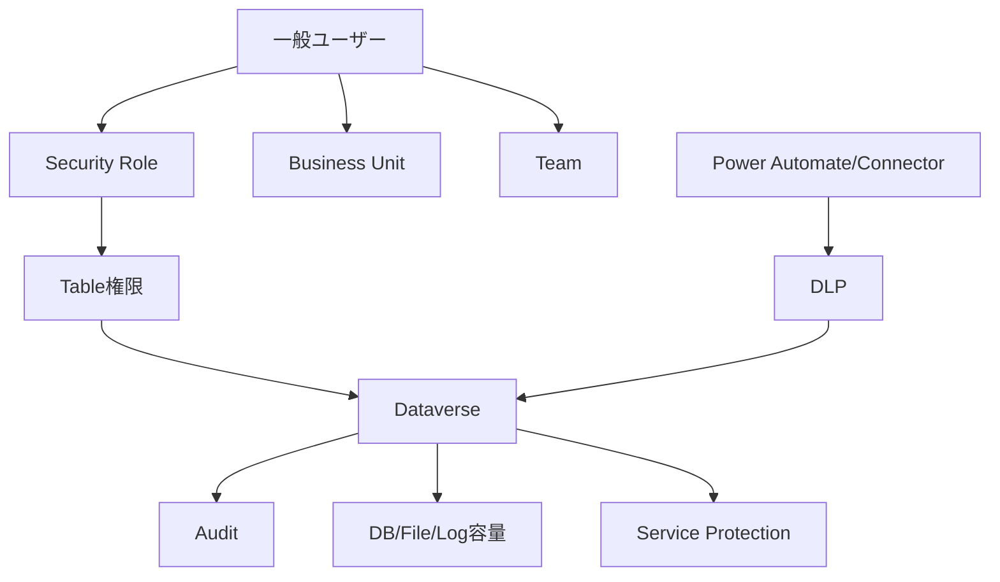

### 混同しやすい近接概念

「Security Role」と「Environment Maker」は違う。Environment Makerは環境でアプリやフローを作る権限。Security RoleはDataverseデータに対する権限である。

「DLPでDataverseをブロックできるか」と「Dataverse利用が安全か」は別である。Dataverseは中核Connectorとして扱われるが、問題はDataverse単体より、HTTP、Custom Connector、外部SaaS、Excel、SharePointなどとの混在である。

「容量がある」と「運用上安全」は違う。DB/File/Logは別枠で消費される。添付、File/Image column、Audit、PluginTraceLog、AsyncOperationBase、POAが積み上がる。

### ここを押さえれば次に進める

Dataverse運用は、Audit、Capacity、Throttling、Security Role、Business Unit、Team、Column-level security、DLPを継続的に見る。System Administratorで動くことは本番利用者で動くことを保証しない。一般ユーザー、最小権限、実データに近い量、監査ログで検証する。

---

# 第3部 実装パターン

## 17. アーキテクチャ候補の網羅

### ふんわり入口

Dataverseを使う画面を作る方法は一つではない。入口だけ見ても、Power Apps、Model-driven Apps、Power Pages、Teams、SharePoint、Excel、React、モバイル、Power BI、RPA、iPaaSまである。

ここで大事なのは、「作れるか」ではなく「本番で通るか」である。自分のPCで動く、Developer環境で動く、管理者権限で動く、はまだ入口でしかない。本番では、DLP、Entra ID権限、環境ロール、端末制御、ネットワーク、監査、ライセンス、所有者、変更管理が待っている。

アーキテクチャ選定は、料理のメニュー選びではなく、会社の稟議を通す配送経路選びに近い。速そうに見える道でも、会社の門で止められるなら本番には使えない。

### 正確に言うと

元資料の改訂版では、Dataverseをバックエンドにしたフロントエンド/連携アーキテクチャをA1からF1まで34本に分類している。大分類は次の通り。

| 分類 | 名前 | 方向性 |
|---|---|---|
| A | Power Platform純正系 | Power Apps、Power Pages、PCF、Code Appsなど |
| B | Office / M365製品をフロント化する系 | Excel、Office Add-ins、SPFx、Outlookなど |
| C | ファイル / マクロ / レガシークライアント系 | VBA、Accessなど |
| D | 独自Webアプリ / デスクトップ / モバイル系 | SPA、BFF、Teams Tab、Azure App Serviceなど |
| E | 仲介・ノーコード・データ連携系 | SharePoint連携、Power Automate Desktop、Virtual Tablesなど |
| F | Dataverseバックエンド補助系 | Custom API、Plug-in、Webhookなど |

### ショートリスト5本

厳しめの会社PC本番環境では、最初から34本を同列に比較しない。まずは次の5本を本命候補として見る。

| 優先 | 候補 | 向いている条件 | 選定根拠 | 注意点 |
|---|---|---|---|---|
| 1 | A2 Model-driven Apps | Dataverse中心のCRUD、権限、監査、フォーム重視 | DataverseのSecurity Role、View、Form、Solutionに素直に乗る | UI自由度は低い。複雑UXはCustom Page/PCF併用 |
| 2 | A1 Canvas Apps | 画面を早く作りたい、小から中規模入力 | Power Apps管理下でDLP、共有、ライセンスを説明しやすい | 委任、性能、複雑式、接続参照、利用者ライセンス |
| 3 | D5/D8 BFF/API中間層 + Dataverse | 独自UI必須、認証/監査/レート制御を中央集約 | SPA直結より情シス説明がしやすい | Azure/ホスティング承認、アプリ登録、運用責任、追加コスト |
| 4 | D6 Teams Tab App + Dataverse | Teamsが標準入口 | 既存M365導線に乗せやすい | Teamsカスタムアプリ許可、Manifest、SSO、ホスティング |
| 5 | B4 SPFx Webパーツ + Dataverse/BFF | SharePointポータルが業務入口 | 社内ポータルに自然に置ける | App Catalog、API permission、CSP、変更管理 |

Model-driven AppsとCanvas Appsは、Power Platform内で完結しやすく、Dataverseの権限とALMに乗せやすい。独自UIが必要なら、ブラウザからDataverse Web APIへ直結するより、BFF/API中間層で認証、監査、制限、ログを集約する構成を先に比較する。

### ロングリスト全34本

| ID | アーキテクチャ | 認証/実行文脈 | 本番で詰まりやすいポイント | 通過感 |
|---|---|---|---|---|
| A1 | Canvas Apps + Dataverse | 委任認証。各ユーザーのDataverse権限 | DLP混在、委任制限、性能、テーブル権限不足、接続参照 | 高 |
| A2 | Model-driven Apps | 委任認証。Security Roleでアプリ/データ制御 | Form/View/Sitemap権限、BU境界、列セキュリティ、BPF | 高 |
| A3 | Power Pages | Power Pages認証、Entra ID/B2C/外部ID等 | 外部公開審査、Table Permissions漏れ、容量課金、匿名アクセス | 中 |
| A4 | Custom Pages + PCF | Power Apps文脈。PCFはホスト文脈 | PCF審査、npm/pac不可、Solution checker、CSP/CORS | 中 |
| A5 | Power Apps Code Apps | Entra ID、Power Platform管理下 | 機能成熟度、開発ツール制限、環境設定無効化、Premium | 中 |
| A6 | Model-driven内 Web resources / JS / Command bar / iframe | Model-driven文脈、Xrm.WebApi | unsupported DOM操作、保守性、iframe先CSP、権限検証 | 中から高 |
| A7 | Power Apps Teams/SharePoint埋め込み、mobile/wrap配布 | 埋め込み先 + Power Apps認証 | Teams/SharePoint埋め込み許可、Intune、wrap、オフライン | 中 |
| B1 | Excel + Power Query(Dataverseコネクタ) | ExcelのM365サインイン、読み取り中心 | 書き戻し困難、外部接続ブロック、ラベル/IRM、再配布 | 中 |
| B2 | Office Scripts + Power Automate + Dataverse | Scripts + Flow接続文脈 | 外部fetch制約、OAuth保管不可、Scripts無効化、DLP | 中 |
| B3 | Office Add-ins + Dataverse/BFF | Office.js + MSAL/SSOまたはBFF | サイドロード禁止、集中配信、ホスティング、SSO同意 | 低から中 |
| B4 | SPFx Webパーツ + Dataverse/BFF | SharePointログイン + MSAL/BFF | App Catalog、API access承認、CSP、ポータル変更管理 | 中 |
| B5 | Outlook Add-in / Dynamics 365 App for Outlook | Office.js SSO/MSALまたは標準D365 | Exchange集中配信、メールデータ、監査、アドイン承認 | 低から中 |
| C1 | Excel VBA + REST | 実装次第。OAuthが難しい | マクロブロック、Defender、Trust Center、トークン保管、監査困難 | 低 |
| C2 | Excel VBA + Dataverse Web API | デバイスコード/認可コード等 | CA/MFA、トークン保管、アプリ登録不可、監査、保守 | 低 |
| C3 | Excel + Office Scripts + Power Automate | Flow接続所有者/実行者文脈 | Premium、Run script制限、保存場所、DLP、タイムアウト | 中 |
| C4 | Microsoft Access + Dataverseリンクテーブル | Office/Access認証、ODBC/OLE DB等 | 端末配布、ドライバ、ローカルキャッシュ、移行性 | 低 |
| D1 | 独自SPA + Dataverse Web API直結 | SPA登録 + MSAL + delegated | アプリ登録、同意、CA、ホスティング、トークン、API制限 | 低から中 |
| D2 | デスクトップアプリ + MSAL + Web API | Public client、interactive等 | EXE/MSI禁止、署名、SmartScreen、MFA/CAE、配布 | 低 |
| D3 | Power BI(フロント代用) + Dataverse | Power BI Connectorの委任認証 | 基本参照中心、書き戻し別、ラベル、DirectQuery性能 | 中から高 |
| D4 | Dynamics 365標準フォーム流用 | D365/Dataverse標準認証 | D365導入有無、Use Rights、標準改修影響、業務承認 | 中 |
| D5 | Azure Static Web Apps + Functions/APIM BFF + Dataverse | Entra認証、OBOまたはApplication User | Azure申請、APIM/Functions、Key Vault、監査、Private Endpoint | 中 |
| D6 | Teams Tab App + Dataverse/BFF | Teams SSO + delegated/OBO/BFF | Teamsアプリポリシー、Manifest、SSO同意、ホスティング | 中 |
| D7 | Mobile Native + Dataverse/BFF | MSAL mobile、BFF、Intune | 社内アプリ配布、企業署名、BYOD、Intune、端末紛失 | 低 |
| D8 | Azure App Service / Container Apps server-side .NET + Dataverse SDK | Confidential client、S2SまたはOBO | ホスティング承認、VNet、Secret rotation、SDK差異、監査 | 中 |
| E1 | SharePoint List連携 → Dataverse同期 | SharePoint/Flow接続所有者文脈 | 二重管理、同期遅延、権限モデル二重化、5000件問題 | 中 |
| E2 | Microsoft Lists / SharePoint Lists + Power Apps | SharePoint/Power Apps委任認証 | Dataverseではない。複雑関係、監査、委任、後の移行 | 中 |
| E3 | Dataverse for Teams + Teams内アプリ | Teamsメンバー/所有者モデル | 容量/機能制限、本格Dataverseとの差、本番移行 | 中 |
| E4 | Power Automate Desktop + UIフロー | 実行端末/実行ユーザー文脈 | RPA監査、端末ロック、無人/有人、資格情報、VDI | 低から中 |
| E5 | Copilot Studio | Copilot/チャネル認証、Connector権限 | チャットUI限定、生成AI制限、会話ログ、データ越境 | 中 |
| E6 | Custom Connector / Logic Apps + Dataverse | Custom Connector/OAuth、Managed Identity等 | Custom Connector禁止、HTTP DLP、Azure統制、接続所有者 | 中 |
| E7 | Virtual Tables | Dataverse認証 + 外部接続認証 | 性能、外部依存、書き込み制限、検索/集計制約 | 中 |
| E8 | Synapse Link / Fabric / Dataflows / Power BI分析基盤 | サービス間連携、分析中心 | 参照専用、遅延、データ複製、所在地、Purview、コスト | 中 |
| E9 | Microsoft Loop + Power Automate/Dataverse連携 | Loop/M365 + Flow接続文脈 | Loopガバナンス、共有範囲、監査、DLP、配布モデル | 低から中 |
| E10 | OutSystems / Mendix等 iPaaS・ローコード基盤 + Dataverse | 製品ごとのSSO/Connector | 二重ライセンス、外部SaaS DLP、ベンダーロックイン | 低から中 |
| F1 | Custom API / Plug-in / Webhookによるバックエンド分離 | Dataverse内実行。呼び出し元文脈 | Sandbox 2分、外部通信制限、デプロイ審査、Trace肥大化 | 中 |

### VBA的にいうと

VBA経験者は、C1やC2を見て「Excelから直接Dataverseを叩けばよいのでは」と考えやすい。技術的には可能でも、本番ではマクロ制御、MFA、条件付きアクセス、トークン保管、アプリ登録、監査、ライセンスで止まりやすい。

VBA資産を活かすなら、Excelを画面として残しつつ、Dataverse直結ではなくPower AutomateやBFFを経由する構成を比較する。ただし、それでもMultiplexingや接続所有者の問題は消えない。

### 最小プローブ

どの候補でも、最初のPoCは見た目ではなく本番ブロッカーを潰すために作る。

```http
GET https://org.crm.dynamics.com/api/data/v9.2/WhoAmI HTTP/1.1
Authorization: Bearer <access_token>
Accept: application/json
```

最低限、次を見る。

| 確認 | 内容 |
|---|---|
| 認証 | 誰のIDで実行されるか |
| 権限 | 一般ユーザーでCRUD、Append、Append Toが通るか |
| 列保護 | Field Security列がどう返るか |
| BU | 部署違いの行が見えるか |
| DLP | 使うConnectorの組み合わせが許可されるか |
| 429 | Retry-Afterをログに出せるか |
| ALM | DevからTestへManagedで運べるか |
| 監査 | 誰の操作として残るか |

### 混同しやすい近接概念

「通過確率が高い」と「最適」は違う。Model-driven Appsは本番説明しやすいが、独自UXが強い要件には合わない場合がある。

「低コード」と「低リスク」も同じではない。Power Automateで簡単に組めても、接続所有者、DLP、ライセンス、孤児化、実行履歴、タイムアウトでリスクが出る。

「独自Webが自由」と「運用も自由」は違う。ホスティング、認証、Secret、監査、脆弱性対応、CI/CD、障害対応を自分たちで持つ必要がある。

### ここを押さえれば次に進める

アーキテクチャ候補は34本あるが、最初の本命はModel-driven、Canvas、BFF/API中間層、Teams Tab、SPFxの5本でよい。比較軸は機能ではなく、ID方式、権限境界、ホスティング、DLP、ALM、監査、性能、ライセンス、運用責任である。

---

## 18. 本番運用ブロッカー

### ふんわり入口

PoCは通ったのに本番で止まる。Power PlatformやDataverseではよくある。

理由は単純で、PoCで見ているのは「技術的に動くか」で、本番審査で見られるのは「会社として許してよいか」だからである。個人のDeveloper環境で動くことと、全社の業務データを扱ってよいことは別問題である。

### 正確に言うと

本番運用でよく止まる横断ブロッカー。

| ブロッカー | 何が起きるか | 先に見ること |
|---|---|---|
| DLP | Connector混在で保存や実行がブロックされる | Dataverse、SharePoint、Excel、HTTP、Custom Connector、外部SaaSの分類 |
| Entra権限 | App Registrationや管理者同意が取れない | アプリ登録権限、同意ワークフロー、API permission |
| 環境ロール | Maker権限やDataverse権限がない | Environment Maker、System Customizer、Security Role |
| ネットワーク | Dynamics/Power Platform/Azure/Office CDNへ到達できない | Proxy、TLS inspection、許可ドメイン |
| デバイス制御 | VS Code、node、npm、pac、dotnet、VBA、EXEが禁止 | 会社PCのソフト制御、Intune、Defender ASR |
| データガバナンス | 個人情報や機密データの扱いが未承認 | データ分類、DPIA、リテンション、外部共有 |
| 監査ログ | 誰が何をしたか説明できない | Audit、Power Platform Activity、Unified Audit、App Insights |
| ライセンス | 利用者、実行者、サービスアカウントに権利がない | Power Apps、Automate、Pages、BI、D365 Use Rights |
| 容量 | DB/File/Logが足りない | 添付、File/Image、Audit、Trace、AsyncOperationBase |
| 所有者 | 個人所有のアプリ/フロー/接続が退職で孤児化 | Co-owner、サービスアカウント、運用担当 |
| ALM | 本番移送、戻し、差分管理がない | Solution、Pipeline、Managed、Rollback |
| 変更管理 | CABや審査会に間に合わない | 申請周期、RACI、戻し手順、障害時連絡 |

DLPは特に誤解されやすい。Dataverse Connector単体が使えるかだけではない。同じアプリやフロー内で、DataverseとHTTP、SharePoint、Excel Online、外部SaaS、Custom Connectorを混ぜたときに、データポリシー上許されるかを見る。

Entra権限では、独自SPA、Teams Tab、SPFx、Office Add-ins、BFFが止まりやすい。App Registration、Redirect URI、API permission、管理者同意、条件付きアクセスが必要になる。

### VBA的にいうと

VBAでは「マクロが動かない」という一言で片付けがちだが、会社端末では多くの制御がある。

| VBAでの止まり方 | Dataverse/Power Platformでの止まり方 |
|---|---|
| マクロが無効 | Power Platform機能がテナントで無効 |
| ActiveXが禁止 | PCF/Office Add-ins/独自アプリが禁止 |
| 外部接続が止まる | DLP、Proxy、CORS、条件付きアクセス |
| ファイル配布できない | Solution import、Teams app配布、App Catalog承認が必要 |
| 誰の最新版かわからない | ALM、所有者、Pipelineが必要 |

### 最小チェックリスト

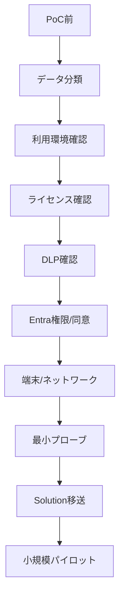

管理者へ依頼する確認項目は、Power Platform管理者、Entra管理者、M365管理者、Teams/SharePoint管理者、端末/ネットワーク管理者、監査/セキュリティ、ライセンス担当に分かれる。全部を一人に聞くと漏れる。

### コード例

429を記録するだけでも、本番説明では意味がある。

```javascript
async function callWithLog(url, options) {
  const response = await fetch(url, options);

  if (response.status === 429) {
    console.warn("Dataverse throttled", {
      retryAfter: response.headers.get("Retry-After"),
      requestId: response.headers.get("x-ms-service-request-id")
    });
  }

  return response;
}
```

### 混同しやすい近接概念

「管理者が一度OKした」と「全要件がOK」は違う。Power Platform管理者が環境を許可しても、Entra管理者がアプリ登録を許可しない、端末管理者がnpmを許可しない、監査部門がログ不足を指摘する、という分業がある。

「PoC許可」と「本番許可」も違う。Trial環境、個人所有接続、ダミーデータ、外部通信の一時許可は、本番には引き継げないことが多い。

「System Administratorで動いた」と「一般ユーザーで動く」も違う。必ず一般ユーザー、最小権限、BU違い、Field Securityありで検証する。

### ここを押さえれば次に進める

本番ブロッカーは、技術より管理境界で出る。DLP、Entra、環境ロール、ネットワーク、端末制御、データガバナンス、監査、ライセンス、所有者、ALMをPoC前に確認する。画面を作る前に、止まりそうな門を洗い出す。

---

## 19. ライセンスと費用

### ふんわり入口

ライセンスは、入場券と利用券の組み合わせである。

遊園地で考えると、入園券だけでは全アトラクションに乗れないことがある。乗り物ごとのチケット、年間パス、団体契約、特別エリアの追加料金がある。Power Platformも同じで、Microsoft 365を持っているからDataverse本番アプリが全部使える、とはならない。

ライセンスは技術者だけで判断できない。購入ルート、契約、Dynamics 365の文脈、Power Apps/Automateの権利、サービスアカウント、外部ユーザー、Azure費用、容量費用が絡む。

### 正確に言うと

Dataverse/Power Platformで特に注意するライセンス・費用の罠。

| 罠 | 内容 | 何を見るか |
|---|---|---|
| Multiplexing | 中間APIや共有アカウントで隠しても、実利用者のライセンスは免除されない | 誰が実質的にDataverseデータを利用するか |
| Dynamics 365 Use Rights | D365に含まれる権利は該当D365文脈に制限されることがある | カスタム業務アプリがD365権利内か |
| Power Apps per app vs Premium | アプリ単位かユーザー単位かで費用が変わる | 利用者数、アプリ数、増加見込み |
| Default環境 | 業務本番に不向き | 本番環境、管理方針、バックアップ、所有者 |
| Managed Environment | 管理機能によりPremium要件が絡む場合 | 対象環境がManagedか |
| Premium Connector | Dataverse、HTTP、Custom Connector等の扱い | アプリ/フロー内のConnector |
| Power Automate文脈 | 自動/スケジュール/HTTP/RPAで権利が変わる | 実行者、所有者、トリガー |
| サービスアカウント | 接続所有者にもライセンスと管理が必要 | 退職しない所有者、PIM、資格情報 |
| Dataverse Capacity | DB/File/Logが別枠 | 添付、File/Image、Audit、Trace |
| Power Pages | authenticated/anonymous capacity、外部ユーザー | アクセス数、匿名、トラフィック |
| Power BI | Pro/PPU/Capacity、Power Apps visual | 閲覧者、共有先、書き戻し |
| Azure中間層 | Functions、App Service、APIM、Key Vault、App Insights | Azure課金と運用責任 |
| Trial/Developer/PoC | 本番へそのまま昇格できない | 再構築、Solution移送、購入リードタイム |
| AI Builder/Copilot | Credit、メッセージ、地域、データ条件 | 契約と利用条件の変化 |

Multiplexingは特に重要である。BFFやAPI中間層を作って、利用者全員の操作を1つのApplication UserでDataverseへ流したとしても、それだけで利用者ライセンスが不要になるわけではない。実際にPower Apps、Power Automate、Copilot Studio、Dataverseのデータや機能を利用する人が誰かで判断される。

### VBA的にいうと

VBAでは、Excelが入っていればマクロも動く、という感覚になりやすい。Dataverseでは、Microsoft 365 Appsがあること、Power Appsを作れること、Dataverseの本番アプリを実行できること、Power AutomateのPremium Flowを使えること、Power Pages外部ユーザーを扱えることは別である。

「共有アカウントでまとめれば安くなる」という発想は危険である。監査上もライセンス上も説明できない可能性が高い。

### 費用見積もりの考え方

最初から正確な金額を出すより、費用の発生箇所を漏らさないことが大事である。

| 費用領域 | 例 |
|---|---|
| 利用者ライセンス | Power Apps Premium/per app、Dynamics 365、Power BI Pro等 |
| 実行ライセンス | Power Automate Premium、RPA、サービスアカウント |
| 容量 | Dataverse DB/File/Log、Power Pages capacity |
| Azure | App Service、Functions、APIM、Storage、Key Vault、App Insights |
| 運用 | 監視、障害対応、変更管理、保守担当 |
| 開発環境 | VS Code、CLI利用許可、証明書、開発用環境 |
| 監査/法務 | DPIA、データ分類、第三者契約レビュー |

### 混同しやすい近接概念

「Microsoft 365に含まれる」と「Dataverse本番利用に足りる」は違う。Dataverse for Teamsや一部標準ConnectorはM365文脈で使える場合があるが、本格Dataverseアプリとは別に考える。

「D365の権利」と「自由なPower Apps権利」も違う。Dynamics 365のUse Rightsは対象アプリ文脈に縛られることがある。別業務のカスタムアプリに流用できるかは必ず確認する。

「Application Userなら安くなる」も危険である。Application Userは技術上の実行主体であり、実利用者のライセンス要否を消す魔法ではない。

### ここを押さえれば次に進める

ライセンスは後回しにしない。アーキテクチャ候補ごとに、利用者、作成者、実行者、接続所有者、外部ユーザー、サービスアカウント、容量、Azure費用を一覧化する。Multiplexing、D365 Use Rights、Default環境、Managed Environment、Premium Connectorは最初に確認する。

---

# 第4部 ハマりどころ事典

## 20. Dataverse特有の罠

### ふんわり入口

Dataverseの罠は、単純な文法ミスよりも「普通のDBやExcelの感覚で考えると見落とす」ものが多い。

Excelなら、セルが空なら空、列が見えなければ非表示、ファイルが重ければブックが重い、と比較的直感的である。Dataverseでは、権限がない列がAPIレスポンスから黙って消える、ReadはできるがAppend Toがなくて関連付けだけ失敗する、ファイル列だけ通常のJSON更新と違う、AuditやTraceが容量を食い尽くす、ということが起きる。

この章は読み物というより事典である。実装中に「なぜか動かない」となったら、DV番号で引く。

### 正確に言うと

元資料のハマりどころDV-01からDV-22を、次の型で再整理する。

- 現象
- なぜ起きるか
- 防ぐ術
- 最小再現コードまたは最小確認手順

コード例は説明用の最小形である。URL、Table名、Column名、GUID、環境固有値は実環境に合わせて置き換える。

---

### DV-01 Field Security Profile / Column-level security

#### 現象

Column-level security(旧Field Security)が有効なColumnは、権限のないユーザーにはAPIレスポンスから黙って消えることがある。`null`が返るのではなく、プロパティ自体が存在しない。

#### なぜ起きるか

DataverseはColumn単位でRead/Create/Update権限を制御できる。Field Security Profileに入っていないユーザー、またはRead権限がないユーザーは、そのColumnを読む資格がない。結果として、Web API、Canvas Apps、Model-driven Apps、PCF、BFFのどこから見ても、列が存在しないように見えることがある。

System Administratorでは問題が出ないため、開発者だけで検証すると見逃す。

#### 防ぐ術

Column-level securityを有効にしたColumnを一覧化し、一般ユーザーで必ず検証する。APIクライアントでは、プロパティがない場合と`null`の場合を区別する。重要な画面では「権限がないため非表示」と「値が未入力」を別扱いにする。

#### 最小再現コード

```javascript
const row = await fetch(
  "https://org.crm.dynamics.com/api/data/v9.2/accounts(<account-id>)?$select=name,new_secretcode",
  { headers: { Authorization: `Bearer ${accessToken}` } }
).then(r => r.json());

console.log("has secret column", Object.hasOwn(row, "new_secretcode"));
console.log("value", row.new_secretcode);
```

一般ユーザーで`has secret column`が`false`、System Administratorで`true`ならColumn-level securityを疑う。

---

### DV-02 Business Unit境界 + Privilege Depth

#### 現象

一覧は見えるのに更新できない。自分の部署の行は更新できるが隣部署の行は更新できない。ReadはできるのにAssignやShareだけ失敗する。

#### なぜ起きるか

Security Roleの権限には操作種別と深さがある。Read、Create、Write、Delete、Append、Append To、Assign、Shareが別々であり、それぞれUser、Business Unit、Parent: Child Business Units、Organizationなどの深さを持つ。

ReadがOrganizationでも、WriteがUserなら「全社の行を読めるが、自分所有の行しか更新できない」になる。

#### 防ぐ術

CRUDだけでなく、Append、Append To、Assign、Shareを操作別に検証する。BU階層、Modern Business Unit、Owner Team、Access Team、共有設定を図にする。必ず一般ユーザーで検証する。

#### 最小再現コード

```http
PATCH https://org.crm.dynamics.com/api/data/v9.2/accounts(<other-bu-account-id>) HTTP/1.1
Authorization: Bearer <general-user-token>
Content-Type: application/json

{
  "telephone1": "03-1111-2222"
}
```

同じユーザーで自分所有行は成功し、別BU所有行で403になるならPrivilege Depthを確認する。

---

### DV-03 API Service Protection

#### 現象

しばらく動いていた処理が急に429になる。Application Userで実行しているのに制限される。大量更新や並列処理で途中から遅くなる。

#### なぜ起きるか

DataverseにはService Protection API limitsがある。これは一部利用者の大量リクエストが環境全体の可用性を壊さないようにするための保護である。人間ユーザーだけでなく、Application User、非対話ユーザー、管理系ユーザーも対象になり得る。

#### 防ぐ術

429を例外として握りつぶさない。`Retry-After`ヘッダーを読み、指数バックオフやキュー制御を入れる。大量処理は分割し、同時実行数を制御する。Power AutomateやLogic Appsでも再試行ポリシーを確認する。

#### 最小再現コード

```javascript
async function requestDataverse(url, options) {
  const res = await fetch(url, options);

  if (res.status === 429) {
    const retryAfter = res.headers.get("Retry-After");
    console.warn("429 Too Many Requests", { retryAfter });
  }

  return res;
}
```

PoC段階から429時のログを出す。実際に過負荷をかける場合は、許可された検証環境で行う。

---

### DV-04 ペイロード上限

#### 現象

大きいJSONを一括送信すると413や400になる。Power Automateでは途中でタイムアウトする。小さいデータでは動くのに、本番データ量で失敗する。

#### なぜ起きるか

Dataverse Web API、Connector、Power Automate、Logic Appsには、リクエストサイズ、応答サイズ、実行時間、バッチサイズの制限がある。制限値は製品更新で変わり得るため、実施時点の公式情報確認が必要である。

#### 防ぐ術

巨大JSONを1回で送らない。ページング、分割、`$batch`、File column専用API、非同期処理を使う。PoCで5MB、20MB級のデータを試し、実際のエラーとログを保存する。TODO: 要確認: 本番時点の最新ペイロード上限。

#### 最小再現コード

```javascript
const bigText = "x".repeat(5 * 1024 * 1024);

const res = await fetch(
  "https://org.crm.dynamics.com/api/data/v9.2/new_payloadtests",
  {
    method: "POST",
    headers: {
      Authorization: `Bearer ${accessToken}`,
      "Content-Type": "application/json"
    },
    body: JSON.stringify({ new_name: "payload test", new_body: bigText })
  }
);

console.log(res.status, await res.text());
```

---

### DV-05 File/Image column

#### 現象

通常のColumnと同じ感覚でFile/Image columnをJSONに入れて更新しようとして失敗する。画像サムネイルが期待通りに出ない。File容量だけが急に増える。

#### なぜ起きるか

File/Image columnは通常の文字列や数値Columnと扱いが違う。ファイル本体は専用APIやブロックアップロード/ダウンロードで扱う。サムネイル生成や容量消費も通常Columnとは別に考える必要がある。

#### 防ぐ術

File/Image columnを設計する前に、ファイルサイズ、アップロード方法、ダウンロード権限、保持期間、File容量、ウイルスチェック、監査要件を確認する。通常のJSON PATCHで済ませようとしない。

#### 最小再現コード

```http
POST https://org.crm.dynamics.com/api/data/v9.2/InitializeFileBlocksUpload HTTP/1.1
Authorization: Bearer <access_token>
Content-Type: application/json

{
  "Target": {
    "@odata.type": "Microsoft.Dynamics.CRM.new_document",
    "new_documentid": "<row-id>"
  },
  "FileAttributeName": "new_file",
  "FileName": "sample.pdf"
}
```

実装時は公式のFile column手順に沿って、初期化、ブロック送信、コミットを行う。

---

### DV-06 DB/File/Log容量

#### 現象

DB容量は余っているのにファイルアップロードが止まる。データ本体は少ないのにLog容量が枯れる。監査やTraceを有効にした後から容量警告が出る。

#### なぜ起きるか

Dataverse容量はDB、File、Logの軸が分かれている。Tableの行だけでなく、添付、File/Image column、Audit、PluginTraceLog、AsyncOperationBase、検索インデックスなどが容量を消費する。

#### 防ぐ術

Power Platform管理センターでDB/File/Logを別々に確認する。容量上位Tableを定期的に見る。Audit、Trace、非同期ジョブ履歴、添付の保持期間を設計する。

#### 最小確認手順

```text
Power Platform admin center
  -> Resources
  -> Capacity
  -> Dataverse
  -> Database / File / Log
  -> Top database capacity use, Top file capacity use
```

コードで再現するより、管理センターで増加要因を見る方が実務的である。

---

### DV-07 POA肥大化

#### 現象

レコード共有を多用した環境で性能が悪くなる。容量上位に`PrincipalObjectAccess`が出てくる。権限計算が複雑になり、誰がなぜ見えるのか説明しにくい。

#### なぜ起きるか

Dataverseの共有は、レコード単位でアクセス権を付与できる便利な機能である。一方で、共有を大量に使うとPrincipalObjectAccess(POA)が肥大化する。行ごとの例外権限が増えるほど、容量と権限計算の複雑さが増す。

#### 防ぐ術

手動Shareの多用を避ける。Business Unit、Owner Team、Access Team、Security Roleで表現できないか先に検討する。共有が必要な場合も、期限、解除、棚卸しを設計する。

#### 最小再現コード

```http
POST https://org.crm.dynamics.com/api/data/v9.2/GrantAccess HTTP/1.1
Authorization: Bearer <access_token>
Content-Type: application/json

{
  "Target": {
    "@odata.type": "Microsoft.Dynamics.CRM.account",
    "accountid": "<account-id>"
  },
  "PrincipalAccess": {
    "Principal": {
      "@odata.type": "Microsoft.Dynamics.CRM.systemuser",
      "systemuserid": "<user-id>"
    },
    "AccessMask": "ReadAccess, WriteAccess"
  }
}
```

これを大量行に対して行う設計は、POA肥大化リスクとしてレビューする。

---

### DV-08 AsyncOperationBase肥大化

#### 現象

非同期処理やFlowを多用した環境でDB容量が増える。失敗ジョブが溜まる。古いシステムジョブ履歴が残り続ける。

#### なぜ起きるか

Dataverseの非同期処理、classic workflow、バックグラウンド処理などは、AsyncOperationBaseに履歴を残す。失敗や長期保持が積み上がると容量を消費する。

#### 防ぐ術

非同期ジョブの保持期間、失敗監視、自動削除設定を確認する。Power Automateの実行履歴も別途見る。失敗を放置しない。

#### 最小確認手順

```http
GET https://org.crm.dynamics.com/api/data/v9.2/asyncoperations?$select=name,statuscode,createdon&$top=10
Authorization: Bearer <access_token>
Accept: application/json
```

実環境でこのTableへのアクセス可否や名称は権限・バージョンで変わるため、管理画面と合わせて確認する。

---

### DV-09 PluginTraceLog肥大化

#### 現象

Plug-inのTraceを有効にしたまま本番運用し、容量が増える。障害調査用ログがいつまでも残る。

#### なぜ起きるか

Plug-in Trace Logは、Plug-inやCustom APIの調査には有用だが、詳細ログを常時出すと容量を消費する。特に高頻度処理でTraceを大量に書くと増加が速い。

#### 防ぐ術

Traceは必要な期間だけ詳細化する。保持期間と削除手順を決める。ログには個人情報やSecretを出さない。障害時に必要な相関ID、入力の概要、処理段階だけを出す。

#### 最小再現コード

```csharp
public void Execute(IServiceProvider serviceProvider)
{
    var tracing = (ITracingService)serviceProvider.GetService(typeof(ITracingService));
    tracing.Trace("Custom API started. CorrelationId={0}", Guid.NewGuid());
}
```

このTraceが本番で高頻度に出続けないよう、設定と保持を管理する。

---

### DV-10 AuditBase肥大化

#### 現象

全Table、全ColumnでAuditを有効にした結果、Log/DB容量が増える。監査要件を満たすつもりが、運用コストが急増する。

#### なぜ起きるか

Auditは誰がいつ何を変えたかを残す強力な機能である。だが、更新頻度の高いColumnや大量Tableで有効にするとAuditBaseが膨らむ。監査ログは必要だが、無制限に残せばよいわけではない。

#### 防ぐ術

監査対象Table/Columnを要件から決める。保持期間、エクスポート、削除、監査レビューの手順を決める。個人情報や高頻度更新列を無差別に監査しない。

#### 最小確認手順

```text
Power Platform admin center
  -> Environment
  -> Settings
  -> Audit and logs
  -> Audit settings
```

Table/Columnごとの監査設定と容量推移をセットで確認する。

---

### DV-11 Lookup Polymorphic

#### 現象

Customer、Owner、RegardingなどのLookupで`@odata.bind`を書いたのに400になる。`customerid@odata.bind`にしたら動かない。

#### なぜ起きるか

Polymorphic Lookupは複数のTable型を参照できる。たとえばCustomerはAccountまたはContactを参照できる。そのため、Web APIではどの型として参照するかを列名に含めて指定する必要がある。

#### 防ぐ術

Entity set名と参照型を明示する。Customerなら`customerid_account@odata.bind`や`customerid_contact@odata.bind`のように書く。Metadataを確認し、論理名とEntity set名を混同しない。

#### 最小再現コード

```http
PATCH https://org.crm.dynamics.com/api/data/v9.2/incidents(<case-id>) HTTP/1.1
Authorization: Bearer <access_token>
Content-Type: application/json

{
  "customerid_account@odata.bind": "/accounts(<account-id>)"
}
```

Contactを入れるなら次のように型が変わる。

```json
{
  "customerid_contact@odata.bind": "/contacts(<contact-id>)"
}
```

---

### DV-12 Calculated/Rollup列

#### 現象

画面更新直後にCalculated/Rollup列の値が期待通りに変わらない。APIで更新した直後に集計値を読むと古い。

#### なぜ起きるか

Calculated columnとRollup columnは、通常Columnと同じタイミングで常に即時確定するわけではない。Rollupは再計算待ちやスケジュールに影響される。計算内容や参照関係によっても挙動が変わる。

#### 防ぐ術

即時判定が必要な業務ロジックをRollup値だけに依存させない。重要な金額、在庫、承認判定はPlug-in、Custom API、Power Automate、またはバックエンドで明示的に処理する。

#### 最小再現コード

```http
PATCH https://org.crm.dynamics.com/api/data/v9.2/new_orderlines(<line-id>) HTTP/1.1
Authorization: Bearer <access_token>
Content-Type: application/json

{
  "new_amount": 1000
}
```

直後に親行のRollup列を読む。

```http
GET https://org.crm.dynamics.com/api/data/v9.2/new_orders(<order-id>)?$select=new_totalamount
Authorization: Bearer <access_token>
```

即時に変わる前提で設計しない。

---

### DV-13 ETag未実装

#### 現象

同じ行を2人が編集し、後から保存した人の内容で上書きされる。先に保存された変更が消える。

#### なぜ起きるか

競合制御を入れていないと、後勝ち更新になることがある。Dataverse Web APIではETagと`If-Match`を使って楽観ロックを実装できる。

#### 防ぐ術

編集画面では取得時のETagを保持し、更新時に`If-Match`を付ける。競合時は412を受けて、利用者に再読み込みや差分確認を促す。

#### 最小再現コード

```javascript
const getRes = await fetch(
  "https://org.crm.dynamics.com/api/data/v9.2/accounts(<account-id>)?$select=name",
  { headers: { Authorization: `Bearer ${accessToken}` } }
);

const etag = getRes.headers.get("ETag");

const updateRes = await fetch(
  "https://org.crm.dynamics.com/api/data/v9.2/accounts(<account-id>)",
  {
    method: "PATCH",
    headers: {
      Authorization: `Bearer ${accessToken}`,
      "Content-Type": "application/json",
      "If-Match": etag
    },
    body: JSON.stringify({ name: "更新後名称" })
  }
);

if (updateRes.status === 412) {
  console.warn("他のユーザーが先に更新しました");
}
```

---

### DV-14 DateTime 3種別

#### 現象

日付が1日ずれる。日本時間で入力した時刻がUTCで保存されて見え方が変わる。日付だけのつもりがタイムゾーン変換される。

#### なぜ起きるか

DataverseのDateTime系Columnには、User Local、Time-Zone Independent、Date Onlyのような挙動の違いがある。APIではUTCやISO 8601文字列として扱われ、UIではユーザーのタイムゾーン設定で表示される。

#### 防ぐ術

Column設計時に「時刻が必要か」「タイムゾーン変換するか」「日付だけか」を決める。誕生日、締切日、会議開始時刻、ログ時刻は同じ設計にしない。APIテストでは日本時間、UTC、日付境界を試す。

#### 最小再現コード

```http
PATCH https://org.crm.dynamics.com/api/data/v9.2/new_events(<event-id>) HTTP/1.1
Authorization: Bearer <access_token>
Content-Type: application/json

{
  "new_startat": "2026-05-18T00:30:00Z"
}
```

日本時間表示では`2026-05-18 09:30`に見える。Date Onlyにすべき業務でUTC時刻を使うと日付ずれの原因になる。

---

### DV-15 Business Rule実行範囲

#### 現象

Model-drivenフォームでは入力制御が効くのに、Web APIやPower Automateから更新すると同じルールが効かない。画面では必須のはずの値がAPI経由で抜ける。

#### なぜ起きるか

Business Ruleは設定により、フォーム側中心に動くもの、サーバー側でも動くもの、適用範囲が異なるものがある。画面制御とサーバー側検証を混同すると、API更新でルールが抜ける。

#### 防ぐ術

重要な業務制約はフォーム制御だけに置かない。必須整合性はColumn制約、Plug-in、Custom API、サーバー側Business Ruleなどで守る。画面の非表示や必須表示はUX補助と考える。

#### 最小再現コード

```http
PATCH https://org.crm.dynamics.com/api/data/v9.2/accounts(<account-id>) HTTP/1.1
Authorization: Bearer <access_token>
Content-Type: application/json

{
  "new_requiresapproval": true,
  "new_approvalreason": null
}
```

フォームでは`new_approvalreason`が必須表示になるのにAPIで通るなら、サーバー側制約が不足している。

---

### DV-16 Solution依存ループ

#### 現象

Solution importが失敗する。削除できないComponentが出る。Managed/Unmanaged layerが競合する。どのSolutionが依存しているかわからない。

#### なぜ起きるか

Power Platformの資産は相互依存する。Table、Column、Form、View、App、Flow、Security Role、PCF、Plug-in、Environment Variableなどが参照し合う。無計画にSolutionを分けたり、Default Solutionで直接触ったりすると依存関係が複雑になる。

#### 防ぐ術

Solution境界を設計する。基盤Table、共通Choice、アプリ、Flow、Plug-inをどう分けるか決める。開発環境でManaged import/upgrade/deleteを検証する。Default Solutionでの直接変更を避ける。

#### 最小確認手順

```powershell
pac solution list
pac solution export --name ContosoApp --path .\ContosoApp.zip --managed true
pac solution import --path .\ContosoApp.zip
```

削除やアップグレードまで検証しないと、本番で依存ループに気づけない。

---

### DV-17 Choice設計

#### 現象

似たような選択肢が複数Tableに乱立する。「承認済み」「承認」「Approved」が別々の値として存在する。レポート統合や移行で困る。

#### なぜ起きるか

Choiceは手軽に作れるため、ローカルChoiceを場当たり的に増やしやすい。だが、選択肢の値、ラベル、翻訳、将来の統合を考えないと、後で意味が揃わなくなる。

#### 防ぐ術

共通概念はGlobal Choiceを検討する。命名規則、値の固定、ラベル変更方針、廃止値の扱い、翻訳を決める。業務状態は単なるChoiceではなく、State/Status、Business Process Flow、承認履歴Tableと分けて考える。

#### 最小再現コード

```http
PATCH https://org.crm.dynamics.com/api/data/v9.2/new_requests(<request-id>) HTTP/1.1
Authorization: Bearer <access_token>
Content-Type: application/json

{
  "new_approvalstatus": 100000001
}
```

Choiceはラベルではなく数値で保存される。環境間で値がずれる設計にしない。

---

### DV-18 Dataverse Search

#### 現象

検索に出るはずの行が出ない。新しく追加したColumnが検索対象にならない。検索結果が更新直後に反映されない。

#### なぜ起きるか

Dataverse Searchは環境で有効化が必要で、検索対象Table/Column、インデックス、反映待ちがある。Model-driven AppsのQuick FindやViewのフィルタとは別物として考える必要がある。

#### 防ぐ術

環境のDataverse Search設定、検索対象Table、検索対象Column、インデックス完了を確認する。更新直後の即時検索結果に依存しない。検索UIの要件とデータ量を先に決める。

#### 最小確認手順

```text
Power Platform admin center
  -> Environment
  -> Settings
  -> Product
  -> Features
  -> Dataverse Search
```

検索対象Table/Columnを追加したら、反映待ちがある前提で検証する。

---

### DV-19 Change Tracking

#### 現象

差分同期APIを使おうとしたら対象Tableで動かない。すべての変更が取れる前提で同期設計したら漏れる。

#### なぜ起きるか

Change TrackingはすべてのTableで常に有効とは限らない。Tableごとに有効化が必要であり、保持期間や削除検出、初回同期、差分トークンの扱いを理解する必要がある。

#### 防ぐ術

同期対象TableでChange Trackingを有効化する。初回全件同期、差分同期、削除、失敗時の再同期を設計する。Webhookだけ、Change Trackingだけに寄せず、用途に応じて組み合わせる。

#### 最小再現コード

```http
GET https://org.crm.dynamics.com/api/data/v9.2/accounts?$select=name&$deltatoken=latest
Authorization: Bearer <access_token>
Accept: application/json
```

実際の差分取得は公式手順に従う。Table側でChange Trackingが有効かを先に確認する。

---

### DV-20 Currency列

#### 現象

金額列を読んだら、入力金額とBase Amountがある。通貨変更後の換算が期待と違う。為替レートが絡んでレポート値がずれる。

#### なぜ起きるか

DataverseのCurrency列は、Transaction CurrencyやExchange Rateと関係する。入力通貨の金額と基本通貨換算額が別に管理される。単純な数値Columnとは違う。

#### 防ぐ術

業務で扱う通貨、基本通貨、為替レート更新、過去レート保持、レポート通貨を決める。単一通貨しかない業務でも、Currency列にするかDecimal/Money相当でよいか検討する。

#### 最小再現コード

```http
GET https://org.crm.dynamics.com/api/data/v9.2/opportunities(<opportunity-id>)?$select=estimatedvalue,estimatedvalue_base,exchangerate
Authorization: Bearer <access_token>
Accept: application/json
```

`estimatedvalue`と`estimatedvalue_base`の意味を混同しない。

---

### DV-21 Plug-in/Custom API制限

#### 現象

Plug-inやCustom APIで長時間処理をしたらタイムアウトする。外部通信やパッケージ制約で動かない。同期処理に重いロジックを入れて画面保存が遅くなる。

#### なぜ起きるか

Dataverse Plug-inはSandbox内で動き、実行時間、外部通信、利用可能なライブラリ、セキュリティに制約がある。同期Plug-inは利用者の保存操作に直結するため、重い処理を入れるとUXを悪化させる。

#### 防ぐ術

重要な検証や整合性チェックは同期、長時間処理は非同期に分ける。外部API呼び出しはタイムアウト、再試行、冪等性を設計する。Traceと監視を入れるが、詳細Traceを常時出さない。

#### 最小再現コード

```csharp
public class ValidateAccountNamePlugin : IPlugin
{
    public void Execute(IServiceProvider serviceProvider)
    {
        var context = (IPluginExecutionContext)serviceProvider.GetService(typeof(IPluginExecutionContext));
        if (!context.InputParameters.Contains("Target")) return;

        var entity = (Entity)context.InputParameters["Target"];
        if (entity.LogicalName != "account") return;

        if (entity.Contains("name") && ((string)entity["name"]).Length < 2)
        {
            throw new InvalidPluginExecutionException("取引先企業名は2文字以上にしてください。");
        }
    }
}
```

この程度の検証は同期でもよいが、外部API連携や大量更新を同期保存に入れない。

---

### DV-22 古いWeb API例

#### 現象

検索で出てきたv8.xや古いDynamics CRMサンプルをコピーしたら動かない。`Xrm.Page`や古いエンドポイント、非推奨の認証方式を使っている。

#### なぜ起きるか

Dataverseは旧Dynamics CRM、Common Data Service、Power Platformの歴史を引き継いでいる。ネット上には古いAPI、古いJavaScript、古いSDK、古い認証フローのサンプルが大量に残っている。

#### 防ぐ術

公式ドキュメントの日付、対象バージョン、`api/data/v9.2`、現行のXrm.WebApi、MSAL、Power Platform CLIを確認する。サンプルを読むときは、まず「これは今のDataverse前提か」を見る。

#### 最小再現コード

古い例にありがちな形。

```javascript
// 古い書き方の例。新規実装では避ける
var id = Xrm.Page.data.entity.getId();
```

現行寄りのModel-drivenフォームでは、executionContextからformContextを取る。

```javascript
function onLoad(executionContext) {
  const formContext = executionContext.getFormContext();
  const id = formContext.data.entity.getId();
  console.log(id);
}
```

Web API URLも、現在の環境では`v9.2`前提で公式確認する。

```http
GET https://org.crm.dynamics.com/api/data/v9.2/WhoAmI
Authorization: Bearer <access_token>
Accept: application/json
```

---

### VBA的にいうと

VBAでも、古いサンプルをコピーすると32bit Office前提、古い参照設定、ActiveX依存、非推奨API、TLS問題で動かないことがある。Dataverseでも同じで、古いDynamics CRM時代のサンプルが検索上位に出ることがある。

特に、旧名が混ざる。

| 古い/近い言葉 | 現在の整理 |
|---|---|
| Entity | Table |
| Attribute / Field | Column |
| Record | Row |
| Option Set | Choice |
| Common Data Service | Dataverse |
| Azure AD | Microsoft Entra ID |
| Xrm.Page | formContext経由のAPI |

古い言葉を見ても慌てない。ただし、新規実装でそのまま使ってよいかは確認する。

### 混同しやすい近接概念

「ハマりどころ」はバグだけではない。仕様、権限、容量、運用、ライセンス、古い情報、会社ポリシーが原因になる。

「System Administratorで再現しない」は解決ではない。むしろ権限・BU・列セキュリティの問題を疑う入口である。

「公式サンプルが動く」と「自社本番で通る」も違う。公式サンプルは製品機能の説明であり、自社のDLP、条件付きアクセス、端末制御、監査、ライセンスまでは代わりに判断しない。

### ここを押さえれば次に進める

Dataverseの罠は、API文法だけでなく、Security Role、BU、Column-level security、容量、Audit、Solution、古い情報に広がる。最小再現は、System Administratorではなく一般ユーザー、実運用に近いデータ量、Field Security、BU違い、429ログ、Solution移送まで含めて作る。

---

# 付録A. 用語対応表

| 一般論 | Dataverse/Power Platform | 旧名/補足 |
|---|---|---|
| データベース | Dataverse | 共通データ基盤 |
| 表 | Table | Entity |
| 列 | Column | Field / Attribute |
| 行 | Row | Record |
| 外部キー | Lookup / Relationship | `@odata.bind` |
| API | Dataverse Web API | OData v4 |
| 画面 | Canvas/Model-driven/Form/View | UI層 |
| サーバー側処理 | Plug-in / Custom API / Power Automate | 同期/非同期に注意 |
| 認証 | Entra ID | 旧Azure AD |
| 認可 | Security Role / BU / Team | 権限深さ |
| 配布 | Solution | Managed/Unmanaged |
| 環境 | Environment | Dev/Test/Prod/Default |
| データ流出防止 | DLP | Connector分類 |
| 監査 | Audit | 容量に注意 |

# 付録B. 実務PoCテンプレート

PoCは画面映えではなく、本番リスクを潰すために作る。

| 項目 | 最小内容 |
|---|---|
| Table | 1つの業務Table、1つの親Table |
| Column | 通常列、Choice、Lookup、DateTime、File、Field Security対象列 |
| Role | 一般ユーザー用Security Role |
| BU/Team | 自分の行、別BUの行、チーム所有行 |
| 操作 | Read/Create/Update/Delete/Append/Append To/Assign/Share |
| API | WhoAmI、1件取得、作成、更新、ETag更新 |
| 制限 | 429ログ、5MB級payload、File upload |
| DLP | Dataverse + 使用予定Connectorの組み合わせ |
| ALM | DevからTestへManaged solution import |
| 監査 | Audit、Power Platform Activity、アプリ側ログ |
| 所有者 | 業務オーナー、環境オーナー、接続オーナー、運用担当 |

# 付録C. 参考確認先

製品状態、制限、ライセンスは変わるため、実案件では必ず実施時点で公式情報を確認する。

- Dataverse Web API / Developer Guide: https://learn.microsoft.com/en-us/power-apps/developer/data-platform/overview
- Dataverse Service Protection API limits: https://learn.microsoft.com/en-us/power-apps/developer/data-platform/api-limits
- Dataverse API limits overview: https://learn.microsoft.com/en-us/power-apps/maker/data-platform/api-limits-overview
- Dataverse file column data: https://learn.microsoft.com/en-us/power-apps/developer/data-platform/file-column-data
- Dataverse storage capacity: https://learn.microsoft.com/en-us/power-platform/admin/capacity-storage
- Dataverse security roles: https://learn.microsoft.com/en-us/power-platform/admin/database-security
- Column-level security: https://learn.microsoft.com/en-us/power-platform/admin/field-level-security
- Power Platform DLP connector classification: https://learn.microsoft.com/en-us/power-platform/admin/dlp-connector-classification
- Power Platform environments overview: https://learn.microsoft.com/en-us/power-platform/admin/environments-overview
- Power Platform ALM basics: https://learn.microsoft.com/en-us/power-platform/alm/basics-alm
- Power Apps code apps overview: https://learn.microsoft.com/en-us/power-apps/developer/code-apps/overview
- Dataverse for Teams overview: https://learn.microsoft.com/en-us/power-platform/admin/about-teams-environment
- Comparing Lists, Dataverse for Teams, and Dataverse: https://learn.microsoft.com/en-us/power-apps/teams/compare-data-sources
- Office Scripts external calls: https://learn.microsoft.com/en-us/office/dev/scripts/develop/external-calls
- Power Platform licensing FAQ: https://learn.microsoft.com/en-us/power-platform/admin/powerapps-flow-licensing-faq
- Power Automate licensing FAQ: https://learn.microsoft.com/en-us/power-platform/admin/power-automate-licensing/faqs
